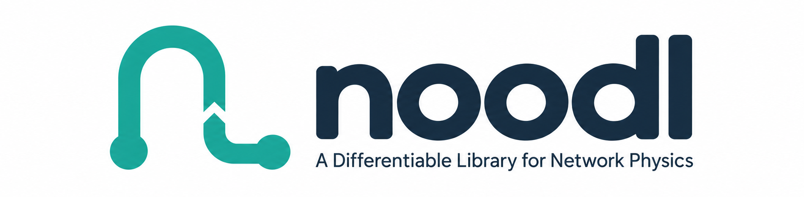

# noodl

<p align="center">
  
</p>

**noodl** — the **N**etwork-**O**riented **O**pen **D**ifferentiable **L**ibrary — is a generic
framework for solving physics problems on networks, built on PyTorch. It combines graph
topology, conservation laws, and modular descriptions of physical processes to model flows,
storage, transport, and reactions within a common framework. Different physical systems can be
composed and coupled through shared network structures, while differentiable solvers support
simulation, parameter estimation, and optimisation.

**[Documentation](https://mvreeuwijk.github.io/noodl/)** ·
[Installation](https://mvreeuwijk.github.io/noodl/installation/) ·
[Quick start](https://mvreeuwijk.github.io/noodl/quickstart/) ·
[Concepts](https://mvreeuwijk.github.io/noodl/concepts/) ·
[Applications](https://mvreeuwijk.github.io/noodl/applications/) ·
[API reference](https://mvreeuwijk.github.io/noodl/api/) ·
[Theory](https://mvreeuwijk.github.io/noodl/theory/)

## Installation

```
pip install noodl
```

Python 3.11 or newer; PyTorch, NetworkX and NumPy are the only hard dependencies. The optional
extras are genuinely optional — `[sparse]` (sparse-direct linear solver), `[street_aq]` (the
street air quality application's NetCDF I/O and IMPAQ port), `[contam]` (ContamX parity, Windows
x86-64 only) and `[dev]` (everything the test suite needs). For a checkout:

```
git clone https://github.com/mvreeuwijk/noodl.git
cd noodl
pip install -e ".[dev]"
```

See [Installation](https://mvreeuwijk.github.io/noodl/installation/) for what each
extra buys you.

## Quick start

```python
import torch

from noodl.elements.powerlaw import PowerLaw
from noodl.layers.potential import PotentialFlowLayer
from noodl.topology import Network

net = Network(dtype=torch.float64)
net.add_node("ambient")
net.add_node("room")
net.add_edge("room", "ambient", kind="airpath")

leak = PowerLaw(C=torch.tensor(0.01), n=torch.tensor(0.65))
layer = PotentialFlowLayer(net, "air", [leak], boundary=["ambient"])

phi_boundary = torch.zeros(1, dtype=torch.float64)
# sources is indexed in full node order (ambient, room); 0.05 m3/s injected into "room"
sources = torch.tensor([0.0, 0.05], dtype=torch.float64)
phi, q = layer.solve(phi_boundary, sources=sources, differentiable=False)

print("pressures (Pa):", dict(zip(net.nodes, phi.tolist())))
print("flows (m3/s):  ", dict(zip(("room->ambient",), q.tolist())))
```

## Applications

noodl ships six worked applications. Each is a thin layer of domain physics over the shared
core, and each is checked against the standard reference implementation in its field.

| Application | Physical system | Reference model |
|---|---|---|
| Building physics | Multi-zone airflow, heat and contaminant transport | CONTAM / ContamX, Modelica Buildings Library |
| Street air quality | Urban air quality, canyon exchange and routing | MUNICH, SIRANE (IMPAQ port check) |
| Sewers | Gravity sewer hydraulics, headspace air, sulfide | SWMM |
| Water distribution | Pressurised mains, pumps, tanks, demand | EPANET 2.2 |
| WSIMOD — rule-based water-system allocation | Requested flows clipped to arc capacity and free storage at the receiving node | WSIMOD |
| Coupling | Two independent models exchanging values | — |

## Repository layout

```
src/noodl/        the package: topology, elements, drives, layers, solvers, operators,
                  Model and couple, and apps/ (building_physics, street_aq, sewer, water)
tests/            the suite, including verification/ — the parity cases against CONTAM,
                  MUNICH, SWMM, EPANET and WSIMOD, and the performance gates
benchmarks/       timing and scaling scripts, and the composed reference model
docs/             the published documentation and the development history
scripts/          fixture-regeneration scripts (Modelica, WSIMOD)
```

A module-by-module map is in the
[development history appendix](docs/development-history.md#appendix-the-source-tree).

## Status

The framework core and all six applications are built and checked against reference
implementations; the suite is 1677 tests at 96.7 % coverage. The per-milestone engineering
record — what each milestone added, the decisions behind it, the measured errors and what it
left open — is in [docs/development-history.md](docs/development-history.md).

## The name

*noodl* stands for **N**etwork-**O**riented **O**pen **D**ifferentiable **L**ibrary. The mark is
a single continuous path through two nodes and a junction — flow through a network, drawn in
one stroke.

## Credits and licence

The topology layer is built on PyTorch, and the physics is implemented as nodal state-space
modules with storage at nodes, typed edges, and batching over instances.

Authors: John Craske and Maarten van Reeuwijk. MIT licensed, with the agreement of the original
author.
