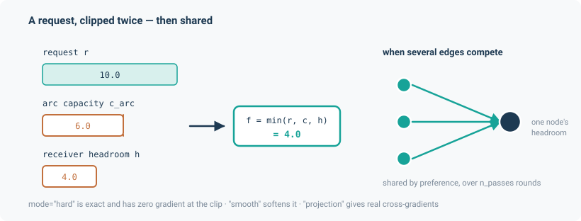

# Flow allocation

Rule-based allocation of water between stores. Nodes are stores (reservoirs, treatment works,
demand points) with a storage ceiling; edges are arcs with a capacity. Each arc carries the flow
that is requested of it, clipped to the arc's capacity and to the free storage at the receiving
node, and storage is conserved exactly at every node. Requests and flows are in m³/s, storage in
m³. In noodl physics this is implemented by `AllocatedFlowLayer`, and it is the framework's
**fourth flow-determination mode**. The earlier name `CapacitatedTransferLayer` (and module
`noodl.layers.capacitated`) still imports, as an alias of the same class.

Every other application on this site determines a flow from physics: a potential difference, a
closure, or continuity. This one does not. Each edge carries a *requested* flow, typically
emitted by an upstream process rather than a pressure difference, and the layer clips it against
two independent bounds — the edge's own capacity, and the receiving node's remaining storage
headroom. There is no potential variable anywhere in the calculation.

$$
f = \min\left(r,\; c_{\text{arc}},\; h_{\text{receiver}}\right)
$$

This is push/pull semantics. An edge pushes a request at its target; the
target accepts up to its own headroom; the difference is left unmet at the source. Conservation
is exact by construction.

It is a genuinely different mode, not a variant of the potential layer. Water-resources
networks — abstraction licences, reservoir operating rules, treatment-works throughput — are
governed by *rules*, and the rule is the physics.

```python
from noodl.layers.allocation import AllocatedFlowLayer
```



Every type this application offers — what it does and how to call it — is listed in its [catalogue](../catalogue/wsimod.md). It is set up and run like every other model; see [Using noodl](../usage.md).

## A worked example

```python
import torch
from noodl.layers.allocation import AllocatedFlowLayer
from noodl.topology import Network

F64 = torch.float64

net = Network()
for n in ("A", "B", "C"):
    net.add_node(n)
net.add_edge("A", "B", kind="link")
net.add_edge("B", "C", kind="link")

layer = AllocatedFlowLayer(
    net, "cap", "link",
    s_max=torch.full((net.n,), 100.0, dtype=F64),
    c_arc=torch.full((2,), 10.0, dtype=F64),
)

s0 = torch.zeros(net.n, dtype=F64)
drivers = {"cap.requests": torch.tensor([2.0, 2.0], dtype=F64)}
s1, f = layer.step(s0, drivers, dt=1.0)

# f  == [2.0, 2.0]   — both requests pass through
# s1 == [-2.0, 0.0, 2.0]
#   A is only a source and loses 2; B gains 2 and loses 2; C gains 2.
```

*(From `tests/layers/test_allocation.py`.)* Two adjacent tests show the clip branches: with
`c_arc = 1.5`, requests of `[5.0, 5.0]` give `f = [1.5, 1.5]`; with node C already full,
requests of `[2.0, 2.0]` give `f = [2.0, 0.0]`.

Note that `s1[0]` is negative. `step` bounds storage from **above** only — a source node may be
drawn below zero, which is a modelling choice belonging upstream of this layer.

## From a WSIMOD topology

`noodl.apps.wsimod.build_model(topology)` builds the layer and a `Model` from a WSIMOD-style
topology (`{"nodes": [{"name"}], "arcs": [{"name", "source", "target", "capacity"}]}`,
or a JSON file of it) and returns `(model, state, drivers)` like the other applications.
Requests and storage are then given by arc and node name:

```python
from noodl.apps import wsimod

model, state, drivers = wsimod.build_model("quickstart_topology.json")
state = wsimod.initial_state(model, values={"wsimod": {"my_groundwater": 5.0}})
drivers = wsimod.initial_drivers(model, values={"wsimod.requests": {"baseflow": 0.3}})
state = model.step(state, drivers, dt=86400.0)
```

See [Using noodl](../usage.md).

## The API

The allocation rules (push/pull requests, the per-arc capacity clip and the receiver's headroom
check) follow those of WSIMOD, Imperial College's Water Systems Integrated Modelling framework.
Sharing between arcs competing for one node's headroom does not: WSIMOD serves such requests
first come, first served, and this layer shares preference-proportionally (see
[where the layer differs from WSIMOD](#where-the-layer-differs-from-wsimod)).

`AllocatedFlowLayer` has exactly two public methods.

```py
AllocatedFlowLayer(
    net, name, kind, *,
    s_max,            # per-node storage ceiling, trailing shape (net.n,); inf for unbounded
    c_arc,            # per-edge arc capacity, in this kind's edge order
    preference=None,  # per-edge sharing weight, strictly positive; None means all ones
    mode="hard",      # 'hard' | 'smooth' | 'projection'
    tau=None,         # temperature; required for mode='smooth'
    n_passes=5,       # fixed sharing rounds
)

s_new, f = layer.step(s, drivers, dt, *, diagnostics=None)
```

`step` reads `f"{name}.requests"` from `drivers` (per edge, m³/s) and returns the new per-node
storage and the realised per-edge flow. `diagnostics`, when given, is filled with `"overflow"`
in m³/s per node — reported, never fed back.

**`dt` is load-bearing.** Headroom is converted to a *rate*, $(s_{\max} - s)/\Delta t$, so the
clip bounds the actual storage increase at any timestep, not only at $\Delta t = 1$. This is
regression-tested at $\Delta t = 2$ and $\Delta t = 86400$.

`preference` must be strictly positive. Projection mode divides by it live, and a non-positive
weight would give a clean forward value with a silent NaN gradient.

In a `Model`, an allocation layer steps between the potential solves and the transport steps, so
a transport layer reading `"<layer>.q"` sees a freshly written flow whichever kind of layer wrote
it. A model owning one **refuses a steady pass and refuses `residuals()`** — a clip-and-allocate
rule is inherently discrete-time and has no steady meaning to report.

## The three modes

They compute the same thing. They differ in what the gradient does, and that is the entire
reason there is more than one.

### `"hard"` — exact, and zero-gradient at the clip

Plain `minimum` and `clamp`. Bit-identical to the bare clip formula, untouched by the existence
of the other modes. This is what WSIMOD parity is measured against.

Differentiable almost everywhere — but **at and near a capacity or headroom crossing the gradient
through the discrete branch choice is exactly zero**. A node moving from "headroom covers demand"
to "oversubscribed" carries no gradient signal across that boundary.

Use it for forward simulation, and for training that never crosses a binding constraint.

### `"smooth"` — a live gradient across the boundary

`minimum` becomes a softmin, $-\tau \log\sum e^{-a/\tau}$; `clamp` becomes a softplus; and the
**branch selection itself** is smoothed by a sigmoid-weighted blend of two whole branches, not
just the arithmetic inside each. That last part is the point: smoothing only the arithmetic would
leave the discrete choice, and its zero gradient, in place.

The cost is an $O(\tau)$ forward bias. The measured 1.79e-3 discrepancy in the parity table below
is *not* capacity-smoothing residue — every arc in that fixture is unbounded, so the softmin is
exact to float64. It is the softplus-at-zero bias, $\tau \ln 2 \approx 6.9\times10^{-4}$ at
$\tau = 10^{-3}$, at kink sites many requests sit exactly on, compounding through recurrent
storage.

Use it when you need a gradient across a capacity boundary but only care about *self*
sensitivity.

### `"projection"` — real cross-gradients between competing edges

Smooth mode's proportional-share formula is
$h_{\text{free}} \cdot \text{pref}_i / \sum_k \text{pref}_k$. That depends only on the preference
weights and the total headroom — **never on any individual competitor's request**. So
$\partial f_i / \partial r_j = 0$ for a competing edge $j$, provably and not approximately. It
is confirmed empirically too: byte-identical zero cross-terms across 200 random trials. That
formula cannot deliver a genuine cross-gradient — *gradients flowing through which arc absorbs a
constraint* — however it is wrapped, which is why projection mode routes the sharing site through
a real coupled QP instead: minimise
$\sum_i \text{pref}_i (f_i - r_i)^2$ subject to $0 \le f_i \le \text{avail}_i$ per edge **and**
$\sum_i f_i \le h_{\text{free}}$ jointly. Its KKT stationarity reduces to

$$
f_i = \operatorname{clamp}\!\left(r_i - \frac{\lambda}{\text{pref}_i},\ 0,\ \text{avail}_i\right)
$$

for **one scalar $\lambda$ shared by every edge competing at that node** — and $\lambda$ is the
unique root of a monotone scalar equation, which is exactly `solve_monotone`'s contract.

That shared multiplier is what produces a genuine cross-gradient:

$$
\frac{\partial f_i}{\partial r_j} = -\frac{1/\text{pref}_i}{\sum_k 1/\text{pref}_k}
$$

On a symmetric-preference diamond this gives $\partial f_{BD} / \partial r_{CD} = -0.5$, which was
hand-derived and is checked for both sign and magnitude. The general formula was separately
hand-verified against asymmetric fixtures (`pref=[1,3]` → $-0.25$; `pref=[1,2,5]`) to four decimal
places. That confirms the *mechanism* generalises — not that $-0.5$ itself does.

A full Newton treatment of the QP was considered and rejected: it would need a
Fischer-Burmeister-smoothed complementarity condition, which is a harder-to-verify
reimplementation of what smooth mode already does, for no accuracy benefit.

## Proportional sharing and `n_passes`

Sharing happens only at a node that is the **target of more than one edge**. A node with a single
in-edge is never touched, however many out-edges lie downstream: this layer never caps an edge to
match a bottleneck further along the graph. That matches WSIMOD for storing nodes (`Storage`,
`Waste`), whose accept decision is a check against their *own* headroom. It does not match a WSIMOD
pass-through `Node`, which accepts only what it can forward in the same step (see
[where the layer differs from WSIMOD](#where-the-layer-differs-from-wsimod)).

Each of the `n_passes` rounds computes a tentative flow, finds the nodes whose summed demand
exceeds their free headroom, and on those nodes replaces the tentative flow with a
preference-weighted share — with preference renormalised over the edges still *actively*
competing, so an edge that already got everything it asked for does not soak up a share it no
longer wants.

That renormalisation is what `n_passes` is for. Three edges into one sink with headroom 3.0, equal
preference, requests `[0.5, 10.0, 10.0]`:

| Passes | Realised | Total |
|---|---|---|
| 1 | `[0.5, 1.0, 1.0]` | 2.5 — under-uses the headroom by 0.5 |
| 2 | `[0.5, 1.25, 1.25]` | 3.0 — X's freed weight redistributes |
| 5 | `[0.5, 1.25, 1.25]` | 3.0 — already converged at pass 2 |

`remaining` only shrinks and `f` only grows round over round, so more passes move a share closer
to the true max-min-fair split and never past it. The default of 5 matches WSIMOD's own
`constants.MAXITER`; WSIMOD uses a `while` loop with early exit, and noodl physics uses a fixed count for
batched differentiability — each round is strictly non-expansive, so a fixed cap is a safe
over-approximation rather than a different algorithm.

## Verification

Against WSIMOD 0.8.1 (Dobson, Liu and Mijic), pinned **exactly** rather than with `>=`, because
the committed fixtures freeze one specific WSIMOD run and a newer release could silently change
the demos' forcing or node parameters.

The harness monkeypatches `Arc.send_push_request` / `send_pull_request` to capture every per-arc
requested/realised pair while WSIMOD runs its own `quickstart_demo` and `oxford_demo`. The
committed fixtures mean the parity tests run **without WSIMOD installed**.

| Check | Tolerance | Measured |
|---|---|---|
| Hard clip vs WSIMOD's realised flows, `quickstart_demo`, all 1,456 steps | 1e-9 abs | **1.11e-16** |
| Same, `oxford_demo`, 20 of 21 arcs | 1e-6 abs | **1.86e-9** |
| `"smooth"` at $\tau=10^{-3}$ vs the hard clip's own output on `quickstart_demo` | 3e-3 abs | **1.79e-3** |
| `"projection"` vs the hard clip's own output on `quickstart_demo` | 1e-9 abs | **9.10e-13** |
| Conservation, both demos, all three modes | exact | holds, no reference needed |
| `gradcheck` through smooth and projection on the diamond | analytic | holds |
| `n_passes=5` vs a hand-converged reference | exact | holds |
| Scripted WSIMOD networks with binding arcs and tanks (6 cases, `dt` = 86400 s): realised volumes and storage | 1e-12 × case scale | **≤ 4.4e-16** |
| `quickstart_tight` (three arc capacities lowered), all 6 arcs, 1,456 steps | 1e-12 × 0.113 | **1.04e-16** |

### Binding capacities and headroom

The two shipped demos never bind: all but one of their 27 arcs sit at WSIMOD's
`UNBOUNDED_CAPACITY` of 1e15, the one finite arc (`abstraction_to_farmoor`, 50000) never sees a
request above about 30,934, and the replay sets $s_{\max} = \infty$. On their own they check
only the identity path, $\min(x, c) = x$.

`tests/verification/test_wsimod_capacity.py` covers the binding branches against WSIMOD's own
numbers. It runs small networks built from WSIMOD's own `Arc`, `Node`, `Storage` and `Waste`
classes, driven by WSIMOD's `push_distributed` and `pull_distributed`, and checks from
WSIMOD's output that each targeted bound really cut a request before it compares:

- a push clipped by arc capacity, with one or several requests in a timestep;
- a push and a pull on the same arc in one timestep, sharing its capacity;
- a tank whose headroom and inflow-arc capacity bind in turn as its storage evolves;
- WSIMOD's preference-weighted `push_distributed` and `pull_distributed`, where a round's
  request exceeds an arc's capacity and WSIMOD's own clip cuts it.

It also replays `quickstart_tight`, which is `quickstart_demo` with `runoff`, `baseflow` and
`percolation` lowered to 0.03, 0.04 and 0.08. WSIMOD cuts `baseflow` to its capacity on 1,085
days. `runoff` and `percolation` run at capacity on 866 and 552 days, but WSIMOD's `Land` node
sizes those requests from the arc's own check, so there request = capacity.

WSIMOD clips each request against `capacity - flow_in`, and `flow_in` accumulates every push and
pull already realised on the arc in that timestep. The split between requests therefore depends
on their order, but the timestep total is $\min(\sum_k r_k, c)$ in any order, and that total is
what one layer step computes from the summed request.

#### Where the layer differs from WSIMOD

These differences are tested, not tolerated:

- **Several arcs competing for one node's headroom.** WSIMOD serves them in call order. The
  layer shares by preference and ignores order. Two 10-unit pushes into 12 units of headroom
  give `[10, 2]` or `[2, 10]` in WSIMOD, depending on which is called first, and `[6, 6]` in the
  layer. The total and the storage agree. WSIMOD's own proportional sharing happens earlier,
  when a sender or puller sizes its requests, so it is already in the requests the layer
  replays.
- **Same-step outflow.** The layer uses the headroom at the start of the step. WSIMOD frees
  headroom for an inflow if an outflow is called first.
- **Bottlenecks behind a pass-through node.** A WSIMOD `Node` forwards each push immediately
  and hands back what it cannot forward, so a tight arc downstream also limits the arcs
  feeding it. The layer is receiver-local. With `quickstart_demo`'s `catchment_outflow` lowered
  to 0.1, that arc replays exactly, but `baseflow` and `storm_outflow` differ by up to 0.24 and
  0.04.
- **Node-level limits.** These are source availability on a pull, and throughput caps such as
  `oxford_demo`'s `WWTW` node. That is why `sewer_to_wwtw` is left out of the `oxford_demo`
  comparison (20 of 21 arcs compared): it mismatches on 185 of 1,456 steps, although its own
  capacity is 1e15.
- **Not compared at all.** `QueueArc` and `DecayArc` travel time and decay, `force=True`
  pushes, and pollutants. The layer does not model any of them.

### Throughput

| Run | Measured |
|---|---|
| `oxford_demo` topology (21 arcs, 18 nodes), hard clip, 1,456 steps | batch 1: 1.004 s; batch 10: 1.338 s; batch 100: 1.439 s |

WSIMOD's own single-instance run takes about 4 s, but that is **not** a fair
batched-against-unbatched comparison and no budget is set on it. The benchmark also carries its
own caveat: with $s_{\max} = \infty$ everywhere, no node is ever oversubscribed, the sharing
branch never runs, and every pass after the first is a no-op. It measures the cheapest path only.

## Out of scope

- The **WSIMOD `Node` wrapper** — embedding a noodl physics `Model` as a live WSIMOD node via
  `push_set`/`pull_set` — is deferred.
- **The other nine WSIMOD pollutants.** The layer is species-count-agnostic, so this is a matter
  of widening a transport layer's species list and the fixture capture, not a change here.
- **Species and quality transport riding on an allocation layer** is not wired up.
- **Time-varying arc capacities and storage bounds** — construction-time buffers only, since
  WSIMOD's own capacities are static within a run.

## Install

Nothing beyond the base dependencies. `wsimod==0.8.1` is needed only to regenerate the fixtures;
the parity tests themselves read the committed ones.
