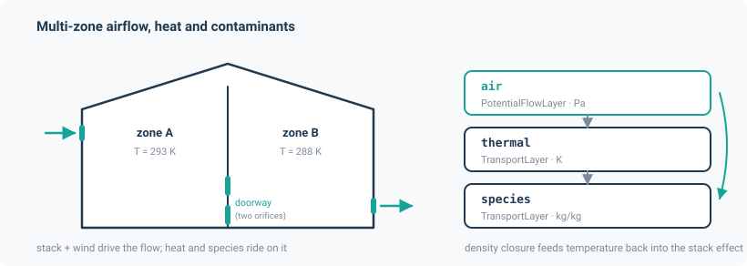

# Building physics

Multi-zone airflow, heat balance and contaminant transport — the CONTAM class of problem, in a
differentiable and batched form.

Rooms are nodes; leaks, doorways, fans and dampers are edges. Air moves under buoyancy, wind
pressure and mechanical pressure; heat rides on that airflow and conducts through walls with
thermal mass; contaminants ride on it too, with CONTAM's four source models. Because air density
depends on temperature and the stack effect depends on density, the airflow and heat problems
are genuinely two-way coupled.

**Units.** Mass flow kg/s, temperature K, heat W, mass fraction kg/kg, pressure Pa. The whole
application works in `float64` regardless of the network's default dtype.

```python
from noodl.apps.building_physics import (
    Zone, WallMass, add_zone, build_model, initial_state,
    add_large_opening, orifice_elements_from_edges, read_prj, project_to_model, read_wth,
)
```



## Two ways in

**From scratch**, for research and verification cases:

```python
import torch
from noodl.apps.building_physics import Zone, add_zone, add_large_opening, orifice_elements_from_edges
from noodl.apps.building_physics import build_model, initial_state
from noodl.drives import Stack
from noodl.topology import Network

F64 = torch.float64

net = Network(dtype=F64)
net.add_node("ambient", z_ref=0.0)
add_zone(net, Zone("A", volume=60.0, T0=288.15))
add_zone(net, Zone("B", volume=60.0, T0=285.15))

add_large_opening(net, "A", "B", H=2.0, W=0.9, z_mid=1.0, Cd=0.78)
net.add_edge("ambient", "B", kind="airpath", z_path=0.2, Cd=0.6, area=0.05)
net.add_edge("ambient", "B", kind="airpath", z_path=1.8, Cd=0.6, area=0.05)

el = orifice_elements_from_edges(net, "airpath")
model = build_model(
    net,
    air_elements=[el],
    drives=[Stack.from_network(net, "airpath")],
    coupling="iterate",
    iterate_tol={"thermal": 0.01},
    iterate_max=50,
)

state = initial_state(model)
sources = torch.zeros(net.n, dtype=F64)
sources[net.node_index("A")] = 1000.0      # a 1 kW heat source in room A

drivers = {
    "air.phi_boundary": torch.zeros(1, dtype=F64),
    "thermal.x_boundary": torch.tensor([283.15], dtype=F64),
    "thermal.sources": sources,
}
state = model.step(state, drivers, dt=60.0)

print(state["thermal.x"])   # [T_A, T_B] in K
print(state["air.q"][0])    # doorway low-opening flow, kg/s
```

*(Adapted from `benchmarks/natural_ventilation.py`, the golden reference case.)*

**From a CONTAM project file:**

```python
from noodl.apps.building_physics import read_prj, project_to_model

project = read_prj("valThreeZonesWthCtm-UseApi.prj")
model, state, drivers = project_to_model(project)
solved = model.steady(state, drivers)

flows = project.path_flows(solved["air.q"])   # in CONTAM path-number order
```

## The API

### Zones and walls

| Object | Purpose |
|---|---|
| `Zone(name, volume, T0=293.15, z_ref=0.0, wall=None)` | A room. `volume` in m³, `T0` the initial temperature, `z_ref` its reference height. |
| `WallMass(name, capacity, ua_zone, ua_ambient)` | A lumped wall node: heat capacity J/K, conductances W/K to the zone and to ambient. |
| `add_zone(net, zone, ambient="ambient")` | Adds the zone's air node and, if `zone.wall` is set, the wall node plus `kind="wall"` edges `zone → wall → ambient`. |

`WallMass` refuses a non-positive `ua` at construction. A negative conductance makes the
conduction operator anti-diffusive — it violates the maximum principle — and *every solve still
reports success*, because nothing downstream looks at the sign. Zero is refused as "a wall that
conducts nothing".

### Layers and model assembly

| Function | Returns |
|---|---|
| `thermal_layer(net, *, ambient, name="thermal", flow_kinds=("airpath",), conduction_kind="wall", c_p=1005.0, rho=1.2041, scheme="exact", fixed_temperature=())` | The heat `TransportLayer`. Capacity is $\rho c_p V + C_{\text{node}}$ per active interior node. Raises naming any node with zero heat capacity. |
| `species_layer(net, *, ambient, name="species", flow_kinds=("airpath",), rho=1.2041, n_species=1, scheme="implicit")` | The contaminant layer, as mass fractions, capacity = zone air mass $\rho V$ (CONTAM's convention). |
| `build_model(net, *, air_elements, drives, ambient="ambient", thermal=True, species=0, density="ideal_gas", density_kwargs=None, coupling="pingpong", iterate_tol=None, iterate_max=20, thermal_scheme="exact", species_scheme="implicit", flow_kinds=None)` | The assembled `Model`. |
| `initial_state(model)` | Temperatures from each node's `T0`, zeros for species. |

`density` selects the closure relating temperature to air density:

- `"ideal_gas"` → `IdealGasDensity`: $\rho = P_{\text{ref}} / (R T)$, with `P_ref` overridable per
  call through `drivers["P_ref"]`.
- `"linear"` → `LinearDensity`: the Boussinesq form
  $\rho = \rho_0\,(1 - (T - T_0)/T_0)$, which is what the Li and Delsante analytical solutions
  assume.

`flow_kinds` narrows which edge kinds advect heat and species; it defaults to every air element's
kind. Naming a kind no air element provides raises — a kind the air layer does not solve carries
no flow, so heat and species would silently not advect on it.

### Elements

| Function | Law |
|---|---|
| `mass_orifice(Cd, A, *, rho=1.2041, dp_transition=1e-3, kind="airpath")` | $F = C_d A \sqrt{2 \rho \Delta p}$ kg/s, built as a `PowerLaw` at $n = 0.5$. |
| `orifice_elements_from_edges(net, kind, *, rho=1.2041, ...)` | One `PowerLaw` over every edge of a kind, reading `Cd` and `area` off each edge. |
| `add_large_opening(net, a, b, *, H, W, z_mid, Cd=0.78, kind="airpath")` | CONTAM's two-opening doorway (`DR_PL2`, TN 1887r1 eq. 69–70): two orifices of area $WH/2$ at $z_{\text{mid}} \mp 2H/9$. Exact for a mid-height neutral plane. Returns the two edge keys. |

### Contaminant sources

CONTAM's four source types, all in `noodl.apps.building_physics.sources`:

| Source | Model |
|---|---|
| `ConstantSource(node, G, R=0.0)` | $S = G - R x$ (TN 1887r1 eq. 15) |
| `CutoffSource(node, G, x_cut)` | $S = \max(G(1 - x/x_{\text{cut}}), 0)$ (eq. 17) — clamped at zero rather than going negative, because CONTAM's cutoff source models generation that *shuts off*, not a sink |
| `DecayingSource(node, G0, tau, t0=0.0)` | $S = G_0 e^{-(t-t_0)/\tau}$ for $t \ge t_0$ |
| `BurstSource(node, mass, t_burst, dt)` | `mass` delivered uniformly over $[t_{\text{burst}}, t_{\text{burst}} + dt)$ |

`assemble_sources(sources, t, x_full)` sums them; `sources_from_project(project, dt=60.0)` builds
them from a `.prj`'s own source records.

## File readers

### CONTAM `.prj`

`read_prj(path) -> Project` parses a documented subset of TN 1887r1 Appendix A into a `Project`,
building a float64 `Network`, its elements and its drives. `project_to_model(project, *,
ambient=None, species=True, scheme="implicit")` returns `(model, state, drivers)`.

**Supported:** run control and ambient conditions; species; wind pressure profiles; zones and
initial concentrations; airflow paths; the power-law element family
(`plr_orfc/leak1/leak2/leak3/crack/fcn/test1/test2/conn/stair/shaft/qcn`), the quadratic family
(`qfr_*`), doorways (`dor_door`, `dor_pl2`), dampers (`plr_bdq`, `plr_bdf`), constant-flow fans
(`fan_cmf`, `fan_cvf`) and the cubic fan curve (`fan_fan`); source elements `ccf`, `cut`, `eds`,
`brs`.

**Refused by name**, rather than silently dropped: schedules, control nodes, filters, kinetic
reactions and air-handling systems referenced by nonzero index; CFD and 1-D convection/diffusion
zones; continuous-values-file zones and paths; duct networks; a constant wind pressure with no
profile; a fan curve on a path with `mult != 1`; `csf_*` and `sup_afe` elements.

A **filter** is refused emphatically, because a filter is invisible to airflow but *not* to the
species layer — loading one would silently corrupt contaminant results while the airflow looked
perfect.

Control nodes that no zone and no path references are silently skipped rather than refused: NIST's
own sample projects carry dozens of unreferenced sensor and logger nodes, and those projects must
load.

**`project_to_model` never builds a thermal layer**, because a `.prj` carries no thermal data.

Every power-law element is built as `UpstreamDensityPowerLaw` — re-evaluating the density of the
air *entering* the path, per direction, matching ContamX section 3.2. The quadratic, damper and
fan families keep reference-density coefficients, because they are not part of this application's
parity evidence.

### CONTAM `.wth`

`read_wth(path) -> Weather` reads the `WeatherFile ContamW 2.0` format. Only `Date, Time, Ta, Pb,
Ws, Wd` are used; humidity, radiation and ground-temperature columns are ignored, as is the
per-day header block.

```python
weather = read_wth("year.wth")
drivers.update(weather.drivers_at(t, thermal="thermal"))
```

`at(t)` interpolates linearly between listed times, with wind direction interpolated on its
shortest arc. `drivers_at(t)` returns the driver keys a `build_model`-built model reads:
`"<thermal>.x_boundary"`, `"P_ref"`, `"V_met"`, `"theta_w"`. It handles the single-boundary-node
case; a model with several prescribed temperatures must build its own boundary vector.

### Modelica Buildings Library

`read_modelica(path) -> (model, state, drivers)` imports a multizone airflow model built with the
Modelica Buildings Library (MBL) v13.0.0 (commit `55abf579598ca81cae0a82f337350375958e6722`)
through an OpenModelica JSON export — a second reference implementation for this application,
independent of CONTAM. The reader never parses Modelica source and never evaluates a Modelica
expression: every number in the JSON was already evaluated by OpenModelica.

```python
from noodl.apps.building_physics import read_modelica
from noodl.apps.building_physics.modelica import simulate

model, state, drivers, names = read_modelica("tests/data/modelica/OneRoom.json", return_names=True)
result = simulate(model, state, drivers, names.times)

print(result["T"][-1])       # zone temperatures (K) at the last grid time, node order names.nodes
print(result["air.q"][-1])   # edge flows (kg/s); names.edges maps an MBL instance to its columns
```

**Supported (18 models: 8 `Validation` + 10 `Examples`).** `Buildings.Airflow.Multizone`
elements, `MixingVolume` zones, pressure/temperature boundaries and trace substances — not
`Buildings.ThermalZones`, HVAC, wind, weather or district networks. `Validation`: `OneWayFlow`,
`DoorOpenClosed`, `OpenDoorPressure`, `OpenDoorTemperature`, `ThreeRoomsContam`,
`ThreeRoomsContamDiscretizedDoor`, `OpenDoorBuoyancyDynamic`, `OpenDoorBuoyancyPressureDynamic`.
`Examples`: `CO2TransportStep`, `ClosedDoors`, `NaturalVentilation`, `OneOpenDoor`, `OneRoom`,
`Orifice`, `PowerLaw`, `ReverseBuoyancy`, `ReverseBuoyancy3Zones`, `ZonalFlow`.

**Refused, each with a named error** (`ModelicaImportError` lists every offending instance and
its class):

- `PressurizationData`, `TrickleVent`, `ChimneyShaftNoVolume`, `ChimneyShaftWithVolume` — wind
  pressure, weather data, feedback controllers, or a dynamic (mass- and heat-storing) hydrostatic
  medium column, none of which is in scope.
- `OneEffectiveAirLeakageArea` — a mass source feeding two boundary-less volumes; the injected
  air can only go into compressing them, which needs the compressible volume storage this
  release does not model.

For example, reading `PressurizationData` raises:

```
ModelicaImportError: modelica: refused 3 items:
  - east (Buildings.Fluid.Sources.Outside_CpLowRise): wind pressure is not supported
  - weaDat (Buildings.BoundaryConditions.WeatherData.ReaderTMY3): weather data is not supported
  - west (Buildings.Fluid.Sources.Outside_CpLowRise): wind pressure is not supported
```

**Conventions and deviations from the design record** (the spec was amended 25 Sep 2026 to match;
see `docs/superpowers/specs/2026-09-24-modelica-import-design.md` section 6):

- `DoorOpen`/`DoorOperable` use MBL's fixed default density (`Door.mo`); a discretised door
  (`DoorDiscretizedOpen`/`Operable`) evaluates density at the actual port pressure
  (`TwoWayFlowElement.mo`) instead — the two door families do not share one convention.
- A door becomes two directional noodl edges between the same pair of zones; a discretised door
  becomes one edge per compartment, each with its own hydrostatic head.
- Zonal flows are four-port, like doors (not the two-port shape a one-way element has), and
  become two directional edges the same way.
- An in-line flow sensor (`Buildings.Fluid.Sensors`, flow-through) is a transparent wire: it adds
  no node and no pressure drop.
- `PrescribedHeatFlow` is supported only at `alpha = 0` (MSL's default: no temperature
  dependence); a nonzero `alpha` is refused.
- A boundary wired straight to one zone's port, and to no other port, is supported: it fixes that
  zone's pressure.
- `"air.phi"` is GAUGE pressure relative to a per-model reference `p_ref` (the first boundary's
  pressure, or an attached boundary's, at the first grid time; the first zone's `p_start` with
  neither) — flows depend only on pressure differences, so the choice changes no result.
- Every source driver (air, heat and species) is the MEAN of the source over each step, not its
  end-of-step value, so that a pulse shorter than the output interval still injects its exact
  mass (found from `CO2TransportStep`'s 3.6 s pulse landing between two 172.8 s outputs).
- A signal may drive several inputs (`drives` accepts one name or a list) — MBL's `ZonalFlow`
  example drives two flows from one `Constant`.
- Refused, also with a named error: a closed group of zones (joined only by pressure-dependent
  edges or zonal flows, no boundary among them) with a net flow imbalance — an unequal
  `ZonalFlow_m_flow` pair or a mass source into it; `MediumColumn.densitySelection = "actual"`;
  and `Outside` without a weather-bus signal driving it. None of the 18 supported models needs
  any of the three.

**Quasi-steady airflow.** Like the CONTAM route, a volume's air mass is not stored: the airflow
is quasi-steady at every step. MBL's volumes do store mass, so a model whose dynamics are
dominated by that storage — a closed, heated room expanding through its leakage, or an initial
pressure imbalance draining away — parts company with noodl by more than round-off (see the
parity table below). Adding volume mass storage would close this gap; it is a follow-up, offered
to Maarten and not implemented in this release.

**Reproducing the export (WSL only — the test suite itself needs none of this).** Tested on
Ubuntu 22.04 (`jammy`) in WSL with OpenModelica 1.27.1. Install OpenModelica from its own apt
repository (needs `sudo`, done once by whoever administers the WSL environment):

```bash
sudo apt-get update && sudo apt-get install -y ca-certificates curl gnupg
curl -fsSL http://build.openmodelica.org/apt/openmodelica.asc | sudo gpg --dearmor -o /usr/share/keyrings/openmodelica-keyring.gpg
echo "deb [arch=amd64 signed-by=/usr/share/keyrings/openmodelica-keyring.gpg] https://build.openmodelica.org/apt jammy stable" | sudo tee /etc/apt/sources.list.d/openmodelica.list
sudo apt-get update && sudo apt-get install -y omc
```

MBL v13 needs the Modelica Standard Library (MSL) 4.1.0, installed once, without `sudo`, with
`omc`'s own `installPackage` (it writes into `~/.openmodelica/libraries`, not a system path):

```bash
echo 'installPackage(Modelica, "4.1.0");' > /tmp/install_msl.mos && omc /tmp/install_msl.mos
```

Clone MBL at the tag this release was exported against:

```bash
git clone --depth 1 --branch v13.0.0 https://github.com/lbl-srg/modelica-buildings.git ~/modelica/modelica-buildings
```

(`git rev-parse HEAD` there is `55abf579598ca81cae0a82f337350375958e6722`, the commit recorded
in every fixture's JSON.) Then, with `omc` on the WSL `PATH` (this release was exported against
`OpenModelica 1.27.1~2-g6db4671`):

```bash
python3 scripts/modelica_export.py <Model> --out tests/data/modelica
```

writes `tests/data/modelica/<Model>.json` (the component graph) and `<Model>.csv` (OpenModelica's
own simulated reference) as committed fixtures. `scripts/modelica_export.py` is not imported by
the package and is not run by the test suite. 9 of the 12 dynamic parity tests take 30 s–5 min
each and are marked `@pytest.mark.slow`, excluded by the repository's default `pytest` run;
`pytest -m slow` runs them.

## Verification

### Against ContamX

The reference is NIST's ContamX 3.4.1.7, driven through `contamxpy` (the `contam` extra, Windows
x86-64 only — the wheel bundles the engine). `noodl.apps.building_physics.contamx` provides `run_steady`
and `run_transient`, which run the engine on a scratch copy of the project and never mutate your
fixture directory.

| Check | Tolerance | Measured |
|---|---|---|
| Stack project, flow directions | exact signs | match |
| Stack project, flow magnitudes, over a ±20 K ambient sweep | rel 1e-3 | **4.1e-5 – 4.4e-5** |
| Residual flatness across the sweep (max/min ratio) | < 1.5 | holds |
| Constant-mass-flow fan delivers its rating (0.200683 kg/s) | rel 1e-5 | holds |
| Three-zone project, steady flows | rel 1e-3, abs 1e-6 | holds |
| Three-zone project, transient concentrations, 24 steps at 300 s | rel 1e-3 | **6.5e-6** |

The magnitude row has history worth knowing. It was previously an `xfail` at a measured
**1.7e-2** relative error — 17x over tolerance — because the reader froze orifice coefficients at
reference density. Adding the upstream-density correction brought it to 4.1e-5, about 25x inside
tolerance. The residual-flatness test exists to guard the fix: the old error scaled with $\Delta
T$ (1.72e-2 at 20 K, 8.61e-3 at 10 K, 0 at 0 K), so a re-introduced density bug would show up as
a residual proportional to $\Delta T$ even if the absolute number stayed small.

The path-flow sign convention was verified independently against two cases rather than assumed,
since `contamxpy`'s own documentation does not pin the sign of `getPathFlow`.

### Against OpenModelica (Modelica Buildings Library)

**Algebraic models (6, no volumes).** Every CSV row and column against OpenModelica's own
simulation, `|noodl - omc| <= 1e-6 |omc| + 1e-9` kg/s:

| Model | Worst relative error | Rows compared |
|---|---|---|
| OneWayFlow | 2.4e-16 | 501 |
| DoorOpenClosed | 1.2e-16 | 501 |
| OpenDoorPressure | 2.4e-16 | 49 |
| OpenDoorTemperature | 1.8e-11 | 49 |
| Orifice | 4.0e-16 | 501 |
| PowerLaw | 6.1e-16 | 501 |

All at round-off except `OpenDoorTemperature`, whose discretised-door port flows sit at 1.8e-11
relative — still five orders of magnitude inside the 1e-6 bound, and diagnosed as an
OpenModelica nonlinear-solver residual on the door's inflow-density loop, not a formula
difference.

The **CONTAM cross-check** on `OneWayFlow` (13 pressure-difference knots × 8 elements, from
CONTAM's own validation table, `OneWayFlow.mo`'s `contamData`): noodl differs from CONTAM by at
most 0.74 % relative (7.68e-4 kg/s absolute) — exactly the amount MBL itself differs from CONTAM.
The assertion is `|noodl - contam| <= |omc - contam| + 1e-6 |omc| + 1e-9` at every entry: noodl
adds nothing to MBL's own departure from the table (41 of 104 entries miss the table's 3
significant figures, in MBL as much as in noodl).

**Dynamic models (12, with volumes).** The error metric is `|noodl - omc| / max(|omc|, floor)`
over every row after `t = StartTime`; the table below instead reports, per model, the worst
ABSOLUTE error in temperature (K) and pressure (Pa), and the worst flow error as a percentage of
the model's own largest flow — the more informative view, since T and p in kelvin and pascal are
insensitive to relative error and a flow that reverses sign makes a relative error explode near
the crossing.

*Parity* — agrees with OpenModelica to its own discretisation/solver tolerance:

| Model | T, abs (K) | p, abs (Pa) | flow, abs (kg/s) | flow, % of model's largest flow |
|---|---|---|---|---|
| ThreeRoomsContam | 2.1e-6 | 3.7e-5 | 2.3e-7 | 5.4e-5 % |
| ThreeRoomsContamDiscretizedDoor | 2.1e-6 | 3.7e-5 | 1.1e-7 | 2.6e-5 % |
| OneRoom | 5.8e-11 | 1.5e-11 | 1.2e-13 | 1.6e-9 % |
| ZonalFlow | 1.0e-2 | 1.5e-11 | 0 | 0 % |
| CO2TransportStep | 2.1e-6 | 5.0e-5 | 2.6e-7 | 6.2e-5 % |

`CO2TransportStep`'s trace-gas mass fraction `C` is excluded from this group: the row just after
its 3.6 s CO2 pulse differs from OpenModelica by up to 170 % relative (6.0e-8 kg/kg absolute) —
noodl injects the pulse's exact mass but spreads it over its 172.8 s step, while OpenModelica has
only just begun to receive it. An independent DOP853 integration of the same species equations
(reusing noodl's flows) shows OpenModelica's own error dominates from about t > 5000 s: up to
3.8 % of the peak concentration, against noodl's 0.6 %.

*Step-limited* — first order in noodl's time step; halving the step halves the error:

| Model | T, abs (K) | p, abs (Pa) | flow, abs (kg/s) | flow, % of model's largest flow |
|---|---|---|---|---|
| OpenDoorBuoyancyDynamic | 1.0e-2 | 2.1e-4 | 2.0e-3 | 1.2 % |
| OpenDoorBuoyancyPressureDynamic | 1.1e-2 | 2.0e-4 | 1.9e-3 | 1.1 % |
| NaturalVentilation | 1.1e-3 | 0.12 | 5.3e-5 | 0.15 % |
| ReverseBuoyancy3Zones | 2.0e-2 | 1.6e-3 | 1.3e-3 | 0.46 % |

Confirmed directly: halving `OpenDoorBuoyancyDynamic`'s step scales its worst door-flow and
boundary-temperature error by a factor of 1.97–2.04
(`test_step_limited_error_halves_with_the_step`).

*Storage-dominated* — MBL's volumes compress and expand; noodl's airflow is quasi-steady, like
CONTAM's, so it does not:

| Model | T, abs (K) | p, abs (Pa) | flow, abs (kg/s) | flow, % of model's largest flow |
|---|---|---|---|---|
| ClosedDoors | 0.31 | 243 | 8.3e-5 | 73 % |
| OneOpenDoor | 0.30 | 366 | 8.2e-4 | 0.9 % |
| ReverseBuoyancy | 0.90 | 566 | 0.20 | 53 % |

Each test asserts the physical mechanism, not just a bound. `ClosedDoors` and `OneOpenDoor` are
closed, ideal-gas rooms heated by a sinusoidal source: MBL's rooms heat at constant volume, while
noodl's zone capacity is the constant-pressure `m cp`, so the ratio of MBL's to noodl's
temperature rise should be `cp/cv` — measured 1.4016 and 1.3995 against `cp/cv` = 1.398 and
1.400. `ReverseBuoyancy`'s zones start 1325 Pa above the boundary; MBL releases the excess through
mass storage and cools by close to the flow-work-minus-latent-heat prediction (0.83 K measured
against 0.78 K predicted, within the ruled 10 % tolerance), while noodl starts already balanced
and does not cool.

**The `t = StartTime` row** is excluded from every bound above, and reported separately. At that
row OpenModelica holds MBL's own pressure initialisation — up to 35 Pa off balance in the
`ThreeRooms*`/`CO2TransportStep`/`ReverseBuoyancy3Zones` stack, 1325 Pa in `ReverseBuoyancy` —
which noodl's quasi-steady solve starts already balanced against. This is an initial-transient
difference from how the two solvers reach their first row, not a parity failure, and the test
still prints it.

Every column's numbers (not just the worst) are in
`.superpowers/sdd/2026-09-24-modelica-import/parity-algebraic.json` and `parity-dynamic.json`.
Volume mass storage — the mechanism behind every number above 1 % here — is the natural next
step to close this gap; it is not implemented in this release.

### Against analytical solutions

Separately from ContamX parity, `tests/verification/test_natural_ventilation.py` checks the
coupled airflow-heat physics against the closed-form solutions of Li and Delsante (2001) for a
single ventilated zone — buoyancy-only, envelope-loss, assisting-wind and opposing-wind cubics —
plus an independent `scipy.optimize.fsolve` reference for a two-zone doorway case and a golden
regression at rtol 1e-8.

## Limitations

- **The coupling default is a trap.** `build_model`'s `coupling` defaults to `"pingpong"`, one
  pass. A `.steady()` call at the defaults solves the airflow at the *initial* temperatures and
  never re-converges. On the linear-density single-zone case it silently returns
  $T_z = T_o + S / (c_p F(293.15\,\mathrm{K}))$ rather than the coupled answer. Pass
  `coupling="iterate"` with an `iterate_tol` whenever the airflow depends on the temperatures it
  carries.
- **`iterate_tol` has a residual floor** set by the potential solve's own Newton tolerance
  propagated through $dT/dF$. Too tight a value stalls, and `steady` raises naming the layer, the
  change and the tolerance.
- **The three-root case does not converge under `"iterate"`.** For a documented Li and Delsante
  opposing-wind case with three roots, the hard-coded 0.5 relaxation in `Model._iterate` cannot
  reach the wind-driven-upward stable root — it diverges from it even when started exactly on it.
  The test is `xfail(strict=True)`. The physics is sound: ping-pong **time stepping** resolves
  all three roots correctly, and a companion test passes. The blocker is the fixed relaxation,
  not successive substitution as a method.
- **Wall conductance is not learnable** through this application's API — `WallMass` takes a plain
  float.
- **Doorway `dp_transition` is approximated.** Doorway openings do not derive `dp_transition`
  from the record's `lam`; both openings get `PowerLaw`'s generic 1e-3 Pa default instead of the
  smaller value the formula would give. The error is bounded twice over — confined to
  $\lvert \Delta p \rvert < 10^{-3}$ Pa, and no doorway flow is compared against ContamX anywhere
  — and it is recorded as a follow-up rather than quietly fixed.

## Install

The application needs nothing beyond the base dependencies. The `contam` extra is required only
to run ContamX itself for a side-by-side comparison:

```bash
pip install "noodl[contam]"    # Windows x86-64 only
```
