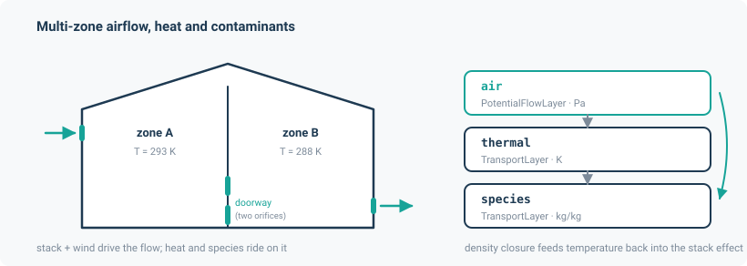

# Building physics

Multi-zone airflow, heat balance and contaminant transport in buildings, in a differentiable and
batched form.

Rooms are nodes; leaks, doorways, fans, ducts and dampers are edges. The air layer solves for the
zone pressures so that mass is conserved at every zone: air moves under buoyancy, wind pressure
and mechanical pressure, and each edge's element turns the pressure difference across it into a
mass flow. Heat rides on that airflow and conducts through walls with thermal mass; contaminants
ride on it too, generated by constant, cutoff, decaying and burst sources. Because air density
depends on temperature and the stack effect depends on density, the airflow and heat problems
are genuinely two-way coupled.

**Units.** Mass flow kg/s, temperature K, heat W, mass fraction kg/kg, pressure Pa. The whole
application works in `float64` regardless of the network's default dtype.

```python
from noodl.apps.building_physics import (
    Zone, WallMass, add_zone, build_model, initial_state,
    add_large_opening, orifice_elements_from_edges,
)
```



Every type this application offers — what it does and how to call it — is listed in its [catalogue](../catalogue/building_physics.md). It is set up and run like every other model; see [Using noodl](../usage.md).

## Building a model in Python

Two rooms joined by a doorway, one of them heated, with two leaks to ambient:

```python
import torch
from noodl.apps.building_physics import Zone, add_zone, add_large_opening, orifice_elements_from_edges
from noodl.apps.building_physics import build_model, initial_drivers, initial_state
from noodl.drives import Stack
from noodl.topology import Network

F64 = torch.float64

net = Network(dtype=F64)
net.add_node("ambient", z_ref=0.0)
add_zone(net, Zone("A", volume=60.0, T0=288.15))
add_zone(net, Zone("B", volume=60.0, T0=285.15))

add_large_opening(net, "A", "B", H=2.0, W=0.9, z_mid=1.0, Cd=0.78)
net.add_edge("ambient", "B", kind="airpath", z_path=0.2, Cd=0.6, area=0.05)
net.add_edge("ambient", "B", kind="airpath", z_path=1.8, Cd=0.6, area=0.05)

el = orifice_elements_from_edges(net, "airpath")
model = build_model(
    net,
    air_elements=[el],
    drives=[Stack.from_network(net, "airpath")],
    coupling="iterate",
    iterate_tol={"thermal": 0.01},
    iterate_max=50,
)

air, th = model.refs.air, model.refs.thermal
state = initial_state(model)                    # room temperatures from each zone's T0
drivers = initial_drivers(model, values={
    th.boundary_temperature: {"ambient": 283.15},
    th.sources: {"A": 1000.0},                  # a 1 kW heat source in room A
})
model.check(state, drivers).raise_for_errors(strict=True)
state = model.step(state, drivers, dt=60.0)

print(th.temperature.named(state[th.temperature]))   # {"A": T_A, "B": T_B} in K
print(state[air.flow][0])                             # doorway low-opening flow, kg/s
```

*(Adapted from `benchmarks/natural_ventilation.py`, the golden reference case.)*

`state` and `drivers` are plain dictionaries of tensors. The references only name their keys
(`th.temperature` is `"thermal.x"`, `th.sources` is `"thermal.sources"`, `air.flow` is
`"air.q"`) and build each tensor in that key's node order: full node order for sources,
the layer's boundary order for `boundary_temperature`, its active interior order for
`temperature`. Hand-built tensors in those orders still work, and `model.check` catches one
in the wrong shape. [Using noodl](../usage.md) covers the details.

The node and edge attributes this example sets (`volume`, `T0`, `z_ref`, `z_path`, `Cd`,
`area`), and the wind attributes a `Wind` drive reads (`azimuth`, `Cp`, `Ch`, `profile`),
are listed with their units under [Network attributes](../catalogue/building_physics.md#network-attributes).

Models can also be read from CONTAM `.prj`/`.wth` files or from a Modelica Buildings Library
export — see [File formats](../formats/index.md).

## The API

### Zones and walls

| Object | Purpose |
|---|---|
| `Zone(name, volume, T0=293.15, z_ref=0.0, wall=None)` | A room. `volume` in m³, `T0` the initial temperature, `z_ref` its reference height. |
| `WallMass(name, capacity, ua_zone, ua_ambient)` | A lumped wall node: heat capacity J/K, conductances W/K to the zone and to ambient. |
| `add_zone(net, zone, ambient="ambient")` | Adds the zone's air node and, if `zone.wall` is set, the wall node plus `kind="wall"` edges `zone → wall → ambient`. |

`WallMass` refuses a non-positive `ua` at construction. A negative conductance makes the
conduction operator anti-diffusive — it violates the maximum principle — and *every solve still
reports success*, because nothing downstream looks at the sign. Zero is refused as "a wall that
conducts nothing".

### Layers and model assembly

| Function | Returns |
|---|---|
| `thermal_layer(net, *, ambient, name="thermal", flow_kinds=("airpath",), conduction_kind="wall", c_p=1005.0, rho=1.2041, scheme="exact", fixed_temperature=())` | The heat `TransportLayer`. Capacity is $\rho c_p V + C_{\text{node}}$ per active interior node. Raises naming any node with zero heat capacity. |
| `species_layer(net, *, ambient, name="species", flow_kinds=("airpath",), rho=1.2041, n_species=1, scheme="implicit", species_names=None)` | The contaminant layer, as mass fractions, capacity = zone air mass $\rho V$ (CONTAM's convention). |
| `build_model(net, *, air_elements, drives, ambient="ambient", thermal=True, species=0 (a count or a list of names), density="ideal_gas", density_kwargs=None, coupling="pingpong", iterate_tol=None, iterate_max=20, thermal_scheme="exact", species_scheme="implicit", flow_kinds=None, return_inputs=False)` | The assembled `Model`; with `return_inputs=True`, `(model, state, drivers)` like the other applications. |
| `initial_state(model, *, values=None)` | Temperatures from each node's `T0`, zeros for species; then `values` by node name. |
| `initial_drivers(model, *, values=None)` | Zero boundary pressures, boundary temperatures from `T0`, zero boundary species; then `values` by node name. See [Using noodl](../usage.md). |

`density` selects the closure relating temperature to air density:

- `"ideal_gas"` → `IdealGasDensity`: $\rho = P_{\text{ref}} / (R T)$, with `P_ref` overridable per
  call through `drivers["P_ref"]`.
- `"linear"` → `LinearDensity`: the Boussinesq form
  $\rho = \rho_0\,(1 - (T - T_0)/T_0)$, which is what the Li and Delsante analytical solutions
  assume.

`flow_kinds` narrows which edge kinds advect heat and species; it defaults to every air element's
kind. Naming a kind no air element provides raises — a kind the air layer does not solve carries
no flow, so heat and species would silently not advect on it.

### Contaminant sources

CONTAM's four source types, all in `noodl.apps.building_physics.sources`:

| Source | Model |
|---|---|
| `ConstantSource(node, G, R=0.0)` | $S = G - R x$ (TN 1887r1 eq. 15) |
| `CutoffSource(node, G, x_cut)` | $S = \max(G(1 - x/x_{\text{cut}}), 0)$ (eq. 17) — clamped at zero rather than going negative, because CONTAM's cutoff source models generation that *shuts off*, not a sink |
| `DecayingSource(node, G0, tau, t0=0.0)` | $S = G_0 e^{-(t-t_0)/\tau}$ for $t \ge t_0$ |
| `BurstSource(node, mass, t_burst, dt)` | `mass` delivered uniformly over $[t_{\text{burst}}, t_{\text{burst}} + dt)$ |

`assemble_sources(sources, t, x_full)` sums them; `sources_from_project(project, dt=60.0)` builds
them from a `.prj`'s own source records.

## Airflow elements

Every edge of the air layer carries an element: a law giving the flow $F$ through the edge from
the pressure difference $\Delta p$ (Pa) across it, together with its derivative for Newton. The
element classes live in `noodl.elements`; two builder helpers used below, `mass_orifice` and
`orifice_elements_from_edges`, come from this building application instead. They are grouped
here by the physics they express. Where two
elements describe the same physics they differ in two respects that matter in practice: how the
law is regularised near $\Delta p = 0$, where a power law with $n < 1$ has infinite slope, and
which air density enters its coefficient. The **Source** line under each group says where the
equations come from; `RegularizedPowerLaw`, `SplineFlowTable`, the door elements and
`AirMedium` follow the Modelica Buildings Library (MBL) v13.0.0.

### Power-law openings

Cracks, leaks, orifices and other small openings: $F = C\,\operatorname{sign}(\Delta p)\,\lvert\Delta p\rvert^{n}$.

| Element | What it computes |
|---|---|
| `PowerLaw(C, n, *, dp_transition=1e-3, regularised=None)` | The power law with flow coefficient $C$ and exponent $n$; $F$ is in whatever flow units $C$ carries. |
| `Orifice(Cd, A, *, rho=1.2)` | `PowerLaw` with $C = C_d A \sqrt{2/\rho}$, $n = 0.5$: the sharp-edged orifice, as a volume flow in m³/s ($A$ in m²). |
| `mass_orifice(Cd, A, *, rho=1.2041)` | `PowerLaw` with $C = C_d A \sqrt{2\rho}$, $n = 0.5$: the same orifice as a mass flow in kg/s (in `noodl.apps.building_physics`). |
| `orifice_elements_from_edges(net, kind, *, rho=1.2041)` | One mass-flow `PowerLaw` over every edge of a kind, $C_e = C_{d,e} A_e \sqrt{2\rho}$, reading `Cd` and `area` off each edge (in `noodl.apps.building_physics`). |
| `RegularizedPowerLaw(C, m, *, dp_turbulent=0.1, form, rho_default)` | The power law with exponent $m$, always returning mass flow in kg/s. `form="volume"`: $C$ is a volume-flow coefficient and the result is multiplied by `rho_default`. `form="mass"`: $C$ is a mass-flow coefficient, used as it is. |
| `regularized_orifice(A, CD=0.65, m=0.5, dp_turbulent=0.1, *, rho_default)` | Volume form, $C = C_D A \sqrt{2/\rho_{\text{default}}}$. |
| `effective_leakage_area(L, dpRat=4.0, CDRat=1.0, m=0.65, dp_turbulent=0.1, *, rho_default)` | Volume form from an effective leakage area $L$ (m²) at the reference pressure difference `dpRat` (Pa): $C = L\,C_{D,\text{Rat}} \sqrt{2/\rho_{\text{default}}}\;\text{dpRat}^{\,0.5 - m}$. |
| `power_law_from_point(dpMea, mMea_flow, m=0.5, dp_turbulent=0.1, *, rho_default)` | Mass form fitted to one measured pair: $k = \dot m_{\text{Mea}} / \Delta p_{\text{Mea}}^{\,m}$. |
| `power_law_from_points(dpMea, mMea_flow, dp_turbulent=0.1, *, rho_default)` | Mass form fitted to two measured pairs: $m = \ln(\dot m_0/\dot m_1) / \ln(\Delta p_0/\Delta p_1)$, then $k = \dot m_0 / \Delta p_0^{\,m}$. |
| `power_law_coefficient(C, m, form, dp_turbulent=0.1, *, rho_default)` | $C$ (or $k$) and $m$ given directly. |

The two families evaluate the same law but differ physically in two places.

- **Near zero pressure difference.** `PowerLaw` replaces the law below `dp_transition` (default
  $10^{-3}$ Pa) by the straight line $F = k\,\Delta p$ with $k = C\,\Delta p_t^{\,n-1}$, chosen so
  that the flow is continuous in value at the switch; this is the laminar blend CONTAM applies
  below a transition Reynolds number. Its slope changes there by the factor $n$. With
  `regularised=eps` it instead uses $F = C\,\Delta p\,(\Delta p^2 + \varepsilon^2)^{(n-1)/2}$,
  smooth everywhere. `RegularizedPowerLaw` replaces the law below `dp_turbulent` (default 0.1 Pa, a
  hundred times wider) by a seventh-order odd polynomial in $\pi = \Delta p / \Delta p_{\text{turb}}$,
  $F = C\,\Delta p_{\text{turb}}^{\,m}\,\pi\,(a + \pi^2(b + \pi^2(c + \pi^2 d)))$, whose
  coefficients depend only on $m$ and make the law twice continuously differentiable at the
  switch.
- **Density.** `Orifice` and `mass_orifice` fold one fixed density into $C$ when they build it
  (both produce a `PowerLaw`, which itself takes $C$ and $n$ as given). MBL's volume form
  multiplies by the medium's `rho_default`, its density at the medium's own fixed default
  state, which does not follow the zone temperatures; the mass form involves no density at
  all. Neither uses the density of the air actually passing through the opening;
  `UpstreamDensityPowerLaw`, below, does.

**Source:** `PowerLaw`/`Orifice`: CONTAM's power-law element (TN 1887r1). `RegularizedPowerLaw` and its
constructors: MBL's `Buildings.Airflow.Multizone` power-law elements (`Orifice`,
`EffectiveAirLeakageArea`, `Point_m_flow`, `Points_m_flow`, `Coefficient_V_flow`,
`Coefficient_m_flow`) and their shared regularisation, `BaseClasses/powerLaw.mo`.

### Density upwinding

`UpstreamDensityPowerLaw(C, n, *, src, tgt, m, rho_ref=1.2041, rho_key="rho", dp_transition=1e-3, regularised=None)`
is a `PowerLaw` whose coefficient tracks the density of the air entering the path:

$$
F = \left(\frac{\rho_{\text{up}}}{\rho_{\text{ref}}}\right)^{m} C\,\operatorname{sign}(\Delta p)\,\lvert\Delta p\rvert^{n},
\qquad
\rho_{\text{up}} = \begin{cases} \rho_{\text{src}} & \Delta p \ge 0 \\ \rho_{\text{tgt}} & \Delta p < 0 \end{cases}
$$

$C$ is the coefficient at the reference density $\rho_{\text{ref}}$ (kg/m³), and the node
densities are read from the full-node driver `drivers["rho"]`, the same one the `Stack` drive
reads. The exponent $m$ says how much density is folded into the coefficient: $m = 0$ for a
mass-flow rating, $m = 1/2$ for the orifice family ($C = C_d A \sqrt{2\rho}$, including both
openings of a two-orifice doorway), $m = 1$ for a volumetric rating. Air density changes by about
0.086 % per kelvin, so on a 20 K stack a coefficient held at reference density is about 1.7 %
wrong in mass flow. The flow stays continuous at $\Delta p = 0$, where the upstream node
switches; only its slope jumps there. `dp_transition` stays at reference conditions.

**Source:** CONTAM's evaluation of every power-law element with the density of the entering air
(TN 1887r1 section 3.2). The CONTAM reader builds every power-law path as this element.

### Quadratic and tabulated laws

| Element | What it computes |
|---|---|
| `Quadratic(a, b)` | The quadratic resistance law $\Delta p = a F + b \lvert F\rvert F$, inverted in closed form: $F = \operatorname{sign}(\Delta p)\, 2\lvert\Delta p\rvert / (\sqrt{a^2 + 4 b \lvert\Delta p\rvert} + a)$. Linear, with slope $1/a$, at small $\Delta p$ and quadratic at large, so it needs no separate regularisation. Requires $a > 0$ and $b > 0$. |
| `SplineFlowTable(dp_points, flow_points, *, form, rho_default=None)` | A measured pressure-flow curve: a monotone cubic Hermite spline through the $(\Delta p, F)$ knots, linearly extrapolated outside them, returning mass flow in kg/s. `form="volume"` scales volume-flow knots by `rho_default` before fitting; `form="mass"` takes mass-flow knots as they are. |

**Source:** `Quadratic`: CONTAM's quadratic element family. `SplineFlowTable`: MBL's `Table_m_flow` and
`Table_V_flow`.

### Large openings and doors

A doorway between two rooms at different temperatures carries flow both ways at once: warm air
out through the top, cool air in through the bottom. Three representations are available, at
increasing resolution of the pressure profile over the door's height.

**Two lumped orifices.** `add_large_opening(net, a, b, *, H, W, z_mid, Cd=0.78, kind="airpath")`
adds two edges, both oriented `a → b`, each an orifice of area $WH/2$ (m²) at height
$z_{\text{mid}} \mp 2H/9$ (m); build their element with `orifice_elements_from_edges`. The
`Stack` drive evaluates the hydrostatic pressure difference at each opening's own height, so a
temperature difference drives opposite flows through the low and the high opening. The
representation is exact for a neutral plane at mid-height. It uses `PowerLaw`'s laminar blend at
$10^{-3}$ Pa and the density convention of the element it is built with.
**Source:** CONTAM's two-opening doorway (`DR_PL2`, TN 1887r1 eq. 69–70).

**A closed-form door pair.** `OpenDoor` and `OperableDoor` (built with `open_door_pair` and
`operable_door_pair`) represent one door as two edges between the same two zones, both
oriented from side A to side B with the same $\Delta p = p_A - p_B$. Each edge carries half of a
regularised power-law flow on $\Delta p$, plus or minus a buoyancy exchange term
$\dot m_{ABt}$: a regularised square root of the temperature difference $T_A - T_B$ of the two
zones, read from `drivers["T"]`. At $\Delta p = 0$ the two edges carry $+\dot m_{ABt}$ and
$-\dot m_{ABt}$: pure exchange, with zero net flow. The flows depend on $(\Delta p, T_A, T_B)$
alone, and both terms use the medium's fixed `rho_default`. Parameters, with MBL's defaults: door
width `wOpe=0.9` m, height `hOpe=2.1` m, discharge coefficient `CD=0.65`, exponent `m=0.5`,
`dp_turbulent=0.01` Pa. `OperableDoor` blends the open door with the closed door's crack by an
opening signal $y$ from `drivers[y_key]`: the volume flow is $y V_{\text{open}} + (1 - y)
V_{\text{closed}}$, the buoyancy term is scaled by $y$ (the closed crack has none), and the
closed crack is an effective-leakage-area law with area `LClo` (m², no default).
**Source:** MBL's `DoorOpen` and `DoorOperable` (`BaseClasses/Door.mo`).

**Discretised compartments.** `DoorCompartment` and `OperableDoorCompartment`, with the
`DoorCompartmentHead` drive, cut the opening into `nCom` compartments of height
$\mathrm{d}h = h_{\text{Ope}} / n_{\text{Com}}$, one edge each;
`discretized_door(*, src, tgt, medium, nCom=10, wOpe=0.9, hOpe=2.1, hA=1.35, hB=1.35, CD=0.65, ...)`
and `discretized_operable_door` build a whole door. Compartment $i$ sees the pressure
difference at its own height,

$$
\Delta p_i = p_A - p_B + \rho_A g \left(h_A - (i - \tfrac12)\,\mathrm{d}h\right) - \rho_B g \left(h_B - (i - \tfrac12)\,\mathrm{d}h\right),
$$

with `hA`/`hB` the heights (m) of the zones' reference-pressure points above the bottom of the
door, so the neutral plane falls wherever the two pressure profiles cross rather than being
assumed at mid-height. Each compartment's volume flow is a power law with coefficient
$C_D\,\mathrm{d}A \sqrt{2/\rho_{\text{default}}}$, $\mathrm{d}A$ the compartment's area, and it is
converted to mass flow with the density of the zone the air comes from, selected per compartment
by a smoothed step of width $v_{\text{Zer}}\,\mathrm{d}A$ ($v_{\text{Zer}} = 0.001$ m/s). Unlike
the door pair, the densities $\rho_A$, $\rho_B$ are evaluated at the actual port pressure,
temperature and water content, read from `drivers["p_abs"]`, `drivers["T"]` and (for a moist
medium) `drivers["X_w"]`. The operable variant blends the open and closed coefficients,
exponents and areas by $y$.

`DoorPortStream(comp, head, direction, kind)` wraps a whole discretised door as MBL's two
port streams instead: one edge carrying `mAB_flow`, positive from A to B (`direction="ab"`), and
one carrying `-mBA_flow` (`"ba"`), with the compartments and their heads evaluated inside the
element. This is how the Modelica reader builds a discretised door. MBL moves the door's
enthalpy, moisture and trace substances on these two port flows, each upwinded on its own sign.
A transport over compartment edges would instead upwind each compartment's net flow, which
differs inside the smoothed step, where a compartment carries air both ways. The node mass
balance is the same either way, since the two streams sum to the compartments' net flow. Each
stream's `dflow` reports half the slope of the net flow, so that the pair's summed slope, the
only one the airflow Jacobian sees, is exact and each edge's slope stays nonnegative.
**Source:** MBL's `DoorDiscretizedOpen` and `DoorDiscretizedOperable`
(`BaseClasses/DoorDiscretized.mo`, `TwoWayFlowElement.mo`).

### Ducts, dampers, fans, fixed flows and conductances

| Element | What it computes |
|---|---|
| `Duct(L, D, eps, sum_C=0.0, *, A=None, Re_t=2000.0, rho=1.2041, mu=1.81625e-5, n_iter=4)` | Flow through a duct of length `L`, diameter `D` and roughness `eps` (m) with dynamic loss coefficients `sum_C`: $F = \sqrt{2 \rho A^2 \lvert\Delta p\rvert / (f L/D + \sum C)}$, the friction factor $f$ from the Colebrook equation iterated `n_iter` times, and a straight line through the origin below the transition Reynolds number `Re_t`. `rho` and `mu` are fixed at construction. **Source:** CONTAM TN 1887r1 section 8.3.3, eq. 50–52. |
| `Damper(C_pos, n_pos, C_neg, n_neg, *, dp_transition=1e-3)` | A backdraught damper: a separate power law, with `PowerLaw`'s laminar blend, for each flow direction. **Source:** CONTAM's `PL_BDF`/`PL_BDQ` elements. |
| `FanCurve(coeffs, q_max)` | A fan with cubic pressure rise $P(q) = a_0 + a_1 q + a_2 q^2 + a_3 q^3$, decreasing on $0 \le q \le q_{\max}$; the branch law $\Delta p = -P(q)$ is inverted for $q$. The flow is 0 when the back-pressure exceeds the shutoff pressure $P(0)$, and $q_{\max}$ when it is below $P(q_{\max})$. **Source:** CONTAM's cubic fan element. |
| `FixedFlow(q0)` | A prescribed supply or exhaust, $F = q_0$ whatever $\Delta p$. A zone connected to the rest of the network only through fixed flows makes the Jacobian singular; `solvers.grounding.spd_certificate` reports that case. **Source:** CONTAM's constant-flow fans. |
| `Conductance(g)` | The linear law $F = g\,\Delta p$, used for thermal conduction and passive exchange. |

### Air properties

The CONTAM-form elements carry one fixed reference density in their coefficients:
`RHO_0 = 1.2041` kg/m³ in the building application (`mass_orifice`,
`orifice_elements_from_edges`, the default of `Duct`, and the reference density of
`UpstreamDensityPowerLaw`); the core `Orifice` defaults to 1.2 kg/m³. A temperature-dependent
density reaches the airflow through the `density` closure of `build_model` (above), which feeds
the `Stack` drive and `UpstreamDensityPowerLaw`.

The MBL-derived elements take their densities from a medium. `medium(name)` returns an
`AirMedium` for one of `"moist_air"` (`Buildings.Media.Air`), `"moist_air_ideal_gas"`
(`Buildings.Media.Specialized.Air.PerfectGas`) and `"dry_air_ideal_gas"`
(`Modelica.Media.Air.SimpleAir`); the Modelica class path is accepted too, and is what the
medium's `name` reports. Each carries:

- `p_default`, `T_default`, `X_default` — the medium's fixed default state;
- `rho_default` — its density at that state, a plain number computed once and used in the
  coefficients of every MBL-derived power-law, table and door element. For `Buildings.Media.Air` it is
  about 1.2 kg/m³ whatever the temperature, because that medium's density depends on pressure
  only;
- `buoyancy_density(T, X_w)` — the density at `p_default` but at the actual temperature and
  water content;
- `density(p, T, X_w)` — the medium's own density function at pressure `p`;
- `specific_heat_cp(X_w)` — in J/(kg K).

**Source:** the media models of MBL v13.0.0 and the Modelica Standard Library v4.1.0.

## Verification

### Against ContamX

The reference is NIST's ContamX 3.4.1.7, driven through `contamxpy` (the `contam` extra, Windows
x86-64 only — the wheel bundles the engine). `noodl.apps.building_physics.contamx` provides `run_steady`
and `run_transient`, which run the engine on a scratch copy of the project and never mutate your
fixture directory; `airflow_convergence=(rcnvg, acnvg)` tightens ContamX's airflow tolerances in
that copy.

ContamX holds project input data in single precision (the fan rated 0.200683 kg/s comes back as
float32(0.200683) exactly), so the reference is only as precise as a float32 roundoff,
$u = 2^{-24} \approx 6\times10^{-8}$, in each input. Every tolerance below is a first-order budget
of such roundoffs through the compared quantity, not a fit to the measured error; ContamX's
airflow iteration is run at `(1e-10, 1e-12)` and noodl physics' Newton at 1e-14 kg/s so that neither
solver contributes.

| Check | Tolerance | Measured |
|---|---|---|
| Stack project, flow directions | exact signs | match |
| Stack project, flow magnitudes, over a ±20 K ambient sweep | rel 17.2–32.8 $u$ (1.02e-6 – 1.96e-6) | **7.2e-8 – 9.4e-8** |
| Stack residual without / with the zone-pressure density | 3e-5 – 6e-5 flat / < 1 % of that | 4.4e-5 / 9.4e-8 |
| Constant-mass-flow fan delivers its rating (0.200683 kg/s) | engine rel $u$, noodl physics rel 1e-12 | holds |
| Three-zone project, steady flows | rel 16 $u$ (9.5e-7) | **9.1e-8** |
| Three-zone project, transient concentrations, 24 steps at 300 s | rel 64 $u$ (3.8e-6) | **2.0e-7** |

The stack rows rely on two density effects matching ContamX's. Orifice coefficients are
corrected for the density of the air entering the path (freezing them at reference density
cost 1.7e-2, growing with $\Delta T$). And the project sets `densZP = 1`, zone density at the
zone's absolute pressure: ignoring it left a residual of 4.1e-5 – 4.4e-5, flat across the sweep,
because the stack pressure is a density difference that amplifies the |P_zone| / Pb ≈ 6e-6
density change about fourteenfold. The three-zone transient was 6.5e-6 while zone air mass was
held at the reference density 1.2041 kg/m³ rather than ContamX's `Pb / (R T)` (2.2e-6 apart at
293.15 K). What remains everywhere is one or two float32 roundoffs.

The path-flow sign convention was verified independently against two cases rather than assumed,
since `contamxpy`'s own documentation does not pin the sign of `getPathFlow`.

### Against OpenModelica (Modelica Buildings Library)

**Algebraic models (6, no volumes).** Every CSV row and column against OpenModelica's own
simulation, `|noodl - omc| <= 1e-6 |omc| + 1e-9` kg/s:

| Model | Worst relative error | Rows compared |
|---|---|---|
| OneWayFlow | 2.4e-16 | 501 |
| DoorOpenClosed | 1.2e-16 | 501 |
| OpenDoorPressure | 2.4e-16 | 49 |
| OpenDoorTemperature | 1.8e-11 | 49 |
| Orifice | 4.0e-16 | 501 |
| PowerLaw | 6.1e-16 | 501 |

All at round-off except `OpenDoorTemperature`, whose discretised-door port flows sit at 1.8e-11
relative — still five orders of magnitude inside the 1e-6 bound, and attributed to an
OpenModelica nonlinear-solver residual on the door's inflow-density loop, not a formula
difference (likely, not diagnosed: not shown by a tighter `omc` tolerance).

The **CONTAM cross-check** on `OneWayFlow` (13 pressure-difference knots × 8 elements, from
CONTAM's own validation table, `OneWayFlow.mo`'s `contamData`): noodl physics differs from CONTAM by at
most 0.74 % relative (7.68e-4 kg/s absolute) — exactly the amount MBL itself differs from CONTAM.
The assertion is `|noodl - contam| <= |omc - contam| + 1e-6 |omc| + 1e-9` at every entry: noodl physics
adds nothing to MBL's own departure from the table (41 of 104 entries miss the table's 3
significant figures, in MBL as much as in noodl physics).

**Dynamic models (13, with volumes).** Every volume stores its air compressibly, as MBL's
`MixingVolume` does (see "Volume mass storage" below), and every model is compared at the
reference's own precision. The reference CSVs were regenerated with DASSL at a tolerance of
1e-13; at 1e-14 DASSL returns no trajectory. At the models' declared 1e-6 the reference's
own error was of the order of the comparison: 5.6e-5 K on `ZonalFlow`, and a 5e-5 relative
door-flow wiggle after `CO2TransportStep`'s pulse.

noodl physics runs `scheme="midpoint"` and combines two runs, with steps in ratio 2, by
Richardson extrapolation (`run.extrapolate`). The midpoint scheme is second order: the
transport layers advance with the mean of the start- and end-of-step flows, and the volumes'
mass with the L-stable BDF2 rate. Extrapolation needs the error to expand smoothly in the step,
so the steps are laid out with care:

- Every signal event (a step, a pulse edge, a ramp corner) is a step boundary.
- Every **switch** is a step boundary too. A switch is where an element's law changes piece
  (the edges of its regularisation band, `Element.switching`) or where an edge flow changes
  sign, since the transport layers upwind on it. A step across one is split there, the
  crossing located on the step's own runs. `OneOpenDoor`'s door flows, reversing through their
  bands across a 14.4 s step, were off by 1.1e-4 of the flow floor before; with the switches
  located they are at the reference's resolution.
- The run at two substeps takes exactly the steps of the run at one, halved. The volumes start
  at MBL's `p_start`, so a start that releases an imbalance begins on a graded sub-grid; a
  start in balance only doubles its steps up from a tiny first one.

`ClosedDoors` and `ReverseBuoyancy` combine two and four substeps per output interval: at one
step per interval their crack flows switching on (`ClosedDoors`) and their orifices reversing
at 18 s (`ReverseBuoyancy`) are not yet in the asymptotic range of the extrapolation.

The metric is `|noodl - omc| / max(|omc|, floor)` at every row after `t = StartTime`. The floor
is 1e-3 of the model's largest flow for flows, and 1e-3 of the column's largest value
otherwise. The tolerance is 1e-6, applied to the difference beyond the reference's own
resolution. That resolution is, per model and variable kind, the largest amount the reference
moved when its tolerance was tightened from 1e-12 to 1e-13: a difference the reference itself
moves by under a tenfold tighter tolerance is not resolved by it. It decides only a few flows,
where noodl physics' runs at 1, 2 and 4 substeps agree to 1e-10 kg/s and the reference does not.
`OneOpenDoor`'s door flows at 28.8 s are 1.2e-8 kg/s from the reference, which moved by up to
2.9e-8 kg/s over its first rows. `NaturalVentilation`'s orifices at their reversal are
5.0e-10 kg/s from it, where it moved by up to 3.7e-9 kg/s. `ClosedDoors`' crack flows are
at most 1.3e-12 kg/s from it (the reference moved by 1.2e-11 kg/s), and `ReverseBuoyancy`'s
door flow at 612 s 1.7e-8 kg/s (it moved by 2.2e-8 kg/s).

The `t = StartTime` row, MBL's `p_start` initialisation, is reproduced too. Worst relative
error per variable, with the part beyond the reference's resolution in brackets where the two
differ and the first is above 1e-6, and the wall time of the two runs:

| Model | flow | T | p | Xi | C | substeps | time |
|---|---|---|---|---|---|---|---|
| ThreeRoomsContam | 4.3e-07 | 7.1e-09 | 1.2e-14 | 1.1e-11 | 0 | 1, 2 | 268 s |
| ThreeRoomsContamDiscretizedDoor | 4.1e-07 | 7.0e-09 | 6.5e-13 | 9.0e-12 | 0 | 1, 2 | 813 s |
| OneRoom | 1.5e-11 | 2.3e-14 | 1.4e-16 | 1.1e-14 | — | 1, 2 | 75 s |
| ZonalFlow | 0 | 2.4e-11 | 1.4e-16 | 3.3e-12 | — | 1, 2 | 135 s |
| CO2TransportStep | 4.5e-07 | 7.1e-09 | 3.4e-14 | 3.3e-11 | 3.8e-07 | 1, 2 | 933 s |
| OpenDoorBuoyancyDynamic | 5.8e-07 | 1.2e-10 | 1.4e-14 | 1.4e-14 | — | 1, 2 | 1059 s |
| OpenDoorBuoyancyPressureDynamic | 1.8e-07 | 2.6e-10 | 4.2e-15 | 3.9e-12 | — | 1, 2 | 1046 s |
| NaturalVentilation | 1.1e-06 (0) | 1.7e-13 | 1.5e-14 | 2.1e-14 | — | 1, 2 | 728 s |
| ReverseBuoyancy3Zones | 4.9e-07 | 3.3e-10 | 6.9e-14 | 1.1e-12 | — | 1, 2 | 1484 s |
| ClosedDoors | 1.2e-05 (4.7e-07) | 6.5e-12 | 3.5e-12 | 1.2e-11 | — | 2, 4 | 8112 s |
| OneOpenDoor | 7.2e-05 (0) | 1.2e-10 | 2.1e-11 | — | — | 1, 2 | 3012 s |
| ReverseBuoyancy | 8.1e-06 (0) | 1.5e-10 | 4.7e-10 | 4.7e-10 | — | 2, 4 | 3929 s |
| OneEffectiveAirLeakageArea | 4.4e-07 | 7.2e-13 | 1.8e-13 | 2.9e-13 | — | 1, 2 | 501 s |

No model needs a bound above 1e-6 (`PARITY_STORAGE` is empty). The storage-dominated models
also assert the storage mechanism on noodl physics' own history. `ClosedDoors` and
`OneOpenDoor` heat at constant volume (`sum V dp = (R/cv) int Q`): MBL's temperature rise over
noodl physics' is 1 to 1e-4, where the quasi-steady route was off by cp/cv = 1.40.
`ReverseBuoyancy` starts at MBL's `p_start` against a 100000 Pa boundary and cools as MBL
does: 0.8301 K in both by 21.6 s. `OneEffectiveAirLeakageArea` stores what its source injects,
to 3.5e-14 of the 36 kg injected.

Before volume mass storage these models were compared differently: the three storage-dominated
ones against bounds set from measurement (0.31 K, 243 Pa and 73 % of the largest flow on
`ClosedDoors`; 0.90 K, 566 Pa on `ReverseBuoyancy`), `OneEffectiveAirLeakageArea` refused, and
the other nine started from the state MBL's volumes reach after relaxing from `p_start`,
with the storage flows, their flow work and MBL's `der(Xi) = mbXi_flow/m` term missing (up
to 1.6e-2 relative in `NaturalVentilation`'s flows).

**Volume mass storage.** MBL's `MixingVolume` (`ConservationEquation.mo`) integrates the volume's
mass `m = V rho(p, T, X)`, its energy `U = m u`, its water mass fraction (`der(Xi) = mbXi/m`,
not the water mass) and its trace-substance masses. The reader writes these balances into the
existing layers: the air layer gets a storage node source per volume (so a zone's pressure is
an unknown even with no boundary in its group), the thermal and species layers get the zone's
actual mass as a per-step capacity and the storage-rate form of `TransportLayer(dilution=...)`,
and the energy balance gets MBL's flow-work, latent and moist-air carrier terms as sources
(`noodl.apps.building_physics.modelica.storage`). `read_modelica(..., mass_storage=False)`
gives the quasi-steady airflow of the CONTAM route instead.

Every column's numbers (not just the worst) are committed at
`tests/data/modelica/parity-algebraic.json` and `parity-dynamic.json` (regenerated only with
`NOODL_RECORD_PARITY=1`; see [Reproducing the export](../formats/modelica.md) on the Modelica
format page). The default `pytest` run compares the first rows of every dynamic model, in
parallel; `pytest -m slow` compares every row of every model.

### Against analytical solutions

Separately from ContamX parity, `tests/verification/test_natural_ventilation.py` checks the
coupled airflow-heat physics against the closed-form solutions of Li and Delsante (2001) for a
single ventilated zone — buoyancy-only, envelope-loss, assisting-wind and opposing-wind cubics —
plus an independent `scipy.optimize.fsolve` reference for a two-zone doorway case and a golden
regression at rtol 1e-8.

## Limitations

- **Airflow is quasi-steady on the CONTAM route.** There a zone's air mass is held fixed within
  a step, as in CONTAM: pressures and flows balance instantly and the air itself does not
  compress or expand. The Modelica route stores it by default (volume mass storage, above);
  `read_modelica(..., mass_storage=False)` gives the quasi-steady airflow there too, and the
  [storage-dominated parity group](#against-openmodelica-modelica-buildings-library) shows what
  that costs.
- **The default coupling is a single pass.** `build_model`'s `coupling` defaults to
  `"pingpong"`: a `.steady()` call then solves the airflow at the *initial* temperatures and does
  not re-converge. On the linear-density single-zone case it returns
  $T_z = T_o + S / (c_p F(293.15\,\mathrm{K}))$ rather than the coupled answer. Whenever the
  airflow depends on the temperatures it carries, pass `coupling="iterate"` with an
  `iterate_tol`.
- **`iterate_tol` cannot be tighter than the airflow solve itself.** Its floor is the potential
  solve's own Newton tolerance, propagated through the temperature response. A tolerance below
  that floor stalls, and `steady` raises an error naming the layer, the change reached and the
  tolerance asked for. Loosen `iterate_tol`, or tighten the airflow solve by passing Newton's
  `atol`/`rtol` as keyword arguments to `step` or `steady` (they reach the potential solve).
- **Multiple steady states: `"iterate"` may not find the one you want.** On Li and Delsante's
  opposing-wind single-zone case, which has three steady states, `coupling="iterate"` (a fixed
  0.5 relaxation) cannot hold the wind-driven, upward-flow state: it moves away from it even when
  started on it. Time stepping with the default `"pingpong"` coupling resolves all three states
  correctly, so for a case like this, step to steady state instead of calling `.steady()`.
- **Wall conductance is not learnable** through this application's API: `WallMass` takes plain
  floats for `ua_zone` and `ua_ambient`, so gradients do not reach them.
- **Doorway laminar transition is approximated.** Doorway openings use the generic laminar
  transition of `PowerLaw` (1e-3 Pa) rather than one derived from the door's own record. The
  effect is confined to pressure differences below $10^{-3}$ Pa across the doorway.
- **The Modelica import accepts a stated subset.** Wind pressure, weather data, controllers,
  and dynamic medium columns are refused with a named error; see [the Modelica import's refused content](../formats/modelica.md).

## Install

The application needs nothing beyond the base dependencies. The `contam` extra is required only
to run ContamX itself for a side-by-side comparison:

```bash
pip install "noodl-physics[contam]"    # Windows x86-64 only
```
