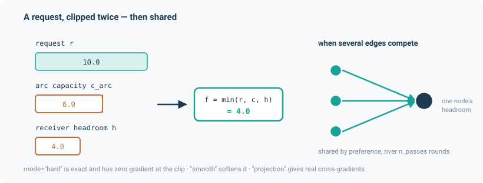

# WSIMOD — rule-based water-system allocation

Each arc carries the flow that is requested of it, clipped to the arc's capacity and to the free
storage at the receiving node — the allocation rule of WSIMOD, Imperial College's Water Systems
Integrated Modelling framework. In noodl this is implemented by `CapacitatedTransferLayer`, and
it is the framework's **fourth flow-determination mode**.

Every other application on this site determines a flow from physics: a potential difference, a
closure, or continuity. This one does not. Each edge carries a *requested* flow, typically
emitted by an upstream process rather than a pressure difference, and the layer clips it against
two independent bounds — the edge's own capacity, and the receiving node's remaining storage
headroom. There is no potential variable anywhere in the calculation.

$$
f = \min\left(r,\; c_{\text{arc}},\; h_{\text{receiver}}\right)
$$

This is push/pull semantics in the WSIMOD sense. An edge pushes a request at its target; the
target accepts up to its own headroom; the difference is left unmet at the source. Conservation
is exact by construction.

It is a genuinely different mode, not a variant of the potential layer. Water-resources
networks — abstraction licences, reservoir operating rules, treatment-works throughput — are
governed by *rules*, and the rule is the physics.

```python
from noodl.layers.capacitated import CapacitatedTransferLayer
```



## A worked example

```python
import torch
from noodl.layers.capacitated import CapacitatedTransferLayer
from noodl.topology import Network

F64 = torch.float64

net = Network()
for n in ("A", "B", "C"):
    net.add_node(n)
net.add_edge("A", "B", kind="link")
net.add_edge("B", "C", kind="link")

layer = CapacitatedTransferLayer(
    net, "cap", "link",
    s_max=torch.full((net.n,), 100.0, dtype=F64),
    c_arc=torch.full((2,), 10.0, dtype=F64),
)

s0 = torch.zeros(net.n, dtype=F64)
drivers = {"cap.requests": torch.tensor([2.0, 2.0], dtype=F64)}
s1, f = layer.step(s0, drivers, dt=1.0)

# f  == [2.0, 2.0]   — both requests pass through
# s1 == [-2.0, 0.0, 2.0]
#   A is only a source and loses 2; B gains 2 and loses 2; C gains 2.
```

*(From `tests/layers/test_capacitated.py`.)* Two adjacent tests show the clip branches: with
`c_arc = 1.5`, requests of `[5.0, 5.0]` give `f = [1.5, 1.5]`; with node C already full,
requests of `[2.0, 2.0]` give `f = [2.0, 0.0]`.

Note that `s1[0]` is negative. `step` bounds storage from **above** only — a source node may be
drawn below zero, which is a modelling choice belonging upstream of this layer.

## The API

`CapacitatedTransferLayer` has exactly two public methods.

```python
CapacitatedTransferLayer(
    net, name, kind, *,
    s_max,            # per-node storage ceiling, trailing shape (net.n,); inf for unbounded
    c_arc,            # per-edge arc capacity, in this kind's edge order
    preference=None,  # per-edge sharing weight, strictly positive; None means all ones
    mode="hard",      # 'hard' | 'smooth' | 'projection'
    tau=None,         # temperature; required for mode='smooth'
    n_passes=5,       # fixed sharing rounds
)

s_new, f = layer.step(s, drivers, dt, *, diagnostics=None)
```

`step` reads `f"{name}.requests"` from `drivers` (per edge, m³/s) and returns the new per-node
storage and the realised per-edge flow. `diagnostics`, when given, is filled with `"overflow"`
in m³/s per node — reported, never fed back.

**`dt` is load-bearing.** Headroom is converted to a *rate*, $(s_{\max} - s)/\Delta t$, so the
clip bounds the actual storage increase at any timestep, not only at $\Delta t = 1$. This is
regression-tested at $\Delta t = 2$ and $\Delta t = 86400$.

`preference` must be strictly positive. Projection mode divides by it live, and a non-positive
weight would give a clean forward value with a silent NaN gradient.

In a `Model`, a capacitated layer steps between the potential solves and the transport steps, so
a transport layer reading `"<layer>.q"` sees a freshly written flow whichever kind of layer wrote
it. A model owning one **refuses a steady pass and refuses `residuals()`** — a clip-and-allocate
rule is inherently discrete-time and has no steady meaning to report.

## The three modes

They compute the same thing. They differ in what the gradient does, and that is the entire
reason there is more than one.

### `"hard"` — exact, and zero-gradient at the clip

Plain `minimum` and `clamp`. Bit-identical to the bare clip formula, untouched by the existence
of the other modes. This is what WSIMOD parity is measured against.

Differentiable almost everywhere — but **at and near a capacity or headroom crossing the gradient
through the discrete branch choice is exactly zero**. A node moving from "headroom covers demand"
to "oversubscribed" carries no gradient signal across that boundary.

Use it for forward simulation, and for training that never crosses a binding constraint.

### `"smooth"` — a live gradient across the boundary

`minimum` becomes a softmin, $-\tau \log\sum e^{-a/\tau}$; `clamp` becomes a softplus; and the
**branch selection itself** is smoothed by a sigmoid-weighted blend of two whole branches, not
just the arithmetic inside each. That last part is the point: smoothing only the arithmetic would
leave the discrete choice, and its zero gradient, in place.

The cost is an $O(\tau)$ forward bias. The measured 1.79e-3 discrepancy in the parity table below
is *not* capacity-smoothing residue — every arc in that fixture is unbounded, so the softmin is
exact to float64. It is the softplus-at-zero bias, $\tau \ln 2 \approx 6.9\times10^{-4}$ at
$\tau = 10^{-3}$, at kink sites many requests sit exactly on, compounding through recurrent
storage.

Use it when you need a gradient across a capacity boundary but only care about *self*
sensitivity.

### `"projection"` — real cross-gradients between competing edges

This mode exists because of a bug that was found, not anticipated.

Smooth mode's proportional-share formula is
$h_{\text{free}} \cdot \text{pref}_i / \sum_k \text{pref}_k$. That depends only on the preference
weights and the total headroom — **never on any individual competitor's request**. So
$\partial f_i / \partial r_j = 0$ for a competing edge $j$, provably and not approximately. It
was confirmed empirically too: byte-identical zero cross-terms across 200 random trials.

The first implementation of projection mode reused that same formula, and therefore delivered
none of the mode's stated purpose — *gradients flowing through which arc absorbs a constraint*.
No amount of wrapping could have fixed it.

The fix routes the sharing site through a real coupled QP: minimise
$\sum_i \text{pref}_i (f_i - r_i)^2$ subject to $0 \le f_i \le \text{avail}_i$ per edge **and**
$\sum_i f_i \le h_{\text{free}}$ jointly. Its KKT stationarity reduces to

$$
f_i = \operatorname{clamp}\!\left(r_i - \frac{\lambda}{\text{pref}_i},\ 0,\ \text{avail}_i\right)
$$

for **one scalar $\lambda$ shared by every edge competing at that node** — and $\lambda$ is the
unique root of a monotone scalar equation, which is exactly `solve_monotone`'s contract.

That shared multiplier is what produces a genuine cross-gradient:

$$
\frac{\partial f_i}{\partial r_j} = -\frac{1/\text{pref}_i}{\sum_k 1/\text{pref}_k}
$$

On a symmetric-preference diamond this gives $\partial f_{BD} / \partial r_{CD} = -0.5$, which was
hand-derived and is checked for both sign and magnitude. The general formula was separately
hand-verified against asymmetric fixtures (`pref=[1,3]` → $-0.25$; `pref=[1,2,5]`) to four decimal
places. That confirms the *mechanism* generalises — not that $-0.5$ itself does.

A full Newton treatment of the QP was considered and rejected: it would need a
Fischer-Burmeister-smoothed complementarity condition, which is a harder-to-verify
reimplementation of what smooth mode already does, for no accuracy benefit.

## Proportional sharing and `n_passes`

Sharing happens only at a node that is the **target of more than one edge**. A node with a single
in-edge is never touched, however many out-edges lie downstream: this layer never caps an edge to
match a bottleneck further along the graph. That mirrors WSIMOD's own per-arc semantics — a node's
accept decision is its own check against its *own* headroom, never against its future ability to
forward the flow onward.

Each of the `n_passes` rounds computes a tentative flow, finds the nodes whose summed demand
exceeds their free headroom, and on those nodes replaces the tentative flow with a
preference-weighted share — with preference renormalised over the edges still *actively*
competing, so an edge that already got everything it asked for does not soak up a share it no
longer wants.

That renormalisation is what `n_passes` is for. Three edges into one sink with headroom 3.0, equal
preference, requests `[0.5, 10.0, 10.0]`:

| Passes | Realised | Total |
|---|---|---|
| 1 | `[0.5, 1.0, 1.0]` | 2.5 — under-uses the headroom by 0.5 |
| 2 | `[0.5, 1.25, 1.25]` | 3.0 — X's freed weight redistributes |
| 5 | `[0.5, 1.25, 1.25]` | 3.0 — already converged at pass 2 |

`remaining` only shrinks and `f` only grows round over round, so more passes move a share closer
to the true max-min-fair split and never past it. The default of 5 matches WSIMOD's own
`constants.MAXITER`; WSIMOD uses a `while` loop with early exit, and noodl uses a fixed count for
batched differentiability — each round is strictly non-expansive, so a fixed cap is a safe
over-approximation rather than a different algorithm.

## Verification

Against WSIMOD 0.8.1 (Dobson, Liu and Mijic), pinned **exactly** rather than with `>=`, because
the committed fixtures freeze one specific WSIMOD run and a newer release could silently change
the demos' forcing or node parameters.

The harness monkeypatches `Arc.send_push_request` / `send_pull_request` to capture every per-arc
requested/realised pair while WSIMOD runs its own `quickstart_demo` and `oxford_demo`. The
committed fixtures mean the parity tests run **without WSIMOD installed**.

| Row | Check | Tolerance | Measured |
|---|---|---|---|
| W1 | Hard clip vs WSIMOD's realised flows, `quickstart_demo`, all 1,456 steps | 1e-9 abs | **1.11e-16** |
| W2 | Same, `oxford_demo`, 20 of 21 arcs | 1e-6 abs | **1.86e-9** |
| W3 | `"smooth"` at $\tau=10^{-3}$ vs W1's own hard-clip output | 3e-3 abs | **1.79e-3** |
| W4 | `"projection"` vs W1's own hard-clip output | 1e-9 abs | **9.10e-13** |
| W5 | Conservation, both demos, all three modes | exact | holds, no reference needed |
| W6 | `gradcheck` through smooth and projection on the diamond | analytic | holds |
| W7 | `n_passes=5` vs a hand-converged reference | exact | holds |

### What the WSIMOD parity does not show

**Read this before citing W1 or W2 as verifying the capacity clip itself.**

Neither reference demo ever exercises a genuine arc-capacity clip. Of `quickstart_demo`'s 6 arcs
and `oxford_demo`'s 21, all but one sit at WSIMOD's own `UNBOUNDED_CAPACITY` of 1e15 for the
entire run — and the single finite-capacity arc (`abstraction_to_farmoor`, capacity 50000.0) never
sees a request above about 30,934 across oxford's full 1,456-day run. This was confirmed against
the fixture data directly: `requested > capacity` is true for **zero rows, for every arc, in the
whole fixture**.

W1 and W2 therefore check the clip arithmetic **only on the identity path**
($\min(x, c) = x$), never on the branch where $c$ actually binds.

The same applies, for a different reason, to the *other* bound: both fixtures set
$s_{\max} = \infty$ at every node, because the harness captures per-arc capacity only — WSIMOD's
node science, not its arcs, decides what a node accepts. So the receiver-headroom clip is the
identity everywhere and the proportional-sharing branch never runs against WSIMOD's numbers
either.

**This is not a gap in the layer's correctness.** Both binding branches are directly and
rigorously unit-tested on synthetic fixtures with deliberately tight bounds. The gap is narrower
and specific: WSIMOD's own numbers have never cross-checked the behaviour *at* the point a
constraint binds, because neither demo pushes any arc that far. It is the same distinction the
other applications draw between a coefficient *calibrated* to one source and one *independently
verified*.

A separate exclusion: `oxford_demo`'s `sewer_to_wwtw` arc is left out of W2 (20 of 21 arcs
compared) because it shows 185 of 1,456 mismatched timesteps, root-caused to WSIMOD's own `WWTW`
node applying an internal treatment-throughput constraint — a node-level *rate* cap the harness
does not extract and which this layer does not model, since `s_max` is a storage-headroom bound.
That arc's own capacity is still 1e15 throughout.

### Throughput

| Run | Measured |
|---|---|
| `oxford_demo` topology (21 arcs, 18 nodes), hard clip, 1,456 steps | batch 1: 1.004 s; batch 10: 1.338 s; batch 100: 1.439 s |

WSIMOD's own single-instance run takes about 4 s, but that is **not** a fair
batched-against-unbatched comparison and no budget is set on it. The benchmark also carries its
own caveat: with $s_{\max} = \infty$ everywhere, no node is ever oversubscribed, the sharing
branch never runs, and every pass after the first is a no-op. It measures the cheapest path only.

## Out of scope

- The **WSIMOD `Node` wrapper** — embedding a noodl `Model` as a live WSIMOD node via
  `push_set`/`pull_set` — is deferred.
- **The other nine WSIMOD pollutants.** The layer is species-count-agnostic, so this is a matter
  of widening a transport layer's species list and the fixture capture, not a change here.
- **Species and quality transport riding on a capacitated layer** is not wired up.
- **Time-varying arc capacities and storage bounds** — construction-time buffers only, since
  WSIMOD's own capacities are static within a run.
- A WSIMOD-captured fixture with a deliberately tight `c_arc`, which would close the parity gap
  described above, does not exist yet.

## Install

Nothing beyond the base dependencies. `wsimod==0.8.1` is needed only to regenerate the fixtures;
the parity tests themselves read the committed ones.
