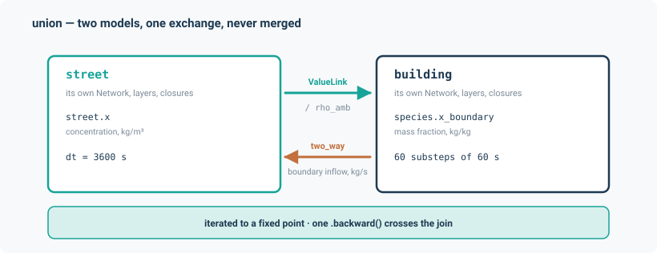

# Coupling

Two independently built models, exchanging named values each step, iterated to a fixed point —
and differentiable across the join.

## Two levels of coupling

These are easy to confuse, and they solve different problems.

**Within one model.** Several physics *layers* on **one** `Network` inside a single `Model`,
stepped together under `coupling="pingpong"` or `coupling="iterate"`. A building's airflow and
its heat balance are coupled this way: one graph, one model, several layers. See
[Layers and models](../concepts/layers.md#the-two-couplings-and-the-trap-in-the-default).

**Across two models.** Two *separately built* `Model` objects, each with its own `Network`, its
own layers and its own closures, coupled by `union`. A street network and a building are coupled
this way: two graphs that were never meant to be one.

This page is about the second.

```python
from noodl.couple import union, ValueLink, DriverAlias
```

## What `union` does — and deliberately does not

`union` exchanges named driver and state **values** between two ordinary `Model.step` calls each
outer step, iterating to a fixed point when a link is two-way.

It **never merges the networks, never rebuilds the layers, and never reconstructs the closures.**
That is a hard constraint, not an optimisation.

The reason is closures. Layers are reconstructible from standard arguments, but a closure is an
arbitrary application object — `StreetFlows`, a building's density closure — bound at
construction time to one specific `Network` with application-specific constructor arguments that
domain-agnostic code cannot know. Rebuilding them generically would require the coupling module
to import application internals, which would break the "neither model is modified" guarantee as
thoroughly as editing the application itself.

So `noodl/couple.py` **never imports from `noodl.apps.*`**. It reads and writes named keys and
applies registered unit conversions, and it never inspects any application's internals. That is
what lets the same machinery couple any pair of models, regardless of which layer type produces
which flow.

Each model's own `step` call stays an ordinary, unmodified call. And because PyTorch's autograd
tracks the computation graph rather than Python object structure, **gradients cross the join in
one `.backward()` exactly as if the two models were one object.**

After a union, the original models still run standalone, bit-for-bit identical — which is pinned
by a test.



## A worked example

```python
import torch
from noodl.couple import ValueLink, union

link = ValueLink(
    from_model="street", from_key="street.x", from_index=0,
    to_model="building", to_key="species.x_boundary", to_index=0,
    convert="concentration_to_mass_fraction",
)

city, state, drivers = union(
    {
        "street": (street_model, street_state, street_drivers),
        "building": (building_model, building_state, building_drivers),
    },
    shared=[link],
)

new_state = city.step(state, drivers, dt=1.0)
```

With `street.x[0] = 3.0` kg/m³ and the building's `rho_amb = 1.2`, the building sees a boundary
mass fraction of $3.0 / 1.2 = 2.5$ kg/kg for that step.

*(Condensed from `tests/test_couple.py`. Each model is built in the ordinary way; the full
real-data demo in `tests/verification/test_coupling_demo.py` uses a CONTAM `.prj` and an AQ_DT
street domain and is longer only because of the wiring, not the coupling API.)*

## The API

### `union`

```python
union(
    models,                # {tag: (Model, State, Drivers)}
    shared,                # a flat sequence of ValueLink and DriverAlias
    *,
    substeps=None,         # {tag: k} — step this model k times per outer step
    relaxation=0.5,
    iterate_rtol=1e-8,
    iterate_atol=0.0,
    iterate_max=20,
) -> (CoupledModel, {tag: State}, {tag: Drivers})
```

The `(Model, State, Drivers)` triple is exactly what `build_street_model`, `project_to_model`,
`build_sewer_model` and `build_water_model` all return. `union` returns fresh copies and never
mutates its inputs.

Two-wayness is set **per link** through `ValueLink.two_way`, not by an argument to `union`.

### `ValueLink`

```python
ValueLink(
    from_model, from_key, from_index,
    to_model, to_key, to_index=0,
    convert=None,          # a registered conversion name, applied forward
    two_way=False,
    convert_back=None,     # applied to the feedback flux
    sources_key=None,      # defaults to "<from layer>.sources"
)
```

- `from_key` is a transport layer's state key `"<layer>.x"`; `from_index` a position on that
  layer's **active interior** axis.
- `to_key` **must** be a transport layer's boundary driver `"<layer>.x_boundary"` — enforced at
  construction, raising if not; `to_index` a position on the **boundary** axis.
- `sources_key`, if given, must end `.sources`.
- The two-way feedback is **added** to the source term, never overwritten — so a lateral load
  already in `sources` survives.

**One-way link timing has a subtlety.** In a union with no two-way link, the single pass reads
the forward value from the *step-start* state — explicit ping-pong. In a union that *also* has a
two-way link, every pass, one-way links included, reads from the previous pass's output, so a
one-way link there carries an end-of-step value. One-way links are never part of the convergence
test.

### `DriverAlias`

```python
DriverAlias(
    source=("street", "theta_w"),
    targets=(("building", "theta_w", "street_rad_to_contam_deg"),),
)
```

The source is authoritative; every target driver is overwritten from it through *its own*
conversion. Applied **once per step, before any pass** — drivers do not change between passes,
only glue values derived from state do.

### Helpers

`apply_conversion(name, value, drivers)` applies a registered conversion, returning `value`
unchanged for `None` and raising with the sorted list of registered names for an unknown one — an
unregistered conversion is never silently treated as identity.

`transport_boundary_inflow(...)` returns the net mass inflow at a boundary node of a transport
layer, computed from a single state snapshot. `Model.ports()` cannot supply this: it reports
`boundary_flows` for *potential* layers only. The coupler itself no longer calls this to build
the two-way feedback (see "The fixed point" below) — it is kept as a public helper and used in
tests as an independent hand-reconstruction oracle.

## Unit conversions

| Name | Formula |
|---|---|
| `concentration_to_mass_fraction` | $x = c / \rho_{\text{amb}}$ |
| `mass_fraction_to_concentration` | $c = x \cdot \rho_{\text{amb}}$ |
| `street_rad_to_contam_deg` | $W_d = (270° - \deg\theta) \bmod 360°$ |
| `contam_deg_to_street_rad` | $\theta = \big(\mathrm{rad}(270° - W_d)\big) \bmod 2\pi$ |

The density pair is a **genuine unit mismatch**, not a scale factor: the street application's
transport state is a concentration in kg/m³, while CONTAM's species convention is a mass fraction
in kg/kg, and the two are related by the local air density.

The wind-direction pair exists because the two conventions differ in *both* origin and sense.
CONTAM's $W_d$ is degrees clockwise from north, giving the direction the wind blows **from**. The
street application's $\theta_w$ is radians counter-clockwise from east, giving the direction it
blows **toward**. A west wind is $W_d = 270°$ and $\theta = 0$; a north wind is $W_d = 0°$ and
$\theta = 3\pi/2$. Both are pinned on the cardinal points by test.

Note that the **backward** link in the canonical pairing needs `convert_back=None`: the feedback
is the recipient's own integrated boundary transfer (an amount, divided by `dt` into a rate), a
mass flux in kg/s on both sides already.

## The fixed point

When any link is two-way, `step` routes through the iteration, on a **recipient-first**
Gauss-Seidel schedule (closing review findings R1, R2 and R7): the model that a two-way link
writes its forward value *into* — the **recipient** — is stepped before its **donor**, and the
donor receives exactly the amount the recipient's own step integrated across the shared
boundary, never a flux recomputed from a state that has not been stepped yet.

1. Apply the one-way links from the latest state (the previous pass's output, or the step-start
   state on the first pass).
2. For each two-way link, compute the raw forward value from the latest state, relax it against
   the previous pass's value, and write it onto the **recipient**'s boundary driver.
3. Step every **recipient** once, **from the step-start state** — never from the previous pass's
   output — recording the boundary transfer `Model.step` integrated over the recipient's own
   whole outer step (its sub-steps included).
4. For each two-way link, divide that integrated transfer by `dt` and **add** it, as a source
   rate, into the **donor**'s sources, for the donor's own whole outer step.
5. Step every other model (donors and any uncoupled models) once, from the step-start state.
6. Test convergence.

Step 3's "from the step-start state" is what keeps the scheme correct: passes never compound
into `passes × dt`. Because the donor is always given exactly what the recipient's own scheme
integrated this same pass, **conservation holds on every returned pass, not only at
convergence** — no separate residual is needed to enforce it (independently checked in
`tests/test_couple_conservation.py`, closed exchanges to floating-point precision regardless of
scheme or sub-step ratio).

**Convergence is judged on the *unrelaxed* residual** of the fixed-point map,
$\lvert g(v_k) - v_k \rvert \le \text{atol} + \text{rtol}\,\lvert g(v_k) \rvert$ — the
**returned** forward value $g(v_k)$, recomputed from this pass's own output state, against
$v_k$, the *relaxed* value the recipient was actually stepped with in this same pass — per link
and per batch instance, inside `no_grad`, on **every** pass including the first. Judging the
relaxed increment that produced $v_k$ instead would make the effective tolerance scale with the
relaxation factor, letting a heavily damped run falsely report convergence while $g(v_k)$ still
disagrees with $v_k$ by a large, unrelaxed amount.

A model that is both a recipient and a donor of two-way links is refused at construction: the
recipient-first schedule has no defined order for a cycle of two-way links.

Failure to converge in `iterate_max` passes raises naming the link — for example
`"street:street.x[0]->building:species.x_boundary"` — the failing instances, and the largest
change.

With `diagnostics`, you get `{"passes", "converged", "max_change", "transfers"}` —
`transfers` is the recipient's own integrated transfer per two-way link, from the pass that
produced the returned state, keyed the same way as `max_change`.

## The canonical pairing: street ↔ building

- **Forward, converted:** the street's segment concentration `street.x[i]` becomes the building's
  `species.x_boundary`, divided by the building's own `rho_amb`.
- **Backward, two-way, unconverted:** the building is the **recipient**, so it is stepped first,
  from that boundary value; its own species boundary transfer, integrated over its whole outer
  step, divided by `dt`, is added into `street.sources` at the shared segment — already a mass
  flux in kg/s on both sides, so no conversion is needed.
- **Aliased weather drivers:** the street's `U_ref` → the building's `V_met` with no conversion
  (the street is built at $z_{\text{ref}} = 10$ m, matching CONTAM's met-station convention), and
  `theta_w` → `theta_w` through the wind-direction conversion.
- **Multi-rate:** `substeps={"building": 60}` — the street steps once per hour, the building
  sixty times at 60 s, with the glue-derived boundary held constant across the inner steps. That
  is an accuracy simplification, not a conservation one, and it is now **conservative**
  regardless: whatever the building actually integrates across those sixty sub-steps — with the
  boundary held constant or interpolated — is exactly the amount reported back and added to the
  street's sources, so holding it constant cannot leak or fabricate mass, only make the
  building's own response to a changing boundary less accurate within the hour.

Physically, infiltration draws segment air into the building and the building acts as a sink on
the street side. Both demos assert that sign.

## Validation

| Check | Tolerance | Measured |
|---|---|---|
| The returned state's forward value agrees with the value the recipient was stepped with, to rtol | rtol 1e-9, atol 1e-14 | holds |
| Gradient across the join vs central differences | rel 1e-5 | holds |
| `substeps={"building": k}` calls the fast model exactly `k` times per slow step | exact | holds |
| Closed two-way exchange conserves the total amount — exact/implicit/trapezoidal schemes, 1 and 4 recipient sub-steps | abs 1e-10 | holds |
| 2×2 analytic fixed point (one implicit step each, unit source into the recipient) solves to $(4/3, 5/3)$ | abs 1e-9 | holds |
| Structural guard: a two-way step assembles no dense topology operator (`upwind`/`incidence`/selectors) | n/a | holds |
| Synthetic back-coupling, 2×3 m canyon: one-way 4.169740e-08 vs two-way 4.145151e-08 kg/m³ | measured | **0.5897 %** change, 27 passes |
| Real `leiden_small`, segment 783, steady 2.079110e-07 vs coupled 2.078961e-07 kg/m³ | measured | **7.191e-5** (0.007191 %) change, 21 passes |
| Loose sequential file exchange vs the two-way result | measured | 0.5897 % discrepancy — equal to the street-side change, as expected for a boundary response linear in the shared value |
| Inverse 1: leakage calibration through the join | rel err < 0.05 | **1.288e-4**, final loss 3.4574e-08 |
| Inverse 2: source attribution by one adjoint pass vs central differences | rel 1e-4 | 7.2e-9, 1.1e-8; third source structurally zero |
| Inverse 3: one measured path recovers all four branch flows | rtol 1e-10 | exact |

The real-data row is worth reading carefully. A 0.007191 % change is **negligible** — and that is
the honest result, not a disappointing one. One building's infiltration should not measurably
change a whole street's concentration, and the number is correctly signed. The synthetic case,
deliberately sized so the building matters, shows 0.5897 %.

Pass counts moved by one relative to the previous (Jacobi-style successive-substitution) coupler
— 28 → 27 on the synthetic fixture, 22 → 21 on the real one — because the recipient-first
Gauss-Seidel schedule now produces a real per-instance convergence verdict on the **first** pass
(the old scheme's first pass wrote a placeholder that no pass could satisfy), rather than because
the new schedule needs systematically more or fewer passes to close the loop.

Throughput, on the headline union over 6 coupled hours with 60 building sub-steps per street
hour, re-measured after task 18b (`Model.step`'s `boundary_transfers` now names only the
linked layer, not every transport layer of the recipient — see below): batch 1 takes
52.647 s and 116 outer passes; batch 10, 61.282 s and 128 passes — the same pass counts as
before the recipient-first change (this benchmark runs at the looser default `rtol=1e-8`,
where the one-pass shift above does not show), and statistically indistinguishable from the
pre-18b numbers (56.968 s / 63.055 s respectively; run-to-run variance on this machine is a
few seconds either way). That is expected, not a null result: this benchmark's building
model (`project_to_model`) carries exactly ONE transport layer, `species`, which is also the
ONE linked layer, so `boundary_transfers=True` (every transport layer) and
`boundary_transfers={"species"}` (only the linked one) request `step_with_transfer` on the
same set here — nothing to skip. Task 18b's saving is for a recipient that ALSO carries an
unlinked transport layer (e.g. a `thermal` layer alongside `species`, as the building
application's own thermal builder produces, though this benchmark's `.prj`-based model does
not build one — "no thermal layer: a .prj carries no thermal data"); that case is covered by
`tests/test_couple_conservation.py`'s dedicated two-layer fixture and
`tests/test_model_transfers.py`'s `boundary_transfers` collection tests, not by this
benchmark. Batch 100 was not re-measured this round; its previous 150.288 s stands. The
measured after-18b numbers -- 52.647 s at batch 1, 61.282 s at batch 10 -- keep the same
sub-linear pattern as before (well under 10x the time for 10x the batch); no new ratio
against the un-re-measured batch 100 is computed here. No budget is set.

## Limitations

- **`CoupledModel.steady` is not built**, though the design names it in the intended public
  surface.
- **Relaxation is fixed at 0.5** in practice — it is a constructor parameter, but no adaptive
  scheme exists. Convergence takes 21–27 passes to rtol $10^{-10}$ on the demo fixtures. This is
  flagged as a known risk: recipient-first Gauss-Seidel substitution at fixed 0.5 relaxation can
  still converge to the wrong root of a repelling fixed point, the same issue the
  [building application's](building.md#limitations) three-root case runs into.
- **Single species, single flow kind only.** A two-way link is refused at construction
  (`ValueError`) unless both layers have `n_species == 1` and the recipient's layer has exactly
  one flow kind: `_reduced`'s single-species layout rule is ambiguous for a multi-species state,
  and the recipient's own transfer is read at one boundary node of a single-flow-kind layer.
- **The recipient-first schedule assumes no cycles of two-way links.** A model that is both a
  recipient and a donor is refused at construction, by name, in the error message — the
  conservative schedule is defined only when every two-way link can be given a strict
  recipient-before-donor order, which a cycle cannot.
- **Differentiated by unrolling** the outer passes, so memory grows with pass count. An
  implicit-function treatment of the fixed point is a recorded follow-up.
- **Ambient temperature is not coupled** in the demo — it reaches the building only through
  `rho_amb`, computed once from the `.prj`'s own `Ta`, and the AQ_DT forcing carries no
  temperature field.
- **A three-way union** (sewer + street + building) is deferred. The mechanism is expected to
  extend; it has not been built or tested.
- **`CoSim` and the WSIMOD `Node` wrapper are out of scope.** `union` is the only coupling route
  built. Coupling to a non-differentiable model outside the framework — EnergyPlus, WSIMOD
  itself — is not available.
- **`Model.current_flows`'s first-pass branch re-solves** the owning potential layer from scratch
  rather than reusing the pass's own upcoming solve. A recorded inefficiency.
