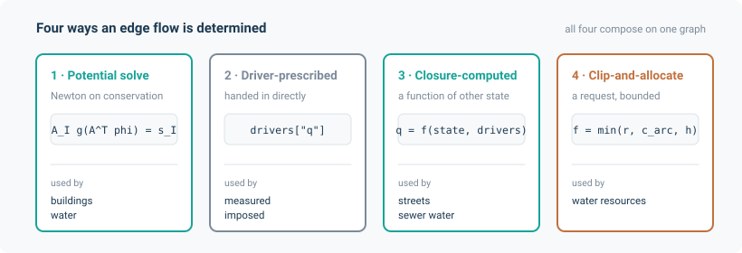

# Applications

noodl physics is one solver. The applications below are physical systems modelled with it, each a thin
layer of domain physics (its elements, drives and closures) over the shared core. Any of them can
be built directly in Python, as each page shows, or, where a reader exists, read from a model
file; see [File formats](../formats/index.md).

| Application | Physical system | Flow determination | Entry point |
|---|---|---|---|
| [Building physics](building_physics.md) | Multi-zone airflow, heat, contaminants | Potential: Newton on zone pressure | `build_model` |
| [Street air quality](street_aq.md) | Urban air quality, canyon exchange, routing | Closure: flows computed from the wind aloft | `build_model`, `StreetNetwork` |
| [Sewers](sewer.md) | Gravity hydraulics, headspace air, sulfide | Continuity on a tree for the water; Newton potential for the headspace air | `build_model` |
| [Water distribution](water.md) | Pressurised mains, pumps, tanks, demand | Potential: Newton on hydraulic head | `build_model` |
| [Capacitated allocation](capacitated.md) | Requested flows clipped to arc capacity and free storage at the receiving node | Capacitated clip | `CapacitatedTransferLayer` |
| [Coupling](coupling.md) | Two models meeting at a shared boundary | Two models exchanging values, iterated to a fixed point | `union` |

## Why these six

They are not a feature list. They are the argument that the factorisation works.

Each uses a **different one of the four flow-determination modes**, and between them they cover
all four:

- The **building physics** and **water** applications solve for a potential — pressure in
  pascals, hydraulic head in metres. Newton on a nodal conservation residual.
- The **street air quality** application has no potential at all. The along-canyon velocity is
  a closed-form function of the wind aloft, so a closure computes every flow directly.
- The **sewer** application's water side exploits the fact that a tree has an empty cycle space:
  continuity alone fixes every discharge, in closed form, with no solve. Its *headspace air*
  side, on the same graph, is a full Newton potential solve.
- The **capacitated allocation** application has no potential and no continuity solve — a
  request, clipped against capacity and headroom.

And they share machinery in ways that would be coincidence if the abstraction were wrong. The
sewer's headspace air layer drives its Newton solve with the *same* `Stack` buoyancy term the
building application uses for room air. The water application's Darcy-Weisbach pipes can be the
framework's own `Duct` element in volumetric form (`friction="colebrook"`), though by default
they follow EPANET's own composite friction law. The sewer and water `.inp` readers share one
tokenizer. The `solve_monotone` root-finder that inverts Manning's equation for sewer depth also
solves the per-node QP inside the capacitated layer's projection mode.

## Verification

Each application page ends with a **Verification** section: code-to-code comparisons against
established reference models that solve the same equations (CONTAM and ContamX and the Modelica
Buildings Library for building physics, MUNICH for street air quality, SWMM through pyswmm for
sewers, EPANET 2.2 through WNTR for water distribution, WSIMOD for capacitated allocation), plus
checks against analytical solutions, conservation identities and finite-difference gradients.

A comparison of this kind runs noodl physics and a reference model on the same input and compares the
outputs at a stated tolerance. It shows that noodl physics solves the same model as the reference; it is
not evidence that the model describes reality. Where the reference model has not been run, as
for MUNICH on this release, the check is instead against the formulas and published results the
reference documents, and the application page says so. **Validation**, comparison against
measurements, is not claimed by any application yet.

Each page states its comparisons with an explicit tolerance and the value actually measured. The
pages are equally explicit about what a comparison *does not* show, and those caveats are
sometimes the most important thing on the page:

- The [capacitated allocation](capacitated.md#where-the-layer-differs-from-wsimod) page
  explains that WSIMOD's shipped demos never exercise a binding clip, how scripted WSIMOD cases
  cover those branches instead, and where the layer's semantics differ from WSIMOD's: sharing
  one node's headroom, and bottlenecks behind a pass-through node.
- The [street air quality](street_aq.md#limitations-and-caveats) page records that the published
  MUNICH idealised case cannot be reproduced absolutely, because its geometry was never
  published, and states the size of the remaining difference.
- The [sewer](sewer.md#coefficient-provenance) page marks each coefficient as verified,
  calibrated, or unverified, naming the source.

Where a reference model and noodl physics disagree, the pages say which is more likely to be right and
why. Several of the remaining discrepancies are the *reference*'s approximation — SWMM's
51-point circular-geometry lookup table, EPANET's float32 binary output — not noodl physics'.

## Starting a new application

The six are also a template. A new application is:

1. A **network builder** — domain dataclasses plus a function that turns them into a `Network`
   with the right edge kinds and attributes.
2. **Elements and drives** for whatever constitutive laws are not already in the core.
3. **Closures** for anything that is a function of solved state.
4. A **file reader**, if your field has a standard exchange format.
5. A **`build_*_model`** function returning `(model, state, drivers)`, and a `*_steady` helper if
   reactions mean `Model.steady` is not enough.

Every application follows exactly that shape, which makes them readable as worked examples.
