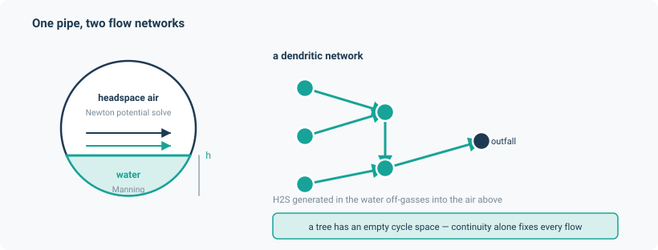

# Sewers

A differentiable gravity sewer: water, headspace air and sulfide, coupled.

Three physical subsystems share one network, and each uses a different part of the framework:

- **Water hydraulics** — partially full circular pipes under gravity, Manning's equation. On a
  dendritic network the cycle space is empty, so continuity alone fixes every discharge in
  closed form. No potential solve at all.
- **Headspace air** — the air above the water surface is its own flow network, a full
  `PotentialFlowLayer` driven by wall friction, the drag of the moving water surface, and
  buoyancy from the sewer-to-ambient temperature difference, vented through manhole leaks and
  optional fans.
- **Water quality** — BOD decay and Pomeroy–Parkhurst sulfide generation in the wastewater, with
  two-film Henry's-law transfer of H₂S into the headspace air, as two coupled transport layers.

The question it answers is corrosion and odour risk: how much H₂S is generated, and how much
reaches the air where it attacks the crown of the pipe.

```python
from noodl.apps.sewer import (
    SewerNetwork, Manhole, Pipe, Outfall, tree_steady,
    build_sewer_model, sewer_steady, initial_state,
    read_inp, pipe_table, to_ppm, to_mg_per_litre,
)
```



## A worked example

```python
from noodl.apps.sewer import build_sewer_model, sewer_steady, pipe_table, tree_steady

model, state, drivers = build_sewer_model(tree_steady())
final = sewer_steady(model, state, drivers)
rows = pipe_table(model, final, drivers, path="pipes.csv")

# rows[0] is pipe "C1": q = 0.05 m3/s, h = 0.153007001 m
```

*(From `tests/apps/sewer/test_report.py`.)* `tree_steady()` is the committed 5-conduit, 6-node
fixture; its steady discharges are 0.05, 0.08, 0.03, 0.13 and 0.16 m³/s.

From a SWMM file instead:

```python
from noodl.apps.sewer import read_inp, build_sewer_model

net, inflows, pollutants = read_inp("tree_steady.inp")
model, state, drivers = build_sewer_model(net)
```

For a single step rather than a steady state:

```python
new = model.step(state, drivers, 60.0)
residuals = model.residuals(new, drivers)     # per-layer nodal balance
```

## Building a network

| Object | Fields |
|---|---|
| `Manhole(name, invert, ground=None, inflow=0.0, surface_area=None)` | A junction. `surface_area` defaults to SWMM's `MIN_SURFAREA`, 1.167 m² — a 4 ft shaft. |
| `Pipe(name, u, v, length, diameter, n, slope)` | A circular gravity conduit. |
| `Outfall(name, invert)` | The root of a tree. |
| `SewerNetwork(manholes, pipes, outfalls, routing="KINWAVE", notes={})` | The whole network. |

`validate()` refuses, by name: duplicate node or pipe names; a pipe naming an unknown node;
non-positive slope, diameter, length or roughness; **a manhole with anything other than exactly
one outgoing pipe**; an outfall with an outgoing pipe; and a manhole whose component never
reaches an outfall — which also catches cycles.

That one-outgoing-pipe rule is the dendritic constraint, and it is what makes the closed-form
flow solve valid.

## `build_sewer_model`

```python
model, state, drivers = build_sewer_model(
    net,
    storage=False,          # implicit-Euler manhole storage sweep
    air=True,               # the headspace layer
    quality=True,           # the two quality layers
    species=("bod", "sulfide"),
    f_air=0.02, f_i=7.49e-4, c_s=1.0,
    leak_area=8e-4, leak_cd=0.6, fans=(),
    coupling="pingpong", scheme="implicit", dt_storage=None,
)
```

`air=False` gives the water-only model the SWMM parity rows use. `fans` names manholes carrying
a prescribed extraction (m³/s, positive out).

`dt_storage` (optional) declares the interval the manhole storage sweep integrates over. When given,
a step at any other interval is refused by name. Omit it (the default) to follow the model's own
step interval via the `StepContext` the closure receives.

`initial_state(model, drivers=None)` builds the all-zero state, dispatching on each layer's
quantity. When `drivers` is given, it also evaluates the initial storage (by querying
`model.initial_capacities`), which a step with a changing capacity requires to be in the step-start
state. Drivers are required whenever the model has a storage sweep and a transport layer.

`sewer_steady(model, state, drivers, *, reaction=None, dt=60.0, max_iter=500, tol=1e-12)` steps
repeatedly until every transport layer stops changing. You need it rather than `Model.steady`
whenever quality is on, because `Model.steady` never applies reactions.

`model._apply_closures(state, drivers)` resolves the hydraulics without stepping any layer,
which is the quickest way to inspect `sewer.q`, `sewer.h`, `sewer.v` and the rest.

## The physics

### Exact circular geometry

With the wetted half-angle $\theta = 2\arccos(1 - 2h/D)$:

$$
A = \frac{D^2(\theta - \sin\theta)}{8},\quad
P = \frac{D\theta}{2},\quad
R = \frac{A}{P} = \frac{D}{4}\left(1 - \frac{\sin\theta}{\theta}\right),\quad
T = D\sin\frac{\theta}{2}
$$

These exact relations are used deliberately in place of SWMM's own 51-point lookup table — SWMM's
manual states the tables are a speed optimisation over these same trigonometric relations. That
choice is the source of the ~1e-3 depth and volume discrepancy in the parity rows below, and
noodl's numbers are the more accurate ones.

Numerical care worth noting: the `arccos` argument is clamped to the *exact* domain $[-1, 1]$,
not an epsilon-shrunk one — that was tried and rejected because it shifts the boundary value by
$O(\sqrt{\varepsilon})$. Every $0/0$ site is guarded on **both** branches of its `torch.where`,
so a masked-out branch cannot back-propagate `inf * 0 = nan`.

### Manning and normal depth

$Q = \frac{1}{n} A R^{2/3} \sqrt{S_0}$, with the SI constant 1.0. $Q$ is strictly increasing in
$h$ up to $h/D = 0.938$ and decreases above it, so the ascending branch is the entire invertible
domain. `normal_depth` inverts it with `solve_monotone`, batched over pipes and instances.

`q = 0` returns exactly `h = 0` with gradient 0 — a documented modelling choice, since the true
$dh/dq$ diverges there. A discharge above `capacity_flow` is **refused by name**: surcharge and
backwater are out of scope.

### The storage sweep

With `storage=True`, each manhole's water level is advanced by implicit Euler:

$$
A_s \frac{H^{n+1} - H^{n}}{\Delta t} + Q_{\text{out}}(H^{n+1}) = \sum Q_{\text{up}} + \text{lateral}
$$

solved with `solve_monotone` bracketed on $[0, 0.938D]$, valid because both left-hand terms are
strictly increasing in $H^{n+1}$. The sweep runs level-synchronously from leaves to outfall using
topological levels computed once; the only Python loop is over tree *levels* (depth 3 on the
committed fixture), never over individual pipes. Each level is one gather and one scatter.

When `storage=True` the normal-depth inversion is skipped entirely — the sweep has already solved
each manhole's own level, which *is* its outgoing pipe's entrance depth, bit-for-bit and with no
root-find.

### Headspace air

`Headspace` is an `Element` with $\Delta p = R(h)\,\lvert Q \rvert Q$ and

$$
R(h) = \frac{f_{\text{air}} L \rho}{2 D_h A_{\text{air}}^2}
$$

inverted in closed form with a laminar blend near zero. The air-side wetted perimeter is
$P_{\text{air}} = \pi D - P(h) + T(h)$ — the dry wall plus the water surface acting as a moving
wall — and $D_h = 4A_{\text{air}}/P_{\text{air}}$.

`Drag` is a `Drive`: $D = \tfrac{1}{2} f_i \rho U_s \lvert U_s \rvert T L / A_{\text{air}}$ with
$U_s = c_s V_w$. The full branch law is $\Delta p = R\lvert Q\rvert Q - D - B$, where $B$ is the
**same `Stack` buoyancy drive the building application uses** — reused unchanged.

The drag sign convention is documented and was verified rather than assumed: the drive returns
$+D$ so that with both ends at ambient the air moves from the upstream manhole toward the
downstream one, the direction the wastewater drags it. The opposite sign was tried and caught by
the measurement.

### Quality

| Quantity | Form |
|---|---|
| Henry's constant | $H(T) = 1/(H_{cp}(T) R T)$, $H_{cp}(T) = H_{cp}(298.15)\exp\!\big(2100(1/T - 1/298.15)\big)$ |
| Free sulfide fraction | $f = 1/(1 + 10^{\,\mathrm{pH} - \mathrm{p}K_a})$ |
| Transfer coefficient | $K_L a = a(1 + b\,\mathrm{Fr}^2)(S_0 V)^{3/8} / d_m$ per hour |
| Two-film flux | $K_L a \, V \, \big(f C_S - C_G (M_S/M_{\mathrm{H_2S}}) / H\big)$ kg S/s |
| Sulfide generation | $d[S]/dt = M' \mathrm{EBOD} / R_h - m [S] (S_0 V)^{3/8} / d_m$ |
| BOD decay | $d[\mathrm{BOD}]/dt = -k_{\mathrm{BOD}} \cdot 1.07^{\,T-20} [\mathrm{BOD}]$ |

The gas concentration is converted to sulfur-equivalent before the Henry partition is applied, so
the flux is symmetric between the two source terms in moles of S.

`LateralLoads` must be registered **before** `H2STransfer` in the closure list, so that
`H2STransfer` adds its transfer term rather than overwriting the lateral load.

## The SWMM `.inp` reader

**Read:** `[TITLE]`, `[OPTIONS]`, `[JUNCTIONS]`, `[OUTFALLS]`, `[CONDUITS]`, `[XSECTIONS]`,
`[INFLOWS]`, `[POLLUTANTS]`.

**Constraints:** `FLOW_UNITS` must be `CMS` — the reader is SI-native and does not convert.
`LINK_OFFSETS` must be `DEPTH` or `ELEVATION`. Only `CIRCULAR` cross-sections. Only constant
`FLOW` baselines and constant `CONCENTRATION` pollutant baselines; a time-series inflow is
refused, because time variation belongs in the drivers.

**Refused by name**, because skipping them would silently change the physics: `[DWF]`,
`[STORAGE]` with non-constant area, `[PUMPS]`, `[WEIRS]`, `[ORIFICES]`, `[OUTLETS]`,
`[DIVIDERS]`, `[SUBCATCHMENTS]`, `[RAINGAGES]`, `[CONTROLS]`, `[CURVES]`, `[TIMESERIES]`,
`[LID_USAGE]`, and any other section carrying content.

**Slope** follows SWMM's own definition $S_0 = dy/dx$ with $dx = \sqrt{L^2 - dy^2}$ — the 3-D
chord, not the naive $dy/L$. Zero or adverse fall is refused, as is a fall $\ge$ length.

## Validation

Against SWMM 5.2.4 through `pyswmm`, on the committed `tree_kinwave.inp` fixture. The engine
identity itself is pinned: `engine_version == "5.2.4"` and `flow_routing_error == 0.0`.

| Row | Check | Tolerance | Measured |
|---|---|---|---|
| W1 | Pipe flows | rel 1e-9 | **1.370e-14** |
| W2 | Normal depths | rel 1e-3 | **5.464e-4** |
| W3 | Velocities, against the binary output series | rel 1e-3 | **6.257e-4** |
| — | Conduit volumes | rel 1e-3 | **6.438e-4** |
| W4 | Tracer concentration, closed form | rel 3e-5 | **7.811e-6** |
| W4 | Tracer, the actual model, Richardson-extrapolated | rel 3e-5 | **8.05e-6** |

The W2 test additionally asserts the discrepancy is **greater than 1e-5** — a deliberate guard.
Too close a match would mean noodl had accidentally reproduced SWMM's lookup-table quantisation
rather than the exact closed form, which is a bug in the other direction.

The second W4 row needs explanation. noodl's reaction is explicit forward Euler, operator-split
from transport; SWMM's is a continuous exponential decay. The $O(\Delta t)$ difference measures
3.47e-3 at $\Delta t = 60$ s, 2.87e-4 at 5 s and 5.79e-5 at 1 s — none inside the 3e-5 target
directly. Richardson extrapolation $2C(\Delta t) - C(2\Delta t)$ removes the leading term and
reaches 8.05e-6, with the three $\Delta t$ pairs agreeing to 3e-8.

Non-SWMM validation, for the physics SWMM does not model:

| Check | Result |
|---|---|
| A2: Pescod & Price Tyneside ventilation band (105–315 m³/h) | bracketed; open-both-ends gives 1253.78 m³/h, a 17.27% velocity ratio, inside their 5–30% envelope |
| A3: fan draws exactly through the leaks | balance 1.234e-14, nodal residual 6.3e-15, power residual 8.1e-13 |
| H3: transfer-dominated state reaches Henry equilibrium | rel 1e-10, **measured 1.4e-16** |
| C1: air-layer nodal residual, and Tellegen power balance | 4.518e-13 kg/s, 6.141e-12 W |
| C2: cross-phase sulfide conservation | rtol 1e-12 |
| C3: adjoint gradients vs Richardson-extrapolated central differences | rel 1e-6, holds |
| W7: storage sweep vs the closed-form steady state | **5.7e-15** on flows, **4.4e-15** on depths |

## Coefficient provenance

Each coefficient is labelled, and three of them are not verified. This matters if you intend to
publish numbers from this application.

| Coefficient | Default | Status |
|---|---|---|
| `f_air`, headspace wall friction | 0.02 | **Unverified.** Stated to lie in the reported 0.015–0.045 range for sewer crowns; the source is paywalled and was not independently checked. |
| `f_i`, interfacial drag | 7.49e-4 | **Calibrated** against one Pescod & Price test (Test 8), cross-checked against Tests 7 and 9 at 24.14% and 25.15% against measured 35% and 27.5% — inside a fairly wide 20–40% acceptance band. |
| Henry's constant, van't Hoff slope | 1.0e-3 mol/m³/Pa, 2100 K | **Verified** (Sander 2023). |
| p$K_a$ | 7.0 | Verified value; its temperature dependence is approximated as constant. |
| $K_L a$ constants $a$, $b$ | 0.86, 0.20 | Correlation form corroborated, **constants unverified** (paywalled). |
| Pomeroy–Parkhurst $M'$, $m$ | 0.32e-3 m/h, 0.64 | **Vendor defaults, unverified** against Pomeroy and Parkhurst 1977. |
| $k_{\mathrm{BOD}}$ | 0.2/day | Generic (Metcalf & Eddy). |

## Limitations

- **Surcharge and backwater are out of scope** and refused by name, not modelled.
- **Dendritic networks only** — one outgoing pipe per manhole, no cycles.
- **No gas-phase sulfide sink** is modelled at all.
- **`Drag` uses absolute, not relative, surface velocity.** The relative form $(U_s -
  U_{\text{air}})$ would need the air layer's own solved state, which a `Drive` may not read.
  Recorded as a follow-up.
- **`f_i` is not differentiable** by this framework's design — it is a `Drive` attribute, and the
  differentiable-solve check refuses `requires_grad=True` on it. Stated as structural, not an
  oversight.
- **Without a ground elevation**, manhole shafts contribute no headspace volume, so the air
  quality capacity is the conduit headspace alone. Recorded in `model.notes`.

## Install

Nothing beyond the base dependencies. `pyswmm` is needed only to reproduce the SWMM parity tests:

```bash
pip install "noodl[dev]"
```
