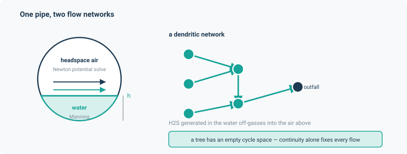

# Sewers

Gravity sewer networks, with the water, the air above it and the sulfide it carries coupled on one
network. Manholes are nodes and circular pipes are edges, draining as a tree to an outfall;
wastewater flows downhill under gravity, and the question the model answers is corrosion and
odour risk: how much H₂S is generated, and how much reaches the air where it attacks the crown
of the pipe.

Three physical subsystems share the network, each conserving its own quantity at every manhole —
water volume, headspace air, and BOD and sulfide mass — and each uses a different part of the
framework:

- **Water hydraulics** — partially full circular pipes under gravity, Manning's equation. On a
  dendritic network the cycle space is empty, so continuity alone fixes every discharge in
  closed form. No potential solve at all.
- **Headspace air** — the air above the water surface is its own flow network, a full
  `PotentialFlowLayer` driven by wall friction, the drag of the moving water surface, and
  buoyancy from the sewer-to-ambient temperature difference, vented through manhole leaks and
  optional fans.
- **Water quality** — BOD decay and Pomeroy–Parkhurst sulfide generation in the wastewater, with
  two-film Henry's-law transfer of H₂S into the headspace air, as two coupled transport layers.

**Units.** Water and headspace air flow m³/s, depth and head m, pressure Pa, concentrations
kg/m³ (with helpers to mg/L and ppm), sulfide transfer kg S/s.

```python
from noodl.apps.sewer import (
    SewerNetwork, Manhole, Pipe, Outfall, tree_steady,
    build_model, sewer_steady, initial_state,
    pipe_table, to_ppm, to_mg_per_litre,
)
```



Every type this application offers — what it does and how to call it — is listed in its [catalogue](../catalogue/sewer.md). It is set up and run like every other model; see [Using noodl](../usage.md).

## A worked example

```python
from noodl.apps.sewer import build_model, sewer_steady, pipe_table, tree_steady

model, state, drivers = build_model(tree_steady())
final = sewer_steady(model, state, drivers)
rows = pipe_table(model, final, drivers, path="pipes.csv")

# rows[0] is pipe "C1": q = 0.05 m3/s, h = 0.153007001 m
```

*(From `tests/apps/sewer/test_report.py`.)* `tree_steady()` is the committed 5-conduit, 6-node
fixture; its steady discharges are 0.05, 0.08, 0.03, 0.13 and 0.16 m³/s.

Start from a different state by naming it — here, sulfide already present in manhole
`J1` — and read the result by manhole and species:

```python
from noodl.apps.sewer import initial_state

wq = model.refs.water_quality                  # species ("bod", "sulfide"), kg/m3
start = initial_state(model, drivers=drivers, values={wq.concentration: {"J1": {"sulfide": 1e-3}}})
model.check(start, drivers).raise_for_errors(strict=True)
after = model.step(start, drivers, 60.0)
print(sorted(wq.concentration.named(after[wq.concentration])))
```

```text
['J1', 'J2', 'J3', 'J4', 'J5']
```

The sewer's `initial_state` takes the drivers as well (`drivers=`), because the storage it starts from
depends on the inflows. In the dictionaries the concentrations are
`"water_quality.x"` and `"air_quality.x"` (manhole order, species last); see
[Using noodl](../usage.md).

A model can also be read from a SWMM `.inp` file (see [File formats](../formats/swmm.md)):

```python
from noodl.apps.sewer import read_swmm_inp, build_model

net, inflows, pollutants = read_swmm_inp("tree_steady.inp")
model, state, drivers = build_model(net)
```

For a single step rather than a steady state:

```python
new = model.step(state, drivers, 60.0)
residuals = model.residuals(new, drivers)     # per-layer nodal balance
```

## Building a network

| Object | Fields |
|---|---|
| `Manhole(name, invert, ground=None, inflow=0.0, surface_area=None)` | A junction. `surface_area` defaults to SWMM's `MIN_SURFAREA`, 1.167 m² — a 4 ft shaft. |
| `Pipe(name, u, v, length, diameter, n, slope)` | A circular gravity conduit. |
| `Outfall(name, invert)` | The root of a tree. |
| `SewerNetwork(manholes, pipes, outfalls, routing="KINWAVE", notes={})` | The whole network. |

`validate()` refuses, by name: duplicate node or pipe names; a pipe naming an unknown node;
non-positive slope, diameter, length or roughness; **a manhole with anything other than exactly
one outgoing pipe**; an outfall with an outgoing pipe; and a manhole whose component never
reaches an outfall — which also catches cycles.

That one-outgoing-pipe rule is the dendritic constraint, and it is what makes the closed-form
flow solve valid.

## `build_model`

```py
model, state, drivers = build_model(
    net,
    storage=False,          # implicit-Euler manhole storage sweep
    air=True,               # the headspace layer
    quality=True,           # the two quality layers
    species=("bod", "sulfide"),
    f_air=0.02, f_i=7.49e-4, c_s=1.0,
    leak_area=8e-4, leak_cd=0.6, fans=(),
    coupling="pingpong", scheme="implicit", dt_storage=None,
)
```

`air=False` gives the water-only model the SWMM parity rows use. `fans` names manholes carrying
a prescribed extraction (m³/s, positive out).

`dt_storage` (optional) declares the interval the manhole storage sweep integrates over. When given,
a step at any other interval is refused by name. Omit it (the default) to follow the model's own
step interval via the `StepContext` the closure receives.

`initial_state(model, drivers=None)` builds the all-zero state, dispatching on each layer's
quantity. When `drivers` is given, it also evaluates the initial storage (by querying
`model.initial_capacities`), which a step with a changing capacity requires to be in the step-start
state. Drivers are required for initial_state whenever the model has a quality layer, because the
hydraulics closure writes those layers' capacity from the flows and the initial storage must be
evaluated from the drivers; this holds with or without `storage=True`.

`sewer_steady(model, state, drivers, *, reaction=None, dt=60.0, max_iter=500, tol=1e-12)` steps
repeatedly until every transport layer stops changing. You need it rather than `Model.steady`
whenever quality is on, because `Model.steady` never applies reactions.

`model._apply_closures(state, drivers)` resolves the hydraulics without stepping any layer,
which is the quickest way to inspect `sewer.q`, `sewer.h`, `sewer.v` and the rest.

## The physics

### Exact circular geometry

With the wetted half-angle $\theta = 2\arccos(1 - 2h/D)$:

$$
A = \frac{D^2(\theta - \sin\theta)}{8},\quad
P = \frac{D\theta}{2},\quad
R = \frac{A}{P} = \frac{D}{4}\left(1 - \frac{\sin\theta}{\theta}\right),\quad
T = D\sin\frac{\theta}{2}
$$

These exact relations are the default for networks built in code (`SewerNetwork(...,
geometry="analytic")`).

### SWMM's own circular geometry

SWMM 5 does not evaluate the circle. For a `CIRCULAR` conduit it interpolates 51-point tables
(`A/Afull`, `Y/Yfull` and the section factor `S/Sfull`, from `xsect.dat`) and near the invert
switches to closed forms solved by Newton iterations with their own starting guesses and stopping
rule (`xsect.c`). The tables differ from the true circle by up to ~5e-3 in depth, and by far more
in velocity near the invert. `geometry="tabulated"` (module `noodl.apps.sewer.xsect_tables`) reproduces
all of it, operation for operation, and is what `read_swmm_inp` uses by default, because a
network read from a SWMM file is read to reproduce SWMM (`read_swmm_inp(path,
geometry="analytic")` gives the exact circle).

At a kinematic-wave steady state SWMM gives a conduit carrying $q$ an inlet area
$a_1 = A(S = q/\beta)$ (inverse section-factor lookup) and an outlet area $a_2$ solving
$\beta\,S(a_2) = q$. It reports depth $\tfrac12(Y(a_1) + Y(a_2))$, volume
$\tfrac12(a_1 + a_2)L$, and velocity $q / A(\text{depth})$, which is zero at a depth of 0.01 ft
or less. $a_1 = a_2$ on the tables. Near the invert the two Newton solves differ slightly, and
both are carried. SWMM's units are reproduced too: it computes in feet with Manning's 1.486, but
converts CMS flows and volumes with 0.02832 m³/ft³ rather than $0.3048^3$. That is an effective
1.6e-4 on the Manning coefficient and 1.2e-4 on reported volumes. Everything is differentiable:
piecewise-linear tables, unrolled Newton loops, and one implicit-function root.

Scope: `geometry="tabulated"` covers the steady kinematic-wave path only, and is refused by name with
`storage=True`. The discharge limit is SWMM's `Qfull` rather than the analytic 0.938 D capacity.
The headspace, top width, hydraulic radius and mean depth (air side, sulfide) remain the exact
circle, evaluated at SWMM's depth. SWMM has no headspace to compare them with.

Numerical care worth noting: the `arccos` argument is clamped to the *exact* domain $[-1, 1]$,
not an epsilon-shrunk one — that was tried and rejected because it shifts the boundary value by
$O(\sqrt{\varepsilon})$. Every $0/0$ site is guarded on **both** branches of its `torch.where`,
so a masked-out branch cannot back-propagate `inf * 0 = nan`.

### Manning and normal depth

$Q = \frac{1}{n} A R^{2/3} \sqrt{S_0}$, with the SI constant 1.0. $Q$ is strictly increasing in
$h$ up to $h/D = 0.938$ and decreases above it, so the ascending branch is the entire invertible
domain. `normal_depth` inverts it with `solve_monotone`, batched over pipes and instances.

`q = 0` returns exactly `h = 0` with gradient 0 — a documented modelling choice, since the true
$dh/dq$ diverges there. A discharge above `capacity_flow` is **refused by name**: surcharge and
backwater are out of scope.

### The storage sweep

With `storage=True`, each manhole's water level is advanced by implicit Euler:

$$
A_s \frac{H^{n+1} - H^{n}}{\Delta t} + Q_{\text{out}}(H^{n+1}) = \sum Q_{\text{up}} + \text{lateral}
$$

solved with `solve_monotone` bracketed on $[0, 0.938D]$, valid because both left-hand terms are
strictly increasing in $H^{n+1}$. The sweep runs level-synchronously from leaves to outfall using
topological levels computed once; the only Python loop is over tree *levels* (depth 3 on the
committed fixture), never over individual pipes. Each level is one gather and one scatter.

When `storage=True` the normal-depth inversion is skipped entirely — the sweep has already solved
each manhole's own level, which *is* its outgoing pipe's entrance depth, bit-for-bit and with no
root-find.

### Headspace air

`Headspace` is an `Element` with $\Delta p = R(h)\,\lvert Q \rvert Q$ and

$$
R(h) = \frac{f_{\text{air}} L \rho}{2 D_h A_{\text{air}}^2}
$$

inverted in closed form with a laminar blend near zero. The air-side wetted perimeter is
$P_{\text{air}} = \pi D - P(h) + T(h)$ — the dry wall plus the water surface acting as a moving
wall — and $D_h = 4A_{\text{air}}/P_{\text{air}}$.

`Drag` is a `Drive`: $D = \tfrac{1}{2} f_i \rho U_s \lvert U_s \rvert T L / A_{\text{air}}$ with
$U_s = c_s V_w$. The full branch law is $\Delta p = R\lvert Q\rvert Q - D - B$, where $B$ is the
**same `Stack` buoyancy drive the building application uses** — reused unchanged.

The drag sign convention is documented and was verified rather than assumed: the drive returns
$+D$ so that with both ends at ambient the air moves from the upstream manhole toward the
downstream one, the direction the wastewater drags it. The opposite sign was tried and caught by
the measurement.

### Quality

| Quantity | Form |
|---|---|
| Henry's constant | $H(T) = 1/(H_{cp}(T) R T)$, $H_{cp}(T) = H_{cp}(298.15)\exp\!\big(2100(1/T - 1/298.15)\big)$ |
| Free sulfide fraction | $f = 1/(1 + 10^{\,\mathrm{pH} - \mathrm{p}K_a})$ |
| Transfer coefficient | $K_L a = a(1 + b\,\mathrm{Fr}^2)(S_0 V)^{3/8} / d_m$ per hour |
| Two-film flux | $K_L a \, V \, \big(f C_S - C_G (M_S/M_{\mathrm{H_2S}}) / H\big)$ kg S/s |
| Sulfide generation | $d[S]/dt = M' \mathrm{EBOD} / R_h - m [S] (S_0 V)^{3/8} / d_m$ |
| BOD decay | $d[\mathrm{BOD}]/dt = -k_{\mathrm{BOD}} \cdot 1.07^{\,T-20} [\mathrm{BOD}]$ |

The gas concentration is converted to sulfur-equivalent before the Henry partition is applied, so
the flux is symmetric between the two source terms in moles of S.

`LateralLoads` must be registered **before** `H2STransfer` in the closure list, so that
`H2STransfer` adds its transfer term rather than overwriting the lateral load.

The model is built with `reaction_order="before_transport"`: each step applies sulfide generation
and BOD decay to the step-start state, then transports it, and returns the post-transport
concentration, as SWMM does. `H2STransfer` reads the step-start state either way.

## Verification

Against SWMM 5.2.4 through `pyswmm`, with `geometry="tabulated"`, on three kinematic-wave networks
of circular conduits:

- `tree_kinwave.inp`, the hand-built 5-conduit tree.
- `example1_kinwave.inp`, the 13-conduit network of EPA SWMM's published *Example 1*. It is
  converted to metres, and its runoff is replaced by rational-method constant inflows, because
  runoff and CFS units are outside this reader.
- `tree_kinwave_large.inp`, a synthetic 32-conduit tree with fills from 8e-5 to 0.81 of `Qfull`.

`tests/data/sewer/make_kinwave_fixtures.py` regenerates the last two. The engine identity is
pinned: `engine_version == "5.2.4"` and `flow_routing_error == 0.0`.

| Check | Tolerance | Measured worst (5 / 13 / 32 conduits) | Exact circle, for comparison |
|---|---|---|---|
| Pipe flows | rel 1e-9 | 1.4e-14 / 3.1e-15 / 6.2e-14 | the same |
| Depths (live, float64) | rel 1e-10 | 7.5e-15 / 1.2e-15 / 1.7e-14 | 5.5e-4 / 1.8e-3 / 5.2e-3 |
| Volumes (live, float64) | rel 1e-10 | 8.6e-15 / 1.8e-15 / 2.3e-14 | 6.5e-4 / 1.7e-3 / 4.8e-3 |
| Velocities (binary output, float32) | rel 1e-7 | 3.7e-8 / 5.8e-8 / 5.3e-8 | 6.3e-4 / 2.5e-3 / 1.8e-1 |
| Tracer, tank-in-series closed form | rel 1e-9 | 4.5e-15 | 7.8e-6 |
| Tracer, the model's quality layer, steady | rel 1e-9 | 6.3e-13 | 3.5e-3 at dt = 60 s if sampled after the reaction |
| Tracer, time-varying load, every 5 s step, head conduit | rel 1e-9 | 1.1e-14 | |
| Tracer, same run, downstream conduits (SWMM's junction lag, see below) | not asserted | 1.1e-2 / 1.7e-2 of peak at 5 s | 2.2e-3 / 3.5e-3 at 1 s |

The tolerances are not fitted to these numbers. Depth and volume are read live, as float64, and
both sides run the same float64 operations. 1e-10 is three decades above a rounding bound of
about 1e-13. Velocity has no live accessor under KINWAVE. The binary output stores it as float32,
whose half-ulp is 5.96e-8.

The quality layer uses SWMM's scheme and reports where SWMM reports. Both codes split a step
into an explicit first-order decay $c \to c(1 - k\Delta t)$ followed by an implicit upwind mixing
over the conduit volume (SWMM `qualrout.c`: `getReactedQual`, then `getMixedQual`), and both
return the concentration after the mixing: `build_model` sets
`Model(reaction_order="before_transport")`. The fixed point satisfies
$c(q + kV) = \sum q_u c_u + \text{load}$ at any $\Delta t$, which is SWMM's own. Sampled after the
reaction instead (the framework's default order), the fixed point would be $(1 - k\Delta t)$
times SWMM's, 3.47e-3 at 60 s.

The transient check drives the model with the inflow concentration SWMM applied at each step
(its `J1` node quality) and compares every routing step. A conduit fed only by a lateral inflow
takes exactly SWMM's step. A conduit fed by upstream conduits does not: SWMM mixes a junction's
inflow from the upstream links' start-of-step concentrations (`findLinkMassFlow` reads
`Link.oldQual`), a one-step lag per junction, where the model solves the whole tree implicitly.
That difference is first order in $\Delta t$. The test asserts that SWMM equals exactly this
lagged recursion on the model's own volumes and flows (5e-15), so the lag is the whole
difference. Transient hydraulics are not compared: the model's water side is quasi-steady (or
manhole storage), not a kinematic wave. SWMM also mixes over the step-start volume,
$(cV_1 + c_{in} q_{in}\Delta t)/(V_1 + q_{in}\Delta t)$, where the model's amount form divides by
$V_2 + q_{out}\Delta t$; the two agree when $V_2 - V_1 = (q_{in} - q_{out})\Delta t$.

Non-SWMM checks, for the physics SWMM does not model:

| Check | Result |
|---|---|
| Pescod & Price Tests 7–9, air-to-water velocity ratio in a 300 mm UPVC pipe, 15 m, open at both ends (20–40 % band) | 24.14 %, 25.00 %, 25.15 % against measured 35 %, 25 %, 27.5 % (Test 8 calibrates `f_i`); each inside the band and equal to the closed form to round-off (asserted at rel 1e-6) |
| Pescod & Price Tyneside ventilation band (105–315 m³/h) | bracketed; open-both-ends gives 1253.78 m³/h, a 17.27% velocity ratio, inside their 5–30% envelope |
| Fan draws exactly through the leaks | balance 1.234e-14, nodal residual 6.3e-15, power residual 8.1e-13 |
| Transfer-dominated state reaches Henry equilibrium | rel 1e-10, **measured 1.4e-16** |
| Air-layer nodal residual, and Tellegen power balance | 4.518e-13 kg/s, 6.141e-12 W |
| Cross-phase sulfide conservation | rtol 1e-12 |
| Adjoint gradients vs Richardson-extrapolated central differences | rel 1e-6, holds |
| Storage sweep vs the closed-form steady state | **5.7e-15** on flows, **4.4e-15** on depths |

## Coefficient provenance

Each coefficient is labelled, and three of them are not verified. This matters if you intend to
publish numbers from this application.

| Coefficient | Default | Status |
|---|---|---|
| `f_air`, headspace wall friction | 0.02 | **Unverified.** Stated to lie in the reported 0.015–0.045 range for sewer crowns; the source is paywalled and was not independently checked. |
| `f_i`, interfacial drag | 7.49e-4 | **Calibrated** against one Pescod & Price test (Test 8), cross-checked against Tests 7 and 9 at 24.14% and 25.15% against measured 35% and 27.5% — inside a fairly wide 20–40% acceptance band. |
| Henry's constant, van't Hoff slope | 1.0e-3 mol/m³/Pa, 2100 K | **Verified** (Sander 2023). |
| p$K_a$ | 7.0 | Verified value; its temperature dependence is approximated as constant. |
| $K_L a$ constants $a$, $b$ | 0.86, 0.20 | Correlation form corroborated, **constants unverified** (paywalled). |
| Pomeroy–Parkhurst $M'$, $m$ | 0.32e-3 m/h, 0.64 | **Vendor defaults, unverified** against Pomeroy and Parkhurst 1977. |
| $k_{\mathrm{BOD}}$ | 0.2/day | Generic (Metcalf & Eddy). |

## Limitations

- **No surcharge or backwater.** Networks that would surcharge or need backwater are refused by
  name; they are not modelled.
- **Dendritic networks only:** one outgoing pipe per manhole, no loops.
- **No gas-phase sulfide sink.** H₂S leaves the headspace by ventilation, at the outfall, and
  by re-absorption into the water (the two-film flux is signed); no wall uptake or gas-phase
  oxidation is modelled.
- **Headspace drag uses the absolute water-surface velocity.** `Drag` drives the air with
  $U_s$ rather than the relative velocity $U_s - U_{\text{air}}$, which would need the air
  layer's own solved state. The drag is overestimated where the headspace air already moves
  with the water.
- **`f_i` is not differentiable.** It is a `Drive` attribute, and the differentiable solve
  refuses `requires_grad=True` on it; you cannot fit it by gradient descent.
- **Without a ground elevation, manhole shafts add no headspace volume**, so the air-quality
  capacity is the conduit headspace alone. `model.notes` says when this applies.

## Install

Nothing beyond the base dependencies. `pyswmm` is needed only to reproduce the SWMM parity tests:

```bash
pip install "noodl-physics[dev]"
```
