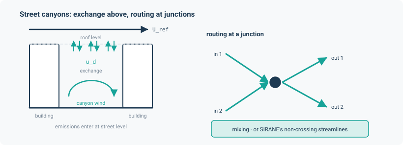

# Street air quality

Urban air quality on a street network — the SIRANE/MUNICH class of problem. Road segments
flanked by buildings are "canyons"; pollutant builds up in each from traffic emissions, is
ventilated into the atmosphere above roof level, and is transported between streets through
junctions.

This application is the framework's clearest case of **closure-computed flows**. There is no
potential variable anywhere: the along-canyon velocity is a closed-form function of the wind
aloft and the canyon geometry, so a closure computes every flow and writes it, and the transport
layer advects on what it wrote.

```python
from noodl.apps.street_aq import (
    build_model, street_steady, street_index, initial_state,
    StreetNetwork, Street, from_test_network, munich_idealised,
    write_network_concentration, to_ug_m3,
    photostationary_for_streets,
)
```



## A worked example

```python
import math
import torch
from noodl.apps.street_aq import build_model, from_test_network

DT = torch.float64

net = from_test_network()                     # a 4-junction, 3-street toy network
model, state, _ = build_model(net, pblh_floor=False)

street_net = model.net
sources = torch.zeros(street_net.n, dtype=DT)
for name, value in zip(("r1", "r2", "r3"), (1.0, 2.0, 3.0), strict=True):
    sources[street_net.node_index(name)] = value

drivers = {
    "street.x_boundary": torch.tensor([1.0e-4], dtype=DT),   # background, kg/m3
    "street.sources": sources,                                # emissions
    "U_ref": torch.tensor(2.0, dtype=DT),                     # wind speed, m/s
    "theta_w": torch.tensor(0.25 * math.pi, dtype=DT),        # rad CCW from east, blowing TOWARD
    "h_abl": torch.tensor(1200.0, dtype=DT),                  # boundary-layer depth, m
}

solved = model.steady(state, drivers)
print(solved["street.x"])                     # kg/m3 per street, interior order
```

*(From `tests/apps/street_aq/test_conservation.py`, which then checks that every kilogram emitted
crosses the atmosphere boundary exactly, rtol $10^{-12}$.)*

**The drivers returned by `build_model` are templates only.** They carry zero-shaped
`x_boundary` and `sources`; you must supply `U_ref`, `theta_w` and `h_abl` yourself (and `lmo`
if you chose `stability="munich"`).

## Building a network

| Object | Purpose |
|---|---|
| `Street(name, u, v, length, width, height, z0_b=0.15, emission_scale=1.0)` | One canyon segment between two junctions. |
| `StreetNetwork(streets, x, y)` | The network plus junction coordinates. `azimuth` gives each street's bearing in radians CCW from east; `junctions` and `degree(node)` describe the topology. |
| `from_test_network()` | A 4-junction, 3-street test network. |
| `munich_idealised(L=100.0, W=20.0, H=20.0)` | The 12-street network of Kim et al. 2022 Fig. 1. `L`, `W`, `H` are arguments because the paper never published them. |

Construction validates: unique street names, `u != v`, coordinates for every named junction, and
strictly positive `length`, `width`, `height` and `z0_b`.

For your own streets, build the `StreetNetwork` directly from whatever source you have (a GIS
layer, OpenStreetMap, a hand-drawn sketch): one `Street` per canyon segment, named by its two
junctions, plus a coordinate for every junction. The coordinates only set each street's bearing
relative to the wind, so any projected system in metres will do; the lengths are yours to give.

```python
import math
from noodl.apps.street_aq import Street, StreetNetwork, build_model, street_index

x = {"a": 0.0, "b": 200.0, "c": 200.0, "d": 400.0}    # junction coordinates, m
y = {"a": 0.0, "b": 0.0, "c": 150.0, "d": 0.0}

def street(name, u, v, width, height):
    return Street(name, u, v, math.hypot(x[v] - x[u], y[v] - y[u]), width, height)

net = StreetNetwork(
    streets=[street("main_w", "a", "b", 20.0, 18.0),
             street("main_e", "b", "d", 20.0, 18.0),
             street("side", "b", "c", 12.0, 15.0)],
    x=x, y=y,
)
model, state, drivers = build_model(net)
street_index(model)                           # {'main_w': 0, 'main_e': 1, 'side': 2}
```

From there the drivers are supplied exactly as in the worked example above: emissions in
`street.sources` at each street's node, a background in `street.x_boundary`, and the wind and
boundary layer in `U_ref`, `theta_w` and `h_abl`.

## `build_model`

```python
model, state, drivers = build_model(
    net,
    canyon_wind="soulhac",        # 'soulhac' | 'exponential'
    exchange="sirane",            # 'sirane'  | 'schulte'
    routing="sirane",             # 'sirane'  | 'mixing'
    direction_averaging="none",   # 'none' | 'munich' | 'gauss'
    species=("nox",),
    chemistry=None,
    stability="impaq",            # 'impaq' | 'munich'
    roof_wind_form="sirane",      # 'sirane' | 'macdonald'
    kappa=None, canyon_wind_min=0.0, u_d_min=0.0,
    z_ref=30.0, pblh_floor=True,
)
```

It builds one `atmosphere` boundary node plus one node per street, then, for every junction,
directed `route` edges between all distinct street ends meeting there, two `vent` edges per
(street, end), and two `exchange` edges per street. A `TransportLayer` and a `StreetFlows`
closure are wrapped into a `Model`.

`street_index(model)` maps street name to row index of `"street.x"`.

### The closure choices

These select between the SIRANE forms and MUNICH's, and they are independent:

| Option | Values | What changes |
|---|---|---|
| `canyon_wind` | `"soulhac"` | Soulhac–Perkins–Salizzoni (2008) closed-form Bessel profile from the friction velocity. Needs `z0_b`. |
| | `"exponential"` | MUNICH's K22 Eq. (B14) exponential profile from the roof-level wind. **Not** the K18 formula of the same name — they diverge by 37% for narrow canyons. |
| `roof_wind_form` | `"sirane"` / `"macdonald"` | How $u_H$ is computed when `canyon_wind="exponential"`. Macdonald uses a log law with a network-mean displacement height and roughness. |
| `exchange` | `"sirane"` | $u_d = \sigma_w / (\sqrt{2}\,\pi)$, aspect-ratio independent. |
| | `"schulte"` | $u_d = \sigma_w \beta / (1 + H/W)$, MUNICH v2's default. Equals the SIRANE form exactly at $H = W$. |
| `routing` | `"mixing"` / `"sirane"` | Perfect mixing, or SIRANE's non-crossing-streamline rule. They differ only at junctions with 2+ inflows **and** 2+ outflows. |
| `direction_averaging` | `"none"` / `"munich"` / `"gauss"` | Single direction; MUNICH's own quadrature over a turbulence-derived $\sigma_\theta$; or noodl's normalised Gauss–Hermite rule. |
| `stability` | `"impaq"` / `"munich"` | Neutral only ($\sigma_w = 1.3\,u_*(1 - 0.8\,z/h_{\text{abl}})$), or MUNICH's three-branch stability dependence (needs an `lmo` driver). |

`kappa=None` resolves automatically: MUNICH's 0.41 if any MUNICH-style option is chosen, else
0.40. An explicit value always wins.

### The canyon physics

`noodl.apps.street_aq.canyon` exposes the pieces directly:

| Function | Returns |
|---|---|
| `boundary_layer(h_mean, u_ref, h_abl, *, z_ref=30.0, kappa=0.4, pblh_floor=None)` | A `BoundaryLayer` with $d = 2h/3$, $z_0 = h/10$, $u_* = \kappa U_{\text{ref}} / \ln((z_{\text{ref}} - d)/z_0)$. |
| `BoundaryLayer.sigma_w(z, ...)` / `.sigma_v(...)` | Velocity standard deviations driving the roof exchange. |
| `canyon_velocity(W, H, phi, ...)` | The **signed** along-canyon velocity, m/s. |
| `exchange_velocity(sigma_w, H, W, form=...)` | The roof exchange velocity $u_d$. |
| `roof_wind(u_star, H, W, form=...)` | Roof-level wind $u_H$. |
| `macdonald_profile(h_mean, w_mean, ...)` | $(d_c, z_{0c})$, Macdonald (1998) network means. |
| `soulhac_shape(ratio)` | The Bessel shape parameter $c$, as a differentiable root. |

## Chemistry

`Model.steady` never applies reactions. For a coupled transport-and-chemistry steady state use
`street_steady`, which iterates the two by successive substitution:

```python
from noodl.apps.street_aq import photostationary_for_streets, street_steady

reaction = photostationary_for_streets(("no", "no2", "o3"))
model, state, drivers = build_model(net, species=("no", "no2", "o3"), chemistry=reaction)
solved = street_steady(model, state, drivers, reaction=reaction, tol=1e-18, max_iter=200)
```

`photostationary_for_streets(species, j_key="J_NO2")` wires the Leighton NO/NO₂/O₃ cycle to the
matching columns of `species`, case-insensitively, and raises naming any missing one.
`j_no2(zenith_deg, attenuation=1.0)` gives the clear-sky photolysis rate from MUNICH's 11-point
tabulation. **Solar geometry is not computed** — you pass the zenith angle you want.

## Writing results

`write_network_concentration(path, ...)` writes a `network_concentration_<year>.nc` with one
record per (time, street): the time axis, each street's feature index and OSM id, the background,
the signed canyon velocity and the concentration increment. The file is classic CDF (so `scipy`
can read it back) in float64 throughout. Needs the
[`street_aq` extra](../installation.md#optional-extras).

## Verification

### MUNICH formulas

Thirteen exact input/output pairs transcribed from MUNICH's own source, each checked at the
precision that source publishes:

| Quantity | Tolerance | Measured |
|---|---|---|
| `SIRANE_EXCHANGE` constant | < 1e-15 | 0.225079079039277, exact |
| Exchange velocity $u_d$ | < 1e-7 relative | 0.08681174 m/s to 8 significant figures |
| `soulhac_shape` root $c$ | < 1e-13 | 0.6198293039179747 |
| Macdonald $d_c$, $z_{0c}$ | < 1e-12 | 4.617352498423888 m, 0.6614635677623194 m |
| Direction-quadrature weight sums, $n = 2\ldots10$ | 1e-6 | e.g. 0.974953 at $n=10$ |

That last row is deliberate: MUNICH's weights are **not** normalised to 1, and reproducing that
artefact is the point. "Fixing" it would introduce a bias relative to MUNICH rather than remove
one. The same applies to `soulhac_shape`: MUNICH quantises the root to a 0.01 grid (0.62), noodl
solves it continuously (0.6198293…), and the resulting 4e-4 relative difference in $u_M$ is
documented rather than matched.

### MUNICH idealised 12-street case

Kim et al. (2022) Fig. 1 gives concentrations on an idealised 12-street network, but not the
street length, width and height behind them, so `munich_idealised(L, W, H)` takes them as
arguments and the case can only be compared in terms that do not depend on them.

| Check | Target | Measured |
|---|---|---|
| Linearity in wind speed at 210° and 240°: doubling $U$ halves every concentration | < 1e-9 | holds (an exact model identity) |
| 270° canyon-wind ratio pattern | paper's value | 1.99451, against the paper's 1.99451 |
| Concentrations relative to one reference street, 19 ratios | 5 % | **not met**: worst ratio off by 51 %, 7 of 19 within 15 % |

The relative-pattern miss is the one open discrepancy against MUNICH; it is listed under
[Limitations](#limitations-and-caveats).

## Limitations and caveats

- **The MUNICH 12-street idealised case is not reproduced.** Its street geometry was never
  published, so absolute concentrations cannot be compared, and the pattern of concentrations
  relative to one street misses its 5 % target: the worst of the nineteen ratios is off by
  51 %, and seven are within 15 %. The scale-invariant checks (linearity in wind speed, the
  270° canyon-wind ratio) do match; see [Verification](#munich-idealised-12-street-case).
- **Tall streets need the boundary-layer guard.** The neutral $\sigma_w$ goes negative when a
  street is taller than $1.25\,h_{\text{abl}}$. `build_model`'s `pblh_floor=True` (the default)
  applies MUNICH's guard, raising the boundary-layer height to at least the tallest street. With
  `pblh_floor=False`, `exchange_velocity` raises an error on such a step rather than clamping
  it.
- **SIRANE exchange coefficient.** The code uses $\sigma_w / (\sqrt{2}\,\pi)$
  (`SIRANE_EXCHANGE` = 0.225079…), as in MUNICH's source, not $\sigma_w/\sqrt{2\pi}$.

## Install

```bash
pip install "noodl[street_aq]"
```

Needed only for `write_network_concentration`. The modelling API — `build_model`,
`street_steady`, the closures — needs only the base dependencies.
