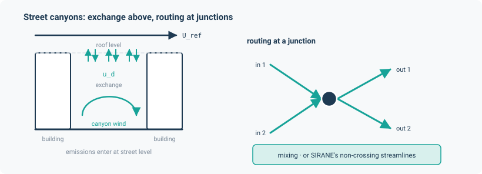

# Street air quality

Urban air quality on a street network. Road segments flanked by buildings are "canyons", and
each canyon is a node holding a well-mixed pollutant concentration (kg/m³); the atmosphere above
roof level is the boundary node. Edges carry air between streets at junctions, and exchange it
with the atmosphere at junctions and through the canyon roof. Pollutant mass is conserved in
every canyon: it builds up from traffic emissions (kg/s), is ventilated into the atmosphere, and
is carried from street to street by the wind-driven flow along them.

A street network is built by hand, as `StreetNetwork` and `Street` objects, or read from a
street-network case on disk with `read_case` -- see [Reading and writing street-network
cases](#reading-and-writing-street-network-cases).

This application is the framework's clearest case of **closure-computed flows**. There is no
potential variable anywhere: the along-canyon velocity is a closed-form function of the wind
aloft and the canyon geometry, so a closure computes every flow and writes it, and the transport
layer advects on what it wrote.

```python
from noodl.apps.street_aq import (
    build_model, street_steady, street_index, initial_state,
    StreetNetwork, Street, from_test_network, munich_idealised,
    write_network_concentration, to_ug_m3,
    photostationary_for_streets,
)
```



## A worked example

```python
import math
import torch
from noodl.apps.street_aq import build_model, from_test_network

DT = torch.float64

net = from_test_network()                     # a 4-junction, 3-street toy network
model, state, _ = build_model(net, pblh_floor=False)

street_net = model.net
sources = torch.zeros(street_net.n, dtype=DT)
for name, value in zip(("r1", "r2", "r3"), (1.0, 2.0, 3.0), strict=True):
    sources[street_net.node_index(name)] = value

drivers = {
    "street.x_boundary": torch.tensor([1.0e-4], dtype=DT),   # background, kg/m3
    "street.sources": sources,                                # emissions
    "U_ref": torch.tensor(2.0, dtype=DT),                     # wind speed, m/s
    "theta_w": torch.tensor(0.25 * math.pi, dtype=DT),        # rad CCW from east, blowing TOWARD
    "h_abl": torch.tensor(1200.0, dtype=DT),                  # boundary-layer depth, m
}

solved = model.steady(state, drivers)
print(solved["street.x"])                     # kg/m3 per street, interior order
```

*(From `tests/apps/street_aq/test_conservation.py`, which then checks that every kilogram emitted
crosses the atmosphere boundary exactly, rtol $10^{-12}$.)*

**The drivers returned by `build_model` are templates only.** They carry zero-shaped
`x_boundary` and `sources`; you must supply `U_ref`, `theta_w` and `h_abl` yourself (and `lmo`
if you chose `stability="munich"`).

`u_star`, when given, is the friction velocity itself and replaces the log law that would
otherwise derive it from `U_ref`; `U_ref` is then needed only for `direction_averaging="munich"`'s
direction spread, $\sigma_\theta = \sigma_v / U$.

`meteo="per_street"` gives every one of `U_ref`, `theta_w`, `h_abl`, `u_star` and `lmo` a
trailing street axis, `(..., n_streets)`, so each street gets its own wind and boundary layer.
Junction routing then reads an explicit `"<key>_junction"` driver when given --
`theta_w_junction`, `U_ref_junction`, `u_star_junction`, `h_abl_junction`, `lmo_junction`, in
`StreetNetwork.junctions` order -- and otherwise falls back to the mean of the streets meeting
at that junction (circular for direction, through $1/L$ for the Obukhov length).

`background="per_street"` gives every street its own atmosphere node, so `"<layer>.x_boundary"`
becomes `(n_streets,)` or `(n_streets, n_species)`, in street order, instead of one
network-wide value shared by every street.

A case read with `read_case` supplies all of these automatically -- see [Reading and writing
street-network cases](#reading-and-writing-street-network-cases).

## Building a network

| Object | Purpose |
|---|---|
| `Street(name, u, v, length, width, height, z0_b=0.15, emission_scale=1.0)` | One canyon segment between two junctions. |
| `StreetNetwork(streets, x, y)` | The network plus junction coordinates. `azimuth` gives each street's bearing in radians CCW from east; `junctions` and `degree(node)` describe the topology. |
| `from_test_network()` | A 4-junction, 3-street test network. |
| `munich_idealised(L=100.0, W=20.0, H=20.0)` | The 12-street network of Kim et al. 2022 Fig. 1. `L`, `W`, `H` are arguments because the paper never published them. |

Construction validates: unique street names, `u != v`, coordinates for every named junction, and
strictly positive `length`, `width`, `height` and `z0_b`.

For your own streets, build the `StreetNetwork` directly from whatever source you have (a GIS
layer, OpenStreetMap, a hand-drawn sketch): one `Street` per canyon segment, named by its two
junctions, plus a coordinate for every junction. The coordinates only set each street's bearing
relative to the wind, so any projected system in metres will do; the lengths are yours to give.

```python
import math
from noodl.apps.street_aq import Street, StreetNetwork, build_model, street_index

x = {"a": 0.0, "b": 200.0, "c": 200.0, "d": 400.0}    # junction coordinates, m
y = {"a": 0.0, "b": 0.0, "c": 150.0, "d": 0.0}

def street(name, u, v, width, height):
    return Street(name, u, v, math.hypot(x[v] - x[u], y[v] - y[u]), width, height)

net = StreetNetwork(
    streets=[street("main_w", "a", "b", 20.0, 18.0),
             street("main_e", "b", "d", 20.0, 18.0),
             street("side", "b", "c", 12.0, 15.0)],
    x=x, y=y,
)
model, state, drivers = build_model(net)
street_index(model)                           # {'main_w': 0, 'main_e': 1, 'side': 2}
```

From there the drivers are supplied exactly as in the worked example above: emissions in
`street.sources` at each street's node, a background in `street.x_boundary`, and the wind and
boundary layer in `U_ref`, `theta_w` and `h_abl`.

## Reading and writing street-network cases

A street-network case bundles a network with the meteorology, emissions and background
concentrations that drive it hour by hour. `read_case(path) -> StreetCase` reads one from disk:
a directory holding a `munich.cfg` is read as a MUNICH case; anything else raises `ValueError`
naming what noodl physics recognises.

```python
from noodl.apps.street_aq import read_case

case = read_case("tests/data/street/munich_paris_excerpt")
case.street_ids           # ['1', '3', '8', '11'], the emissions/background street axis
case.species               # ['NO2']
case.meteo["u_star"].shape  # (3, 4): 3 hours, 4 streets
```

### `StreetCase`

| Field | Holds |
|---|---|
| `source` | Which reader produced the case: `"munich"`, or `"synthetic"` for one built with `StreetCase.synthetic`. |
| `network` | The case's `StreetNetwork`, in metres. |
| `times` | `(n_hours,)`, seconds since `start`. |
| `street_ids` | The streets' names, in `network.streets` order -- the axis `emissions` and `background` use. |
| `junction_ids` | The source model's own node ids for `network.junctions`, in that order (MUNICH: `intersection.dat`'s ids). |
| `species` | The case's species names, the last axis of `emissions` and `background`. |
| `meteo` | One `(n_hours, n_streets)` array per key: `wind_dir_from_deg` and `wind_speed` always; `h_abl`, `u_star`, `lmo`, `temperature` wherever the source provides them. |
| `meteo_junction` | The same keys, `(n_hours, n_junctions)`, in `network.junctions` order -- may be empty or partial when the source has no genuine per-junction meteorology. |
| `emissions` | `(n_hours, n_streets, n_species)`, kg/s per street. |
| `background` | `(n_hours, n_streets, n_species)`, kg/m3 per street. |
| `native` | The source's own options, as read (MUNICH: one dict per `munich.cfg` section, plus the lon/lat projection the reader used); `model_options` translates these into `build_model` keywords, and `write_case` writes them back when the format matches. |
| `start` | The absolute date and time of `times[0]`, or `None` for a synthetic case built without one (writing such a case to MUNICH then raises). |

`wind_dir_from_deg` is degrees clockwise from north, the direction the wind blows FROM. MUNICH's
own `WindDirection` is radians clockwise from north, the direction the wind blows TOWARD (MUNICH's
`preprocessing/meteo.py`, `compute_wdir`); `read_case` and `write_case` convert at the file
boundary, and `drivers_at` converts degrees-FROM into noodl physics' `theta_w` (radians
counter-clockwise from east, TOWARD). Every mass in `StreetCase` is SI (kg/s, kg/m3); MUNICH's
own files hold micrograms, converted at read and write time.

### `drivers_at`

`drivers_at(case, model, k, *, species=None) -> dict` is the driver mapping at time index `k` for
`model`, built from `case`. It follows the model's own shape: `meteo="uniform"` reduces every
meteorology array to one network-wide value (circular mean for direction, through the reciprocal
for the Obukhov length, a plain mean otherwise); `meteo="per_street"` keeps every driver's
trailing street axis and adds the `"<key>_junction"` drivers junction routing needs, from
`case.meteo_junction` when the source has it, otherwise the same street-to-junction reduction.
`u_star` is supplied whenever `case.meteo` has it, and drives the friction velocity directly
rather than through noodl physics' log law. `background` follows the model's own boundary count the same
way: one `"<layer>.x_boundary"` row per street, or one network-wide mean. `species` (default
`case.species`) selects and orders which of the case's species end up on the emissions and
background drivers. The model's own street order (`street_index(model)`) must equal
`case.street_ids` -- build the model on `case.network` itself.

### `StreetCase.model_options()`

`case.model_options()` reads the closure options `case`'s own source model implies. For
`source="munich"`, that is `munich.cfg`'s `[street]` section, translated into `build_model`
keywords (`canyon_wind`, `exchange`, `roof_wind_form`, `direction_averaging`, `z_ref`,
`canyon_wind_min`), plus `stability="munich"` and MUNICH's own hard-coded `u_d_min=0.001`. A
missing `Minimum_Street_Wind_Speed` defaults to MUNICH's own `0.1` m/s (`canyon_wind_min=0.1`);
`Zref`'s absence still raises. A `synthetic` case raises `NotImplementedError` -- pass
`build_model`'s keywords directly instead.

### `StreetCase.synthetic`

`StreetCase.synthetic(network, *, species, times, meteo, emissions, background,
meteo_junction=None, start=None)` builds a case in Python -- an idealised network to drive
directly, or to write out with `write_case`. `meteo` needs `wind_dir_from_deg` and
`wind_speed`; the rest are optional. `meteo_junction` takes any subset of the same keys, or
none at all. Each value is a scalar, an `(n_hours,)` series, or the full `(n_hours, n_streets)`
(`n_junctions` for `meteo_junction`) array. `emissions` and `background` broadcast the same way,
with an optional trailing species axis. Writing the case out with `write_case(format="munich")`
additionally needs `meteo` to carry `h_abl`, `u_star` and `lmo`.

### `write_case`

`write_case(out_dir, case, *, format="munich", options=None) -> Path` writes `case` under
`out_dir`; only `format="munich"` is implemented, and `case.start` must be set, and `case.meteo`
must have `h_abl`, `u_star` and `lmo` -- MUNICH needs their `PBLH`, `UST`, `LMO` fields whenever
transport is on, which this writer always turns on. A case read from MUNICH files writes its own
`[street]` section and projection back (`read_case` then `write_case` round-trips those two);
`[options]` itself always turns chemistry, photolysis, deposition and scavenging off, and the six
`[meteo]` fields MUNICH always requires (`Rain`, `SolarRadiation`, `SpecificHumidity`,
`SurfacePressure`, `SurfaceTemperature`, `Attenuation`) come from the case where it has one (only
`SurfaceTemperature`, from `meteo["temperature"]`), else a constant default -- either way,
`options` overrides them. `options` are the format's own overrides -- for MUNICH, any `[street]`
closure key, any of those six `[meteo]` fields, or `lat0_deg`/`lon0_deg` (the lon/lat a synthetic
network's `(0, 0)` is anchored to). `options` win even over a value the case itself supplies.
Missing per-junction meteorology is derived from the streets meeting at each junction (circular
mean for direction, through the
reciprocal for the Obukhov length, a plain mean otherwise).

### Worked example

```python
from noodl.apps.street_aq import build_model, drivers_at, read_case

case = read_case("tests/data/street/munich_paris_excerpt")

model, state, _ = build_model(
    case.network, species=case.species, meteo="per_street", background="per_street",
    **case.model_options(),
)

for k in range(len(case.times)):
    drivers = drivers_at(case, model, k)
    state = model.steady(state, drivers)

print(state["street.x"])          # kg/m3 per street, at the case's last hour
```

*(`munich_paris_excerpt` is a four-street excerpt of MUNICH's own published test case -- see
`tests/data/street/munich_paris_excerpt/NOTICE.md`.)*

## `build_model`

```python
model, state, drivers = build_model(
    net,
    canyon_wind="soulhac",        # 'soulhac' | 'exponential'
    exchange="sirane",            # 'sirane'  | 'schulte'
    routing="sirane",             # 'sirane'  | 'mixing'
    direction_averaging="none",   # 'none' | 'munich' | 'gauss'
    species=("nox",),
    chemistry=None,
    stability="neutral",          # 'neutral' | 'munich'
    roof_wind_form="sirane",      # 'sirane' | 'macdonald'
    kappa=None, canyon_wind_min=0.0, u_d_min=0.0,
    z_ref=30.0, pblh_floor=True,
    meteo="uniform",               # 'uniform' | 'per_street'
    background="uniform",          # 'uniform' | 'per_street'
)
```

It builds one `atmosphere` boundary node plus one node per street, then, for every junction,
directed `route` edges between all distinct street ends meeting there, two `vent` edges per
(street, end), and two `exchange` edges per street. A `TransportLayer` and a `StreetFlows`
closure are wrapped into a `Model`.

`street_index(model)` maps street name to row index of `"street.x"`.

### The closure choices

These select between the SIRANE forms and MUNICH's, and they are independent:

| Option | Values | What changes |
|---|---|---|
| `canyon_wind` | `"soulhac"` | Soulhac–Perkins–Salizzoni (2008) closed-form Bessel profile from the friction velocity. Needs `z0_b`. |
| | `"exponential"` | MUNICH's K22 Eq. (B14) exponential profile from the roof-level wind. **Not** the K18 formula of the same name — they diverge by 37% for narrow canyons. |
| `roof_wind_form` | `"sirane"` / `"macdonald"` | How $u_H$ is computed when `canyon_wind="exponential"`. Macdonald uses a log law with a network-mean displacement height and roughness. |
| `exchange` | `"sirane"` | $u_d = \sigma_w / (\sqrt{2}\,\pi)$, aspect-ratio independent. |
| | `"schulte"` | $u_d = \sigma_w \beta / (1 + H/W)$, MUNICH v2's default. Equals the SIRANE form exactly at $H = W$. |
| `routing` | `"mixing"` / `"sirane"` | Perfect mixing, or SIRANE's non-crossing-streamline rule. They differ only at junctions with 2+ inflows **and** 2+ outflows. |
| `direction_averaging` | `"none"` / `"munich"` / `"gauss"` | Single direction; MUNICH's own quadrature over a turbulence-derived $\sigma_\theta$; or noodl physics' normalised Gauss–Hermite rule. |
| `stability` | `"neutral"` / `"munich"` | Neutral only ($\sigma_w = 1.3\,u_*(1 - 0.8\,z/h_{\text{abl}})$), or MUNICH's three-branch stability dependence (needs an `lmo` driver). |
| `meteo` | `"uniform"` / `"per_street"` | One instance value per driver, or a trailing street axis on `U_ref`, `theta_w`, `h_abl`, `u_star`, `lmo`, with junction routing from the mean of the streets meeting there (or an explicit `"<key>_junction"` driver). |
| `background` | `"uniform"` / `"per_street"` | One atmosphere boundary node shared by every street, or one atmosphere node per street with its own `"<layer>.x_boundary"` row. |

`kappa=None` resolves automatically: MUNICH's 0.41 if any MUNICH-style option is chosen, else
0.40. An explicit value always wins.

### The canyon physics

`noodl.apps.street_aq.canyon` exposes the pieces directly:

| Function | Returns |
|---|---|
| `boundary_layer(h_mean, u_ref, h_abl, *, z_ref=30.0, kappa=0.4, pblh_floor=None)` | A `BoundaryLayer` with $d = 2h/3$, $z_0 = h/10$, $u_* = \kappa U_{\text{ref}} / \ln((z_{\text{ref}} - d)/z_0)$. |
| `BoundaryLayer.sigma_w(z, ...)` / `.sigma_v(...)` | Velocity standard deviations driving the roof exchange. |
| `canyon_velocity(W, H, phi, ...)` | The **signed** along-canyon velocity, m/s. |
| `exchange_velocity(sigma_w, H, W, form=...)` | The roof exchange velocity $u_d$. |
| `roof_wind(u_star, H, W, form=...)` | Roof-level wind $u_H$. |
| `macdonald_profile(h_mean, w_mean, ...)` | $(d_c, z_{0c})$, Macdonald (1998) network means. |
| `soulhac_shape(ratio)` | The Bessel shape parameter $c$, as a differentiable root. |

## Chemistry

`Model.steady` never applies reactions. For a coupled transport-and-chemistry steady state use
`street_steady`, which iterates the two by successive substitution:

```python
from noodl.apps.street_aq import photostationary_for_streets, street_steady

reaction = photostationary_for_streets(("no", "no2", "o3"))
model, state, drivers = build_model(net, species=("no", "no2", "o3"), chemistry=reaction)
solved = street_steady(model, state, drivers, reaction=reaction, tol=1e-18, max_iter=200)
```

`photostationary_for_streets(species, j_key="J_NO2")` wires the Leighton NO/NO₂/O₃ cycle to the
matching columns of `species`, case-insensitively, and raises naming any missing one.
`j_no2(zenith_deg, attenuation=1.0)` gives the clear-sky photolysis rate from MUNICH's 11-point
tabulation. **Solar geometry is not computed** — you pass the zenith angle you want.

## Writing results

`write_network_concentration(path, ...)` writes a `network_concentration_<year>.nc` with one
record per (time, street): the time axis, each street's feature index and OSM id, the background,
the signed canyon velocity and the concentration increment. The file is classic CDF (so `scipy`
can read it back) in float64 throughout. Needs the
[`street_aq` extra](../installation.md#optional-extras).

## Verification

### MUNICH formulas

Thirteen exact input/output pairs transcribed from MUNICH's own source, each checked at the
precision that source publishes:

| Quantity | Tolerance | Measured |
|---|---|---|
| `SIRANE_EXCHANGE` constant | < 1e-15 | 0.225079079039277, exact |
| Exchange velocity $u_d$ | < 1e-7 relative | 0.08681174 m/s to 8 significant figures |
| `soulhac_shape` root $c$ | < 1e-13 | 0.6198293039179747 |
| Macdonald $d_c$, $z_{0c}$ | < 1e-12 | 4.617352498423888 m, 0.6614635677623194 m |
| Direction-quadrature weight sums, $n = 2\ldots10$ | 1e-6 | e.g. 0.974953 at $n=10$ |

That last row is deliberate: MUNICH's weights are **not** normalised to 1, and reproducing that
artefact is the point. "Fixing" it would introduce a bias relative to MUNICH rather than remove
one. The same applies to `soulhac_shape`: MUNICH quantises the root to a 0.01 grid (0.62), noodl physics
solves it continuously (0.6198293…), and the resulting 4e-4 relative difference in $u_M$ is
documented rather than matched.

### MUNICH idealised 12-street case

Kim et al. (2022) Fig. 1 gives concentrations on an idealised 12-street network, but not the
street length, width and height behind them, so `munich_idealised(L, W, H)` takes them as
arguments and the case can only be compared in terms that do not depend on them.

| Check | Target | Measured |
|---|---|---|
| Linearity in wind speed at 210° and 240°: doubling $U$ halves every concentration | < 1e-9 | holds (an exact model identity) |
| 270° canyon-wind ratio pattern | paper's value | 1.99451, against the paper's 1.99451 |
| Concentrations relative to one reference street, 19 ratios | 5 % | **not met**: worst ratio off by 51 %, 7 of 19 within 15 % |

The relative-pattern miss is the one open discrepancy against MUNICH; it is listed under
[Limitations](#limitations-and-caveats).

## Limitations and caveats

- **The MUNICH 12-street idealised case is not reproduced.** Its street geometry was never
  published, so absolute concentrations cannot be compared, and the pattern of concentrations
  relative to one street misses its 5 % target: the worst of the nineteen ratios is off by
  51 %, and seven are within 15 %. The scale-invariant checks (linearity in wind speed, the
  270° canyon-wind ratio) do match; see [Verification](#munich-idealised-12-street-case).
- **Tall streets need the boundary-layer guard.** The neutral $\sigma_w$ goes negative when a
  street is taller than $1.25\,h_{\text{abl}}$. `build_model`'s `pblh_floor=True` (the default)
  applies MUNICH's guard, raising the boundary-layer height to at least the tallest street. With
  `pblh_floor=False`, `exchange_velocity` raises an error on such a step rather than clamping
  it.
- **SIRANE exchange coefficient.** The code uses $\sigma_w / (\sqrt{2}\,\pi)$
  (`SIRANE_EXCHANGE` = 0.225079…), as in MUNICH's source, not $\sigma_w/\sqrt{2\pi}$.

## Install

```bash
pip install "noodl-physics[street_aq]"
```

Needed only for `write_network_concentration`. The modelling API — `build_model`,
`street_steady`, the closures — needs only the base dependencies.
