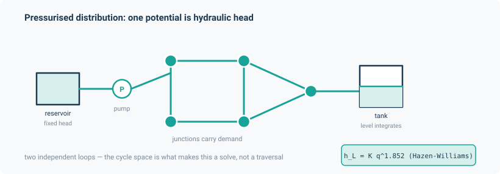

# Water distribution

Pressurised water distribution — the EPANET class of problem. Reservoirs and tanks at fixed or
slowly varying head, junctions with demand, connected by full pipes, pumps and valves.

This is the framework's own case, stated plainly in the module's own words: every pipe is full,
the head loss is a monotone function of the head difference, and the whole thing is **one**
`PotentialFlowLayer` whose potential is hydraulic head in metres. That is exactly what
distinguishes it from the free-surface [sewer](sewer.md), whose normal flow is set by slope and
upstream inflow rather than by head difference.

```python
from noodl.apps.water import (
    Junction, Reservoir, Tank, WaterPipe, Pump, Valve, WaterNetwork, WaterOptions,
    build_model, water_steady, initial_state, twoloop,
    read_epanet_inp, pressure_head, to_kilopascal, link_table, tank_inflow,
)
```



## A worked example

```python
from noodl.apps.water import read_epanet_inp, build_model, water_steady

net = read_epanet_inp("twoloop_si.inp")
model, state, drivers = build_model(net)
final = water_steady(model, state, drivers)

# final["water.phi"] is head (m) at every node
# final["water.q"] is flow (m3/s) in every link
```

Or without a file, using the built-in fixture:

```python
from noodl.apps.water import build_model, water_steady, twoloop

model, state, drivers = build_model(twoloop())
final = water_steady(model, state, drivers)
```

`twoloop()` is the committed hand-built network matching `twoloop_si.inp`: reservoir `R1` at
50 m, six junctions with demands 5/8/6/10/7/9 L/s, eight Hazen-Williams pipes at $C=130$ forming
two independent loops. Its reference heads from EPANET 2.2 are 49.267731, 48.877316, 48.430882,
48.213867, 48.117119 and 48.122936 m.

## The objects

| Object | Fields |
|---|---|
| `Junction(name, elevation, demand=0.0, pattern=None)` | A demand node. |
| `Reservoir(name, head, pattern=None)` | Fixed-head boundary. |
| `Tank(name, elevation, init_level, min_level, max_level, diameter)` | Cylindrical tank. |
| `WaterPipe(name, u, v, length, diameter, roughness, minor_loss=0.0, status="OPEN")` | A full pipe. |
| `Pump(name, u, v, curve, power=None, speed=1.0)` | Edge oriented **suction → discharge**. |
| `Valve(name, u, v, diameter, kind, setting, minor_loss=0.0)` | TCV or FCV only. |
| `WaterOptions(demand_model="DDA", minimum_pressure=0.0, required_pressure=0.1, pressure_exponent=0.5, ...)` | Carried from the file's `[OPTIONS]`. |

`WaterNetwork` collects them plus `curves`, `patterns`, `controls` and the timing options.
`nodes()` returns junctions, then reservoirs, then tanks; `links()` returns pipes, pumps, TCVs,
FCVs in that order; `validate()` refuses anything out of scope by name.

## `build_model`

```python
model, state, drivers = build_model(
    net,
    headloss=None,      # 'H-W' (default) or 'D-W'; None takes the network's own
    pda=None,           # pressure-driven demand; None takes net.options
    p_min=None, p_req=None, exponent=None,
    quality=None,       # bulk decay coefficient, 1/day; adds a quality TransportLayer
    coupling="pingpong",
    dt=None,            # overrides net.hydraulic_timestep for the tank closure
)
```

`water_steady(model, state, drivers, **solve_kwargs)` wraps `model.steady` with defaults
`atol=rtol=1e-11`, `max_iter=200` (both empirically tuned; caller overrides win), then checks
every converged pump's flow against its own `q_max()` and raises naming the pump and batch
instance if it is exceeded — rather than silently accepting an extrapolated point off the end of
the curve.

## The physics

### Hazen-Williams — the parity formula

$$
h_L = K q^{1.852} + m q^2, \qquad
K = \frac{10.666829500036\, L}{C^{1.852} d^{4.871}}, \qquad
m = \frac{K_{\text{minor}}}{2 g A^2}
$$

The SI constant was re-derived from EPANET's own US constant 4.727 and matches `wntr`'s `hw_k` to
1.04e-9 relative. With no minor loss the inversion is closed form; with one, it is a batched
monotone root solve bracketed by the pure Hazen-Williams flow as an upper bound.

Below `dp_transition` (default $10^{-9}$ m) the law blends to a laminar linear form to keep the
Jacobian finite. That value is empirically chosen: at 1e-9 the 24-hour tank trajectory is
converged to 8.18e-5 m against EPANET, and Newton iteration counts run 50/93/136/179 at
1e-3/1e-6/1e-9/1e-12.

### Pumps

`three_point_curve(q_design, h_design)` reproduces EPANET's single-point construction — shutoff
head at 133% of design head, maximum flow at twice design flow — giving $h_0 = 4H/3$,
$r = (H/3)/q_d^2$ and forcing $n = 2$ exactly. `PumpCurve` inverts
$h_{\text{gain}} = w^2 (h_0 - r (q/w)^n)$ in closed form, with the same laminar blend near
shutoff. `q_max = w (h_0/r)^{1/n}` is the flow at zero head gain.

### Tanks and controls

`TankLevels` is a `Model` closure declaring `state_keys = ("water.tank_level",
"water.link_status")`. Its `__call__` applies controls and returns updated drivers; it does **not**
advance the level. `advance(level, inflow, dt)` does that by explicit Euler,
$H \mathrel{+}= q\,\Delta t / A$. `event_step(level, rate, dt)` implements EPANET's adaptive
step-shortening to the next control crossing.

That shortening is not optional. A fixed one-hour step was measured to diverge from EPANET by
**2.07 m** on Net1, because the pump switches an hour late; with event shortening the same
trajectory matches to **8.181e-5 m**.

An extended-period run therefore looks like this:

```python
for _ in range(steps):
    drivers["water.sources"] = base_demand * pattern_factor(t)
    solved = water_steady(model, state, drivers)
    inflow = tank_inflow(model, solved)
    dt_eff = model.tank_closure.event_step(level, rate, dt)
    level = model.tank_closure.advance(level, inflow, dt_eff)
```

### Pressure-driven demand

EPANET's Wagner function (Manual eq. 13.6), with $p = H - z$:

$$
d(p) = \begin{cases}
D & p \ge P_{\text{req}} \\
D \left(\dfrac{p - P_{\min}}{P_{\text{req}} - P_{\min}}\right)^{e} & P_{\min} < p < P_{\text{req}} \\
0 & p \le P_{\min}
\end{cases}
$$

Implemented with a guarded kink so both `where` branches stay finite and differentiable.
`PressureDrivenDemand` refuses `p_req <= p_min` — a zero-span demand curve.

## The EPANET `.inp` reader

**Read:** `[JUNCTIONS]`, `[RESERVOIRS]`, `[TANKS]`, `[PIPES]`, `[PUMPS]`, `[VALVES]`,
`[DEMANDS]`, `[PATTERNS]`, `[CURVES]`, `[CONTROLS]`, `[OPTIONS]`, `[TIMES]`.

**Ignored** because nothing in the hydraulics references them: `[TITLE]`, `[REPORT]`,
`[COORDINATES]`, `[VERTICES]`, `[LABELS]`, `[BACKDROP]`, `[TAGS]`, `[ENERGY]`, `[END]`, and the
quality sections (a quality run is configured through `build_model(quality=...)` instead).

**Refused by name:** `[RULES]`; `[EMITTERS]`; `[STATUS]` with content; time-based controls (only
`LINK <id> OPEN|CLOSED IF NODE <tank> BELOW|ABOVE <level>` is read); PRV, PSV, PBV and GPV valves;
a constant-**power** pump; a pump with a speed pattern; a tank with a volume curve; a `HEADLOSS`
other than H-W or D-W; a closed pipe or check valve.

A constant-power pump is refused with a specific reason: the head-flow relation EPANET uses
internally for one is not stated in the manual, so implementing it would be a guess.

**Units** follow `[OPTIONS] UNITS`: `CFS GPM MGD IMGD AFD` are US, `LPS LPM MLD CMH CMD` are SI,
and everything is converted to SI on read. Unrecognised `[OPTIONS]` lines are recorded verbatim in
`notes["unrecognised_options"]` rather than dropped.

## Validation

Against the real EPANET 2.2 engine through `wntr` 1.5.0, which bundles `epanet22.dll`. Note the
reference implementation's own floor: `EpanetSimulator` reads EPANET's binary output, whose
on-disk reals are **float32**, so roughly 1e-7 relative is EPANET's own precision, not noodl's.

| Row | Check | Tolerance | Measured |
|---|---|---|---|
| D1 | `twoloop_si.inp` heads and flows | rel 1e-6 | **4.361e-7** heads, **8.090e-8** flows |
| D1 | noodl's own nodal continuity | 1e-13 | **2.093e-14** |
| D2 | Net1 single period: heads, flows, pump head gain | 1e-6 / 1e-5 / 1e-6 | 7.058e-8, 2.868e-6, 1.189e-7 |
| D3 | Net1 24 h tank level with level-triggered pump controls | 2e-4 m | **8.181e-5 m** worst of 25 steps |
| D4 | Darcy-Weisbach vs EPANET's own D-W | recorded band, not asserted | 3.822e-2 heads, 4.446e-1 flows |
| D5 | Pressure-driven demand vs EPANET's `DEMAND MODEL PDA` | 1e-5 | 3.521e-7 heads, 2.184e-7 demands |
| D6 | Head loss sums to zero around every cycle-basis loop | 1e-12 | **exactly 0.0** |
| D7 | Autodiff vs central differences | 1e-6 × scale | 3.212e-6 / 2.505e-10 / 1.007e-6 / 2.753e-9 |
| D8 | TRACE water quality, single source | 1e-3 | 6.438e-12 percentage points |
| G2 | Golden regression | 1e-10 | **0.0** |

Two rows deserve comment.

**D1's continuity** is machine-precision exact for noodl (2.093e-14), while EPANET itself misses
continuity at Net1 node 13 by 4.5e-10 m³/s. The ~1e-7 residuals in D1 and D2 are attributable to
EPANET's float32 output path and its own mild continuity violation, not to this solver.

**D4 is deliberately loose.** EPANET switches between Swamee-Jain, Hagen-Poiseuille and Dunlop's
cubic depending on Reynolds number, while noodl reuses the existing `Duct` element (Colebrook,
unrolled). The test records the discrepancy in a wide band rather than asserting agreement.
Hazen-Williams, not Darcy-Weisbach, is this application's parity formula.

**D6 is a formulation identity, not a comparison** — head loss summing to zero around every
independent loop is a property of the cycle-space formulation, and it holds exactly.

## Limitations

- **Not modelled, refused by name:** PRV/PSV/PBV/GPV valves; time-based controls and `[RULES]`;
  variable-speed pumps; non-cylindrical tanks; emitters; leakage; energy and cost reports;
  Chezy-Manning head loss; pipe-status controls and check valves.
- **Pump curves** are single- or three-point only, with the exponent pinned at $n = 2$; curves
  with four or more points, which EPANET connects piecewise-linearly, are refused.
- **D8 is a smoke test.** A genuinely discriminating two-source trace — EPANET's Net3-style
  "percent of Lake water" — is a recorded follow-up.
- **Tank area is not reachable by a single `water_steady` call.** Only `bottom + level` enters the
  steady solve, so gradients with respect to tank area flow through `TankLevels.advance`, not
  through the steady state.
- **`TankLevels.event_step` is not batch-safe.** It indexes its level and rate tensors positionally
  on the first dimension, so a batched `(B, n_tanks)` rollout would index into the batch dimension
  incorrectly. No batched caller exists yet.
- **A latent unit bug**: on a Darcy-Weisbach file setting both `SPECIFIC GRAVITY` and `VISCOSITY`
  away from their defaults, the effective kinematic viscosity is divided by specific gravity once
  too often. No fixture currently sets both.

## Install

Nothing beyond the base dependencies, plus optionally `sparse`. `wntr` — the EPANET reference
implementation — is test-only and deliberately **not** a runtime extra, because it pulls in a
measured 351 MB of mandatory dependencies.

```bash
pip install "noodl[dev]"     # only if you want to run the EPANET parity tests
```
