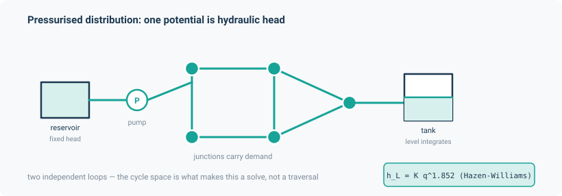

# Water distribution

Pressurised water distribution: reservoirs and tanks at fixed or slowly varying head, and
junctions with demand, are nodes; full pipes, pumps and valves are edges. Water is conserved at
every junction, and flow is driven by differences in hydraulic head.

Every pipe is full and its head loss is a monotone function of the head difference, so the whole
network is **one** `PotentialFlowLayer` whose potential is hydraulic head. That is exactly what
distinguishes it from the free-surface [sewer](sewer.md), whose normal flow is set by slope and
upstream inflow rather than by head difference.

**Units.** Head and elevation m, flow and demand m³/s, pressure head m (with a helper to kPa).

```python
from noodl.apps.water import (
    Junction, Reservoir, Tank, WaterPipe, Pump, Valve, WaterNetwork, WaterOptions,
    build_model, water_steady, initial_state, twoloop,
    pressure_head, to_kilopascal, link_table, tank_inflow,
)
```



## A worked example

```python
from noodl.apps.water import build_model, water_steady, twoloop

model, state, drivers = build_model(twoloop())
final = water_steady(model, state, drivers)

# final["water.phi"] is head (m) at every node
# final["water.q"] is flow (m3/s) in every link
```

`twoloop()` is a hand-built network: reservoir `R1` at 50 m, six junctions with demands
5/8/6/10/7/9 L/s, eight Hazen-Williams pipes at $C=130$ forming two independent loops. Its heads
are 49.267731, 48.877316, 48.430882, 48.213867, 48.117119 and 48.122936 m, the same as EPANET 2.2
gives for the equivalent `twoloop_si.inp`.

The same network can be read from an EPANET `.inp` file (see [File formats](../formats/epanet.md)):

```python
from noodl.apps.water import read_epanet_inp, build_model, water_steady

net = read_epanet_inp("twoloop_si.inp")
model, state, drivers = build_model(net)
final = water_steady(model, state, drivers)
```

## The objects

| Object | Fields |
|---|---|
| `Junction(name, elevation, demand=0.0, pattern=None)` | A demand node. |
| `Reservoir(name, head, pattern=None)` | Fixed-head boundary. |
| `Tank(name, elevation, init_level, min_level, max_level, diameter)` | Cylindrical tank. |
| `WaterPipe(name, u, v, length, diameter, roughness, minor_loss=0.0, status="OPEN")` | A full pipe. |
| `Pump(name, u, v, curve, power=None, speed=1.0)` | Edge oriented **suction → discharge**. |
| `Valve(name, u, v, diameter, kind, setting, minor_loss=0.0)` | TCV or FCV only. |
| `WaterOptions(demand_model="DDA", minimum_pressure=0.0, required_pressure=0.1, pressure_exponent=0.5, ...)` | Carried from the file's `[OPTIONS]`. |

`WaterNetwork` collects them plus `curves`, `patterns`, `controls` and the timing options.
`nodes()` returns junctions, then reservoirs, then tanks; `links()` returns pipes, pumps, TCVs,
FCVs in that order; `validate()` refuses anything out of scope by name.

## `build_model`

```python
model, state, drivers = build_model(
    net,
    headloss=None,      # 'H-W' (default) or 'D-W'; None takes the network's own
    pda=None,           # pressure-driven demand; None takes net.options
    p_min=None, p_req=None, exponent=None,
    quality=None,       # bulk decay coefficient, 1/day; adds a quality TransportLayer
    coupling="pingpong",
    dt=None,            # overrides net.hydraulic_timestep for the tank closure
    friction="epanet",  # D-W friction law: 'epanet' (default) or 'colebrook'
)
```

`water_steady(model, state, drivers, **solve_kwargs)` wraps `model.steady` with defaults
`atol=rtol=1e-11`, `max_iter=200` (both empirically tuned; caller overrides win), then checks
every converged pump's flow against its own `q_max()` and raises naming the pump and batch
instance if it is exceeded — rather than silently accepting an extrapolated point off the end of
the curve.

## The physics

### Hazen-Williams

$$
h_L = K q^{1.852} + m q^2, \qquad
K = \frac{10.666829500036\, L}{C^{1.852} d^{4.871}}, \qquad
m = \frac{K_{\text{minor}}}{2 g A^2}
$$

The SI constant was re-derived from EPANET's own US constant 4.727 and matches `wntr`'s `hw_k` to
1.04e-9 relative. With no minor loss the inversion is closed form; with one, it is a batched
monotone root solve bracketed by the pure Hazen-Williams flow as an upper bound.

Below `dp_transition` (default $10^{-9}$ m) the law blends to a laminar linear form to keep the
Jacobian finite. That value is empirically chosen: at 1e-9 the 24-hour tank trajectory is
converged to 8.18e-5 m against EPANET, and Newton iteration counts run 50/93/136/179 at
1e-3/1e-6/1e-9/1e-12.

### Darcy-Weisbach

`EpanetDarcyWeisbach` is EPANET 2.2's own composite law, transcribed from its source
(`hydcoeffs.c`, `DWpipecoeff` and `frictionFactor`), in EPANET's internal feet and cfs:

$$
h_L = \begin{cases}
(16 \pi \nu d R + m \lvert q \rvert)\, q & Re \le 2000 \quad \text{(Hagen-Poiseuille)} \\
(f(Re) R + m)\, \lvert q \rvert q & Re > 2000
\end{cases}
\qquad R = \frac{L}{2 \cdot 32.2\, d A^2}, \quad m = \frac{0.02517\, K_{\text{minor}}}{d^4}
$$

with $f$ Dunlop's cubic interpolation for $2000 < Re < 4000$ and Swamee-Jain above. The
composite is $C^1$: the cubic matches $64/Re$ and Swamee-Jain in value and slope at its ends.
EPANET's constants are kept as EPANET has them, because they are part of what it computes:
$g = 32.2$ ft/s² (not 32.174), the rounded minor-loss factor 0.02517, water at
$\nu = 1.1 \times 10^{-5}$ ft²/s times `[OPTIONS] VISCOSITY`, and the flow-unit factor EPANET
divides a file's flows by (`LPSperCFS = 28.317`, `GPMperCFS = 448.831`, ...;
`WaterOptions.flow_units` carries the file's unit). EPANET has no low-flow linearisation for D-W:
the laminar branch is already linear through $q = 0$, so the element needs no transition blend.
The flow is found by a safeguarded Newton inversion of the odd law $h_L(q)$ with EPANET's own
analytic gradient, and differentiated by the implicit-function rule.

This is the default whenever the head loss is D-W, including every `.inp` read with
`HEADLOSS D-W`, because the application's reference is EPANET. `friction="colebrook"` selects
the framework's generic `Duct` instead (implicit Colebrook, a straight laminar line to its
Re = 2000 value, water at $1.002\times10^{-3}/998.2$ m²/s, standard gravity); it is a different
law and does not reproduce EPANET (3.6e-4 on the two-loop heads, up to 81 % on a pipe's head
loss near Re = 2000).

### Pumps

`three_point_curve(q_design, h_design)` reproduces EPANET's single-point construction — shutoff
head at 133% of design head, maximum flow at twice design flow — giving $h_0 = 4H/3$,
$r = (H/3)/q_d^2$ and forcing $n = 2$ exactly. `PumpCurve` inverts
$h_{\text{gain}} = w^2 (h_0 - r (q/w)^n)$ in closed form, with the same laminar blend near
shutoff. `q_max = w (h_0/r)^{1/n}` is the flow at zero head gain.

### Tanks and controls

`TankLevels` is a `Model` closure declaring `state_keys = ("water.tank_level",
"water.link_status")`. Its `__call__` applies controls and returns updated drivers; it does **not**
advance the level. `advance(level, inflow, dt)` does that by explicit Euler,
$H \mathrel{+}= q\,\Delta t / A$. `event_step(level, rate, dt)` implements EPANET's adaptive
step-shortening to the next control crossing.

That shortening is not optional. A fixed one-hour step was measured to diverge from EPANET by
**2.07 m** on Net1, because the pump switches an hour late; with event shortening the same
trajectory matches to **8.181e-5 m**.

An extended-period run therefore looks like this:

```python
for _ in range(steps):
    drivers["water.sources"] = base_demand * pattern_factor(t)
    solved = water_steady(model, state, drivers)
    inflow = tank_inflow(model, solved)
    dt_eff = model.tank_closure.event_step(level, rate, dt)
    level = model.tank_closure.advance(level, inflow, dt_eff)
```

### Pressure-driven demand

EPANET's Wagner function (Manual eq. 13.6), with $p = H - z$:

$$
d(p) = \begin{cases}
D & p \ge P_{\text{req}} \\
D \left(\dfrac{p - P_{\min}}{P_{\text{req}} - P_{\min}}\right)^{e} & P_{\min} < p < P_{\text{req}} \\
0 & p \le P_{\min}
\end{cases}
$$

Implemented with a guarded kink so both `where` branches stay finite and differentiable.
`PressureDrivenDemand` refuses `p_req <= p_min` — a zero-span demand curve.

## Verification

Against the real EPANET 2.2 engine through `wntr` 1.5.0, which bundles `epanet22.dll`. Note the
reference implementation's own floor: `EpanetSimulator` reads EPANET's binary output, whose
on-disk reals are **float32**, so roughly 1e-7 relative is EPANET's own precision, not noodl physics'.

| Check | Tolerance | Measured |
|---|---|---|
| `twoloop_si.inp` heads and flows | rel 1e-6 | **4.361e-7** heads, **8.090e-8** flows |
| `twoloop_si.inp`, noodl physics' own nodal continuity | 1e-13 | **2.093e-14** |
| Net1 single period: heads, flows, pump head gain | 1e-6 / 1e-5 / 1e-6 | 7.058e-8, 2.868e-6, 1.189e-7 |
| Net1 24 h tank level with level-triggered pump controls | 2e-4 m | **8.181e-5 m** worst of 25 steps |
| Darcy-Weisbach, `twoloop_si.inp` heads and flows | rel 1e-6 | 5.819e-8 heads, 6.482e-8 flows |
| Darcy-Weisbach, Net1 single period: heads, flows | 1e-6 / 1e-5 | 7.009e-8, 3.986e-6 |
| Darcy-Weisbach, laminar + transitional + turbulent pipes (`lowflow_dw_si.inp`): heads, flows, per-pipe head loss | 1e-6 / 1e-6 / 2.65e-7 m | 3.5e-8, 9.4e-8, 9.6e-8 m |
| Pressure-driven demand vs EPANET's `DEMAND MODEL PDA` | 1e-5 | 3.521e-7 heads, 2.184e-7 demands |
| Head loss sums to zero around every cycle-basis loop | 1e-12 | **exactly 0.0** |
| Autodiff vs central differences | 1e-6 × scale | 3.212e-6 / 2.505e-10 / 1.007e-6 / 2.753e-9 |
| TRACE water quality, single source | 1e-3 | 6.438e-12 percentage points |
| Golden regression | 1e-10 | **0.0** |

Three rows deserve comment.

**Continuity** is machine-precision exact for noodl physics (2.093e-14), while EPANET itself misses
continuity at Net1 node 13 by 4.5e-10 m³/s. The ~1e-7 residuals on `twoloop_si.inp` and the
Net1 single period are attributable to EPANET's float32 output path and its own mild continuity
violation, not to this solver.

**Darcy-Weisbach reaches the same floor as Hazen-Williams.** With EPANET's own composite law
(above) the D-W rows sit at the float32 output floor. The per-pipe loss bound is derived, not
fitted: EPANET stores its heads as float32 feet in its hydraulics file and reports them as
float32 metres, so each reported head can be off by half a spacing in each, and a loss by twice
that, $2(0.3048 \cdot 2^{-22} + 2^{-24})$ m for heads between 1 and 2 m. Two EPANET details
matter at this level: the rounded flow-unit factor (with the exact one the two-loop heads miss
by 4.3e-7 instead of 5.8e-8) and, for the low-flow network, `ACCURACY 1e-8` in the fixture,
since at EPANET's default 1e-3 its own loop flows stop 5e-7 short of converged.

**The loop head-loss row is a formulation identity, not a comparison** — head loss summing to zero around every
independent loop is a property of the cycle-space formulation, and it holds exactly.

## Limitations

- **Not modelled, refused by name:** PRV/PSV/PBV/GPV valves; time-based controls and `[RULES]`;
  variable-speed pumps; non-cylindrical tanks; emitters; leakage; energy and cost reports;
  Chezy-Manning head loss; pipe-status controls and check valves. A file using any of these
  raises an error naming the feature.
- **Pump curves** are single- or three-point only, with the exponent fixed at $n = 2$. Curves
  with four or more points, which EPANET connects piecewise-linearly, are refused; fit a
  three-point curve instead.
- **The Colebrook option is not EPANET below Re = 4000.** With `friction="colebrook"` a laminar
  D-W pipe's head loss follows a straight line to the Colebrook value at Re = 2000, not
  Hagen-Poiseuille, and Dunlop's transition cubic is not used. The default `friction="epanet"`
  reproduces both.
- **Water-quality tracing is verified on a single source only.** The TRACE check uses a
  network with one source, where the answer is 100 % everywhere it reaches; mixing of several
  traced sources has not been compared against EPANET.
- **Tank area does not enter a single `water_steady` call.** Only the tank's head
  (`bottom + level`) enters the steady solve, so gradients with respect to tank area come from
  a time-stepped run (`TankLevels.advance`), not from the steady state.
- **Tank level events are not batch-safe.** `TankLevels.event_step` indexes tanks along the
  first tensor dimension, so a batched `(B, n_tanks)` rollout with level-triggered controls
  gives wrong results. Run batched tank simulations one instance at a time.

## Install

Nothing beyond the base dependencies, plus optionally `sparse`. `wntr` — the EPANET reference
implementation — is test-only and deliberately **not** a runtime extra, because it pulls in a
measured 351 MB of mandatory dependencies.

```bash
pip install "noodl-physics[dev]"     # only if you want to run the EPANET parity tests
```
