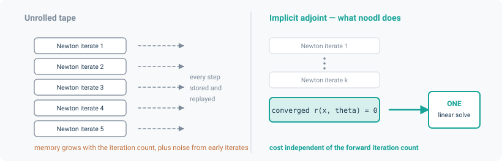

# Differentiability

Every quantity in noodl is a PyTorch tensor and every solve is differentiable. This is the
difference between a simulator and a tool you can calibrate, invert and optimise with.

## What you get

For a converged solve, gradients flow back to:

- `phi_boundary` and `x_boundary` — the prescribed boundary values,
- `sources` — the nodal source terms,
- every value in the `drivers` mapping,
- every element parameter registered with `learnable=True`,
- and, across a [coupled model](../applications/coupling.md), through the join into the *other*
  model's parameters.

```python
phi, q = layer.solve(phi_boundary, drivers, sources=sources)   # differentiable=True default
loss = (phi[room] - measured) ** 2
loss.backward()
```

## The adjoint, not an unrolled tape



The naive way to differentiate a Newton solve is to record every iteration and back-propagate
through all of them. That costs memory proportional to the iteration count and is numerically
noisy — the early iterates are far from the solution and contribute derivative noise.

noodl does not do that. It applies the implicit-function theorem at the converged solution.
For a residual $r(x, \theta) = 0$,

$$
\frac{\partial x}{\partial \theta} = -\left(\frac{\partial r}{\partial x}\right)^{-1}
\frac{\partial r}{\partial \theta}
$$

so the backward pass is **one transposed linear solve**, whatever the forward took. The Jacobian
is the one Newton already assembled, and the transposed solve reuses the same operator through
`TransposeOperator`. For a symmetric operator — which a potential-flow layer's is — `rmatvec` is
the forward action, so nothing extra is built.

The practical consequence: a model that takes 12 Newton iterations to converge costs the same to
differentiate as one that takes 3.

**The exception is iteration at the `Model` level — and it is no longer an unrolled exception.**
`coupling="iterate"` and `CoupledModel`'s two-way fixed point both run their passes to
convergence without a graph, run the certified pass once more on the graph at the converged
interface, and attach the implicit adjoint of the interface equations
(`solvers.fixed_point.differentiate_fixed_point`): one small GMRES solve at the converged
interface, backward memory is one pass, and the gradient error is of the order of the primal
residual rather than the unrolled truncation counted from the start state. The convergence
decision itself is still made on detached copies and never enters the graph.

## The contract

For `differentiable=True` to be *safe*, two rules must hold. Both are checked before any solve
is attempted, and a violation raises naming the offending element or drive and the attribute —
rather than silently returning a wrong or absent gradient.

**1. An element's differentiable state must be a registered parameter.**

```python
leak = PowerLaw(C=torch.tensor(0.01), n=torch.tensor(0.65), learnable=True)   # correct
```

A bare tensor held with `requires_grad=True` outside `named_parameters()` is a supported
construction, and its graph is reachable through the element's own component calls — but it is
invisible to the differentiable solve. Since `differentiable=False` returns detached tensors,
*neither* path would carry a gradient to it.

**2. A drive must read every differentiable quantity from the `drivers` mapping**, never hold
one as an instance attribute. See [Elements and drives](elements.md#the-rule-a-drive-must-obey)
for why this is structural rather than stylistic.

## What is guaranteed

The sections above describe how noodl differentiates and what it takes to keep that safe.
This section states the contract itself, as a list of bounded claims, each pinned to the test
that would fail if the claim stopped holding.

- **First-order derivatives only.** The implicit adjoint never builds a graph connecting its
  own returned gradients back to its inputs, so a second `torch.autograd.grad(..., create_graph=True)`
  through an already-differentiated implicit solve is refused by name, inside `backward()` at
  the moment that second differentiation is attempted, rather than silently returning an
  incomplete result with a missing second-order term
  (pinned by tests/solvers/test_implicit.py::test_second_order_differentiation_raises_instead_of_silently_dropping_a_term).
- **At regular solutions.** The guarantee above is for a converged solve at which the residual's
  Jacobian is invertible; every implicit-adjoint gradient this page cites is checked at such a
  point, both for a linear system and for a Newton solve of a nonlinear one
  (pinned by tests/solvers/test_implicit.py::test_gradcheck_implicit_solve_batched_wrt_linear_system_matrix_entries
  and tests/solvers/test_implicit.py::test_gradcheck_implicit_solve_on_cube_root_wrt_parameter).
- **Implicit adjoint for linear and Newton solves.** For a residual $R(z, \theta) = 0$ solved
  at $z^*$, the backward pass solves the *transposed* system for the adjoint variable,
  $R_z^T \lambda = L_z$, and then assembles the parameter gradient from one more pass through
  the residual, $dL/d\theta = L_\theta - R_\theta^T \lambda$ — never by unrolling the forward
  iteration. `adjoint()` solving the transposed system is checked directly
  (pinned by tests/solvers/test_implicit.py::test_adjoint_solves_the_transposed_system), and the
  same construction is what `_LinearSolve` in `noodl.layers.transport` specialises to a linear
  residual (its own class docstring calls out `solvers/implicit.py`'s warning "almost verbatim,
  because it is the identical trap").
- **A discrete-step derivative for every integrator, including the exponential action with a
  state-independent term count.** `implicit`, `trapezoidal` and `exact` (matrix-exponential)
  schemes are all differentiable, and the exact scheme's tangent at equilibrium matches the
  analytic matrix-exponential derivative even from $x_0 = 0$ or $x_0 \to 0$, because the
  Taylor schedule (substep count $s$, term count $m$) is computed from $\lVert dt\, M\rVert_1$
  under `no_grad` before any arithmetic on $x$ or the forcing term runs, and bounds the
  truncation of both the state polynomial and the forcing polynomial together with each one's
  own derivative with respect to the operator -- on the forcing (affine) path AND on the
  shifted (homogeneous) path a sealed pure-decay zone takes -- so coefficient sensitivities
  are accurate at and near a zero operator on both paths, not just the forward value
  (pinned by tests/layers/test_transport_derivatives.py::test_exact_step_tangent_matches_the_matrix_exponential_at_equilibrium,
  tests/layers/test_expm_schedule.py::test_forced_step_value_and_coefficient_derivative_match_the_closed_form_near_a_zero_operator
  and
  tests/layers/test_expm_schedule.py::test_shifted_action_gradients_match_the_dense_reference_near_a_zero_operator).
- **Every transport coefficient is differentiable under every scheme.** Carrier, transmission,
  kinetics, removal and conductance all reach the backward pass under `implicit`, `trapezoidal`
  and `exact` alike, checked by `gradcheck` against each coefficient family, both in a single
  step and at steady state
  (pinned by tests/layers/test_transport_coefficients.py::test_carrier_gradient,
  tests/layers/test_transport_coefficients.py::test_transmission_gradient,
  tests/layers/test_transport_coefficients.py::test_kinetics_gradient,
  tests/layers/test_transport_coefficients.py::test_removal_gradient and
  tests/layers/test_transport_coefficients.py::test_conductance_gradient, all parametrised
  over scheme, plus each one's `_steady` counterpart).
- **Coupled fixed points are differentiated implicitly.** Both `Model`'s own `coupling="iterate"`
  and `couple.CoupledModel`'s two-way join run their passes to convergence WITHOUT a graph, run
  the certified pass once more on the graph, and attach the implicit adjoint of the interface
  equations (`solvers.fixed_point`): one small GMRES solve on $(I - J^T)$ at the converged
  interface, with its own residual check that raises by name. The gradient is therefore the
  fixed point's: its error is of the order of the primal residual (the interface is a fixed
  point only to within the primal tolerance), not the unrolled $O(\rho^{\text{passes}})$
  truncation counted from the *start* state and tied to nothing the caller controls; it is
  exact where the interface equations are linear in the interface, which is why the pinned
  tests return $1/3$ and $2/3$ to one ulp at `iterate_rtol` $10^{-12}$ and $10^{-3}$ alike.
  Memory is one pass. Second-order differentiation through it is refused by name
  (pinned by tests/test_couple_conservation.py::test_gradient_at_a_converged_start_is_the_coupled_derivative,
  tests/test_couple_conservation.py::test_gradient_does_not_depend_on_the_primal_tolerance,
  tests/test_model.py::test_iterate_gradient_from_a_near_fixed_point_start_matches_central_differences
  and tests/solvers/test_fixed_point.py::test_second_order_differentiation_is_refused_by_name).
  The certified pass is *re-run* for the adjoint, and `solvers/select.py` drops the SuperLU fast
  path when a differentiating input requires grad, so the adjoint pass can take a different
  linear-solver route than the primal passes did — the returned state reproduces the certified
  pass to *solver accuracy*, not identically by construction. Conservation does not depend on
  which route ran: it is a property of the pass function itself
  (see [Coupling](../applications/coupling.md#differentiating-the-fixed-point) for the full
  derivation). The GMRES solve runs one independent system per batch instance when EVERY
  interface tensor carries the batch shape as its leading dims — a documented precondition on
  the caller (instances must not couple through the pass), checked only by shape, not proven
  from it — and falls back to the interface flattened across the whole batch otherwise, which
  is still correct but whose cost can scale up to linearly with batch size even though the
  interface Jacobian is block-diagonal there. `diagnostics["adjoint_batched"]` says which of
  the two ran. `CoupledModel` and `Model` both pass the batch shape through, so on the
  per-instance path the adjoint's cost no longer scales with batch size
  (see [Coupling](../applications/coupling.md#limitations)).
- **Nonsmooth element laws have declared piecewise semantics, named per element.** `Damper`
  evaluates both signed power-law branches everywhere and selects with `torch.where`, so its
  `dflow` is finite at the kink (`dp = 0`) and matches finite differences away from it
  (pinned by tests/elements/test_damper.py::test_dflow_matches_finite_differences_on_both_sides
  and tests/elements/test_damper.py::test_gradcheck_flow_wrt_dp_away_from_the_kinks_and_finite_at_zero).
  `Duct` declares a laminar/turbulent transition at `Re_t` with its own bounded, shrinking
  transition step, checked at and either side of that boundary
  (pinned by tests/elements/test_duct.py::test_gradcheck_flow_wrt_dp_at_zero_inside_and_outside_the_transition).
  `UpstreamDensityPowerLaw` declares its own transition and is finite through it too — see
  `tests/elements/test_upstream.py` for that element's own kink tests. No element in noodl
  claims to be globally smooth where its law is not; where it is not, the transition is
  declared and tested, not left to autograd to discover.

No claim above is new: each restates something the module docstrings of
`noodl.solvers.implicit`, `noodl.layers.transport` and `noodl.couple` already document, gathered
here as one checklist with the test that pins it.

## What this is for

### Parameter estimation

The gradient of a mismatch against measurements, with respect to a physical coefficient, is what
gradient-based calibration needs. The coupling application's first inverse example calibrates a
building's leakage coefficient through a coupled street-building join, with the gradient running
through the coupled solve and back into the street model: relative error $1.29\times10^{-4}$
against the true value, final loss $3.46\times10^{-8}$.

### Source attribution

Which emission source is responsible for the concentration measured here? That is
$\partial c / \partial s_j$ — one adjoint pass, not one forward run per source. The coupling
application's second inverse example matches central differences to relative $10^{-4}$
(measured $3.6\times10^{-7}$ and $5.3\times10^{-7}$), and correctly returns a *structural* zero
for the source that cannot reach the receptor.

### Latent state recovery

`project_measured` and the cycle-space tools recover unmeasured flows from a few measured ones.
The third inverse example recovers all four branch flows of a network from one measured path,
exactly (rtol $10^{-10}$).

### Design optimisation

Anything the forward model computes can be an objective, and any element parameter can be a
design variable.

## Where gradients are zero, and why

Not every derivative that exists mathematically is non-zero in the model, and noodl documents
the cases rather than leaving you to discover them.

- **At a hard clip.** `CapacitatedTransferLayer` in `mode="hard"` carries *exactly zero*
  gradient across a capacity or headroom crossing — the branch choice is discrete. That is the
  entire reason `mode="smooth"` and `mode="projection"` exist. See
  [Capacitated transfer](../applications/capacitated.md).
- **At the sharing site, in smooth mode.** Smooth mode's proportional-share formula depends only
  on preference weights and total headroom, never on any individual competitor's request, so the
  cross-gradient $\partial f_i / \partial r_j$ is provably zero. `mode="projection"` routes that
  site through a real coupled QP to give a genuine cross-gradient. This was found as a live bug,
  not anticipated.
- **At zero flow in the sewer.** `normal_depth` returns exactly $h = 0$ with gradient $0$ at
  $q = 0$, a documented modelling choice, because the true $dh/dq$ diverges there.
- **Structurally, for `f_i`.** The sewer's interfacial drag coefficient is a `Drive` attribute
  and therefore not differentiable by this framework's design — stated as such, "not an
  oversight."
- **For a tank's area.** In the water application, tank area is not reached by a single
  `water_steady` call — only `bottom + level` enters the steady solve. Gradients with respect to
  it flow through `TankLevels.advance`, not through the steady state.

## Verification

Every application checks its gradients against finite differences, and the numbers are recorded:

| Application | Check | Tolerance | Measured |
|---|---|---|---|
| Water (D7) | demand, roughness, pump $h_0$, tank area | $10^{-6}\times$ scale | 3.2e-6 / 2.5e-10 / 1.0e-6 / 2.8e-9 |
| Sewer (C3) | inflow, `T_head`, leak area, `f_air`, vs Richardson-extrapolated central differences | rel $10^{-6}$ | holds |
| Capacitated (W6) | `torch.autograd.gradcheck` through smooth and projection modes | analytic | holds |
| Coupling | gradient across the join vs central differences | rel $10^{-5}$ | holds |

If you write your own element, do the same: `torch.autograd.gradcheck` in float64 against a
finite-difference reference is cheap insurance against a `dflow` that disagrees with its `flow`.

## Performance notes

- **Use float64.** Finite-difference comparisons and tight Newton tolerances both need it, and
  `gradcheck` is effectively meaningless in float32.
- **The sparse-direct backend also speeds up the backward pass**, measured 3.25x at ensemble 1
  and 3.66x at ensemble 100. Install the [`sparse` extra](../installation.md#optional-extras).
- **Batch instead of looping.** A gradient over a 100-instance ensemble is one backward pass, not
  100.
