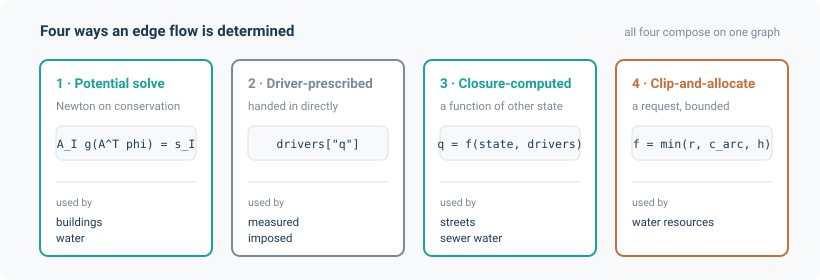
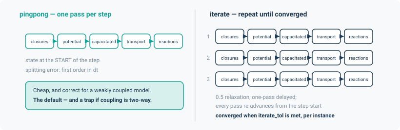

# Layers and models

A **layer** is one physical process on one network. A **`Model`** holds several layers on one
network and steps them together.

This page covers the part of noodl least like other network solvers: there are four different
ways an edge flow can be determined, and choosing the right one for your problem matters more
than any other modelling decision you will make.

## The four flow-determination modes

Most network tools support exactly one of these. noodl supports all four, and they compose on
one graph.

| # | Mode | The flow comes from | Implemented by |
|---|---|---|---|
| 1 | **Potential solve** | Newton's method on a nodal conservation residual: $A_I\,g(A^\top\phi) = s_I$ | `PotentialFlowLayer` |
| 2 | **Driver-prescribed** | Handed in directly as a driver value | any `TransportLayer` with no potential owner |
| 3 | **Closure-computed** | Computed from other state by an arbitrary function | a closure writing `"<layer>.q"` |
| 4 | **Clip-and-allocate** | A *request*, clipped against arc capacity and receiver headroom — no potential variable anywhere | `CapacitatedTransferLayer` |



Worked examples of each, from the applications:

- **1** — A building's airflow network. Pressures are unknown; flows follow from them.
- **2** — Not usually chosen alone; it is the escape hatch for a flow you measured or imposed.
- **3** — A street canyon. The along-canyon velocity is a closed-form function of the wind aloft
  and the canyon geometry, so there is no potential to solve for; `StreetFlows` computes every
  flow and writes it. The sewer's water side likewise: on a tree the cycle space is empty, so
  continuity alone fixes every pipe discharge in closed form.
- **4** — A water-resources network. An arc *requests* a transfer; the receiving reservoir
  accepts what its remaining headroom allows; the rest is unmet. There is no head, no pressure,
  no potential — the rule *is* the physics.

Getting this wrong is expensive. Modelling a gravity sewer as a potential problem, or a
water-allocation rule as a pressure network, produces a model that converges to a confidently
wrong answer.

## `PotentialFlowLayer`

Solves for nodal potentials such that flow is conserved at every interior node.

```python
from noodl.layers.potential import PotentialFlowLayer

layer = PotentialFlowLayer(
    net,
    name="air",
    elements=[leak],            # one Element per edge kind
    drives=[stack],             # additive potential-difference terms
    boundary=["ambient"],       # nodes whose potential is prescribed
    linear_solver="auto",       # 'auto' | 'cg' | 'gmres' | 'direct' | 'sparse_direct'
    quantity="pressure",        # metadata a Model reports
    unit="Pa",
)

phi, q = layer.solve(phi_boundary, drivers, sources=sources, differentiable=True)
```

`quantity` and `unit` are metadata only — nothing numerical reads them. They exist so that a
model composing several potential layers over one network can tell a pressure layer from a
temperature one without matching on names.

Useful accessors: `flows(phi, drivers)` evaluates the branch law; `flows_of_kind(q, kinds)`
extracts one kind's block from the concatenated flow vector; `residual(...)` and `jacobian(...)`
expose the Newton pieces directly; `kind_slice(kind)` and `element_for(kind)` locate a kind.

`diagnostics`, when you pass a dict, is filled with `newton_iterations`, `linear_iterations`,
`method`, `backend`, `converged` and `residual_norm`. `method` is what you asked for; `backend`
is what actually ran. They are deliberately separate — see [Solvers](solvers.md#solve-the-auto-table).

## `TransportLayer`

Advects one or more species (or heat) along the flows of its kinds, with storage at nodes:

$$
\frac{dx}{dt} = M x + N x_b + \frac{s}{\text{capacity}}
$$

```python
from noodl.layers.transport import TransportLayer

layer = TransportLayer(
    net, "thermal",
    capacity=heat_capacities,       # per ACTIVE INTERIOR node
    flow_kind=("airpath", "door"),  # one or several advecting kinds
    boundary=["ambient"],
    n_species=1,
    conduction_kind="wall",         # optional diffusive edges
    conductance=ua,
    scheme="exact",                 # 'exact' | 'implicit' | 'trapezoidal'
    quantity="temperature", unit="K",
)
```

Three things catch people:

- **The active interior.** Nodes that no edge of this layer's kinds touches are *inactive* and
  have no row at all — not a zero row, which would be singular. `capacity` must be indexed by the
  active interior, which `active_interior(net, kinds, boundary)` computes. A wall-mass node with
  conduction edges and no airpath edge *is* an unknown of a thermal layer and is *not* one of a
  species layer over the same network.
- **`sources` is in full node order**, not interior order — zeros on boundary and inactive nodes.
  This differs from `capacity` on purpose: sources are an application-level quantity, capacity a
  layer-level one.
- **`flow_kind` may be several kinds**, and `q` is then their flows *concatenated in that order*.
  That is exactly what `PotentialFlowLayer.flows_of_kind(q, layer.flow_kinds)` produces, so heat
  advected by both `"airpath"` and `"door"` edges needs no new operator.

The three schemes: `"exact"` uses an augmented matrix exponential and controls its own error by
sub-stepping; `"implicit"` is implicit Euler; `"trapezoidal"` is the second-order variant. Use
`"exact"` for heat, `"implicit"` for species — the application defaults reflect this.

The exact scheme bases its sub-stepping on the operator's one-norm `||dt M||_1`, computed from
the state-independent matrix before any arithmetic on the state; if the predicted work exceeds
the budget, the step is refused, raising an error that names the layer and advises the implicit
or trapezoidal schemes. A stiff operator (large `||dt M||_1`, e.g. fast removal with a nonzero
forcing) costs the exact scheme thousands of matvecs per step by nature; `scheme="implicit"` is
the documented choice there, not a larger budget. All coefficients the layer owns—carrier,
transmission, kinetics, removal, and conductance—are differentiable under every scheme.

**Changing storage.** A transport layer's capacity may change over a step: a sewer pipe's wetted
volume, or a headspace volume as the water level changes. The step conserves the stored amount
`V x` in amount form: `V_new x_new - V_old x_old = dt F(x_new)` (implicit) or `= dt/2 (F(x_new) + F(x_old))`
(trapezoidal). In the trapezoidal form the old-time rate `F(x_old)` is evaluated with the OLD
capacity, which matters for removal and kinetics (they act on the amount `V x`), not for advection
or conduction (capacity-free amount rates). The argument `capacity_prev` (the storage at the step's start, when it differs from
the `capacity` argument at the step's end) implements this; a fixed-storage layer omits both and
recovers the classical form. The driver `"<layer>.capacity"` holds the storage at the step's end.
When a closure writes that driver, the step-start state must carry the key `"<layer>.capacity"`,
the storage at the state's own time, which `Model.initial_capacities(state, drivers)` builds by
querying the closures. The `"exact"` scheme has no changing-capacity form and raises by name if
`capacity_prev` differs from `capacity`.

**Linear solver.** The `"implicit"` and `"trapezoidal"` schemes each need one linear solve per
step (`"exact"` has none). `linear_solver` names it: `"auto"` (the default), `"gmres"`,
`"gmres_jacobi"`, `"gmres_ilu"`, `"sparse_direct"` or `"direct"`, resolved fresh on every solve
(unlike `PotentialFlowLayer.linear_solver`, which is fixed for the layer's lifetime). `"auto"`
picks `"sparse_direct"` (SciPy's sparse LU, one exact factor-and-solve, no outer iteration) at or
under a batch cap of 32 instances, and plain `"gmres"` above it — chosen on an interleaved
forward/backward benchmark across the whole family (`gmres`, `gmres_jacobi`, `gmres_ilu`,
`sparse_direct`), not on iteration counts alone (`benchmarks/transport_solver_bench.py`).
`"auto"` never picks
`gmres_jacobi`/`gmres_ilu`: the benchmark found `gmres_ilu`'s per-instance ILU factorisation cost
(paid twice per differentiable step — once in the forward solve, once in the backward adjoint,
since preconditioning is not reused across the two) the clear loser at every batch size measured,
and the gmres-vs-`gmres_jacobi` ordering too close to the run-to-run spread to trust as a
tie-break. Two fall-backs, both silent (never a raise, since `"auto"` is a promise to choose a
backend that works): SciPy absent (`"auto"` would have factorised, but the optional `noodl[sparse]`
extra is not installed) falls back to `gmres` and warns once per process; a grad-requiring solve
on the `on_failure="return"` early-return path (which runs outside the differentiable path's own
`no_grad`, unlike `step`'s ordinary forward/backward) falls back to `gmres` silently, since an
explicit `sparse_direct` there would otherwise raise for a reason the caller did not ask for.
`diagnostics["linear"]["backend"]` reports which backend actually ran on every solve.

## `ConstitutiveLayer`

The loop formulation, for the one case `PotentialFlowLayer` cannot express: a branch law
that is flow-controlled, mixes potential- and flow-controlled edges, or is a dynamic element
(inductor, capacitor) stepped implicitly. Instead of solving for nodal potentials directly,
it solves for cycle amplitudes and reduced nodal potentials so both Kirchhoff laws hold by
construction, leaving only `law(p, q, theta) = 0` to solve — `b` equations in `b` unknowns
for a connected network of `b` branches. It is a dense solve, for small networks by nature
(the Jacobian is a plain `torch.func.jacrev` tensor, no sparse path); use `PotentialFlowLayer`
for nodal balances over a network of any size.

```python
from noodl.layers.constitutive import ConstitutiveLayer

def spring_mass_damper(p, q, theta):
    L, R, C, q0_prev, p2_prev, dt = theta
    return torch.stack([
        q[0] - q0_prev - dt / L * p[0],   # inductor, implicit
        p[1] - R * q[1],                   # resistor
        p[2] - p2_prev - dt * q[2],        # capacitor, implicit
    ])

layer = ConstitutiveLayer(net, "smd", kind="pipe", law=spring_mass_damper)
p, q = layer.solve(theta, z0=z0)   # z0: the previous step's own z, for a dynamic law
```

**A standalone block.** `ConstitutiveLayer` is not one of the three layer kinds `Model` steps
(`PotentialFlowLayer`, `TransportLayer`, `CapacitatedTransferLayer`); `Model` refuses it by name
at construction. It is used directly through `solve()`, as the worked-example parity tests do,
and a dynamic law carries its own previous state in `theta`. Making it steppable inside `Model` would
need a declared state key and a step contract; nothing needs that yet, so the boundary is
explicit rather than adapted.

## `Reaction`

Applied to a transport layer's state after its step, operator-split:

```python
from noodl.layers.reaction import FirstOrderDecay

model = Model(net, layers, reactions=[("species", FirstOrderDecay(k))])
```

`FirstOrderDecay` and `Photostationary` (Leighton NO/NO₂/O₃) ship built in; the sewer
application adds `SulfideGeneration`.

**`Model.steady` never applies reactions.** This is deliberate — a steady state under a reaction
is a different fixed-point problem, not the transport steady state. The street and sewer
applications each provide their own `street_steady` / `sewer_steady` helper that iterates
transport and chemistry together to a joint fixed point. If you have a reaction and you call
`Model.steady`, you get the transport-only answer.

## `CapacitatedTransferLayer`

The fourth mode. Each edge carries a *requested* flow; the layer clips it against arc capacity
and the receiver's remaining storage headroom, sharing proportionally when several edges compete
for one node's headroom.

```python
from noodl.layers.capacitated import CapacitatedTransferLayer

layer = CapacitatedTransferLayer(
    net, "cap", kind="link",
    s_max=storage_ceilings,   # per node, full node order; inf for unbounded
    c_arc=arc_capacities,     # per edge
    preference=weights,       # optional sharing weights, strictly positive
    mode="hard",              # 'hard' | 'smooth' | 'projection'
    n_passes=5,
)

s_new, f = layer.step(s, drivers, dt, diagnostics=diag)
```

In the simplest case the realised flow is just $f = \min(r,\; c_{\text{arc}},\; h)$. The three
modes differ in gradient behaviour, which is the whole reason there is more than one — see the
[WSIMOD allocation application page](../applications/capacitated.md) for the full treatment.

A capacitated layer is inherently discrete-time. A `Model` owning one refuses a steady pass and
refuses `residuals()` outright, because a clip-and-allocate rule has no steady meaning to report.

## `Model`

```python
from noodl.model import Model

model = Model(
    net,
    layers={"air": air_layer, "thermal": thermal_layer},
    closures=[density],
    reactions=[("species", decay)],
    coupling="pingpong",            # or "iterate"
    iterate_tol={"thermal": 0.01},  # REQUIRED when coupling="iterate"
    iterate_max=20,
    substeps={"species": 4},
)

state = model.step(state, drivers, dt=60.0)
state = model.steady(state, drivers)
```

### Key conventions

State and driver keys are namespaced by layer name:

| Key | Meaning |
|---|---|
| `"<layer>.phi"` | Nodal potentials, full node order |
| `"<layer>.q"` | Branch flows, the layer's kind order |
| `"<layer>.x"` | Transport state, interior order, `(n_i,)` or `(n_i, K)` |
| `"<layer>.s"` | A capacitated layer's per-node storage |
| `"<layer>.phi_boundary"` | Prescribed boundary potentials (driver) |
| `"<layer>.x_boundary"` | Prescribed boundary transport state (driver) |
| `"<layer>.sources"` | Nodal sources, **full node order** (driver, optional) |
| `"<layer>.capacity"` | Per-step capacity override (driver, optional) |
| `"<layer>.requests"` | A capacitated layer's per-edge request (driver, required) |

### The order within a pass

Closures → potential solves → capacitated steps → transport steps → reactions.

The capacitated step sits between the potential solves and the transport steps so that a
transport layer reading `"<layer>.q"` sees a freshly written flow, whichever kind of layer wrote
it.

### Closures

A closure is `(state, drivers) -> driver updates`. It is the escape hatch for anything that is a
function of solved state: air density from temperature, canyon velocities from wind, tank levels
from the previous step.

```python
def density(state, drivers):
    T = state["thermal.x"]
    return {"rho": P_REF / (R_AIR * T)}
```

Closures may **not** write layer state keys. A closure may carry *its own* state across steps by
declaring `state_keys`, which `Model` copies from its return into the returned state — a sewer
manhole level, or a water tank level and its controlled links' status. Two closures claiming one
key is refused at construction, naming both, rather than resolved by whichever ran last.

### Closures and the clock

A closure that only computes coefficients or forcing terms keeps the two-argument form `closure(state, drivers)`.
A closure that integrates some state over the step (such as a storage sweep that advances manhole levels)
declares `integrates = True` and receives a third argument, `ctx = StepContext(dt, t)`, where `dt` is
the integration interval and `t` the step's start time if tracked. Inside `step(...)` the context carries the
interval; inside `steady(...)` it refuses the closure by name because there is no interval to integrate over.
Queries (`residuals`, `current_flows`, and the sewer report) call closures with `ctx = None`, where an
integrating closure evaluates its outputs at the given state without advancing it. A closure declaring `state_keys`
must also declare `integrates` (True or False) so the model knows whether its carried state changes step to step;
omitting it is refused by name.

### The two couplings, and the trap in the default



`coupling="pingpong"` (**the default**) takes exactly **one** pass per step, with the state at
the *start* of the step. It is cheap, it is what a weakly coupled model wants, and its splitting
error is first order in `dt`.

`coupling="iterate"` — Hensen's "onion" — repeats that pass within the one step until the
transport states named in `iterate_tol` stop changing, at most `iterate_max` times. Successive
substitution with 0.5 relaxation, applied with a one-pass delay: pass 1 sees the step-start
state, pass 2 sees pass 1's transport states unrelaxed, and from pass 3 on each pass sees the
mean of the two before it. Every pass re-advances from the step-start state, so passes never
compound into `passes × dt`.

**The trap.** Calling `.steady()` at the defaults on a two-way coupled model solves the airflow
at the temperatures the closures saw — the *initial* ones — and never re-converges it against
the temperatures it produced. It does not warn you; it returns a plausible number. Whenever the
flow depends on what it carries, pass `coupling="iterate"` with an `iterate_tol`.

Three more things about `iterate_tol`:

- It is **absolute**, in each layer's own units. A species layer whose mass fractions are
  $\sim10^{-3}$ and a thermal layer in kelvin cannot share a tolerance, which is why it is a
  per-layer mapping. A transport layer left out of it is stepped every pass but not tested.
- It has a **floor**: the potential solve's own residual, propagated through $dT/dF$. A tolerance
  tighter than that can never be met, and the run raises naming the layer, the change and the
  tolerance. A tight `iterate_tol` needs a matching `atol`/`rtol` on the `step`/`steady` call.
- Convergence is decided **per batch instance**. A batch that fails raises naming the instances;
  `on_failure="return"` with a `diagnostics` dict returns instead of raising.

### Introspection

```python
model.residuals(state, drivers)   # per-layer nodal balance residual
model.ports(state)                 # what a coupled or external model may prescribe and read
```

`Ports` reports boundary nodes, prescribable keys, boundary flows, and each transport layer's
flow driver key. `Model.flow_layer_of[name] is None` tells you whether a transport layer's flows
are yours to prescribe. This is the surface the [coupling application](../applications/coupling.md)
builds on.

### Differentiability

Ping-pong is one pass of differentiable operations. Iterate runs its passes to convergence
without a graph, then re-runs the certified pass once more on the graph and attaches the
implicit adjoint of the interface equations — memory is one pass, not all of them, and the
gradient error is of the order of the primal residual rather than tied to the pass count. The
convergence *decision* is still made on detached copies, so it never appears in the graph. See
[Differentiability](differentiability.md#what-is-guaranteed) and
[Coupling](../applications/coupling.md#differentiating-the-fixed-point) for the full contract.
`**solve_kwargs` on `step`/`steady` reach the **potential solves only** (`differentiable`,
`on_failure`, `method`, Newton options); transport steps always raise on failure.
