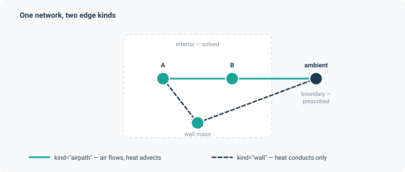

# Networks

`noodl.topology.Network` is the typed multigraph every model is built on. It owns the graph and
every operator derived from it — incidence, gradient, cycle basis, spanning forest, boundary
and interior selectors — and caches them, so building a layer costs the derivation once.

## Building one

```python
import torch
from noodl.topology import Network

net = Network(dtype=torch.float64)
net.add_node("ambient")
net.add_node("room", volume=60.0, z_ref=0.0)
net.add_edge("room", "ambient", kind="airpath", area=0.05, Cd=0.6)
```

Nodes and edges carry arbitrary attributes. Those attributes are how an application passes
geometry to its elements: `orifice_elements_from_edges` reads `Cd` and `area` off every edge of
a kind, and `thermal_layer` reads `volume` off every node. Attributes are retrieved in bulk and
as tensors, never one at a time:

```python
volumes = net.node_attr("volume", default=0.0)     # (n,) tensor, full node order
areas = net.edge_attr("area", kind="airpath")      # (b_kind,) tensor, kind order
```



## Edge kinds

Every edge has a `kind`, and every operator takes an optional `kind` argument that restricts it
to those edges. This is the mechanism that lets one network hold several physical systems:

```python
net.add_edge("room", "ambient", kind="airpath")   # air can flow
net.add_edge("room", "wall", kind="wall")          # heat conducts, air does not
```

A potential-flow layer solving on `"airpath"` never sees the wall edges. A thermal layer
advecting on `"airpath"` and conducting on `"wall"` sees both, in separate blocks. The sewer
application uses this to put water, headspace air and two quality layers on one graph; the
street application uses it to separate `route`, `vent` and `exchange` edges.

```python
net.edge_kinds()            # ['airpath', 'wall']
net.edge_index("airpath")   # positions of that kind's edges in full edge order
```

## The operators

These are the graph-theoretic core. All are cached, all take a `kind`, and all move with
`.to(device, dtype)`.

| Method | Returns |
|---|---|
| `incidence(kind=None)` | $A$, the $n \times b$ signed node-edge incidence matrix. |
| `gradient(kind=None)` | $A^\top$, mapping nodal potentials to potential differences along edges. |
| `difference(kind=None)` | The same difference operator in the form layers consume. |
| `cycle_basis(kind=None)` | A basis for the cycle space: $n_{\text{cycles}} = b - n + n_{\text{components}}$. |
| `spanning_forest(kind=None)` | Tree and chord edge indices — a tree has an empty cycle space, which is what makes the sewer's flow solve closed-form. |
| `endpoints(kind=None)` | `(source_idx, target_idx)` per edge, for matvec-free assembly. |
| `accumulate(w, kind=None)` | Scatter-adds an edge quantity to its endpoints with sign — nodal balance, without ever forming $A$. |
| `source_selector` / `target_selector` | Selection matrices for the two endpoints. |
| `upwind(q, kind=None)` / `downwind(q, kind=None)` | Sign-aware indexing: which endpoint is upstream given the flow direction. This is what makes advection work on a graph whose edge orientations are arbitrary. |

The `accumulate` / `endpoints` pair matters more than it looks. Layers assemble their operators
through them rather than through a dense $A$, which is why a large network never materialises an
$n \times b$ matrix and why the linear operators are matvec-free. See [Solvers](solvers.md).

## Boundary and interior

A node is *boundary* if its potential (or state) is prescribed rather than solved. Everything
else is interior. You name the boundary when you build a layer, and the network turns that into
index tensors:

```python
interior = net.interior_index(["ambient"])   # solved nodes
boundary = net.boundary_index(["ambient"])   # prescribed nodes
```

`n`, `b`, `n_components` and `n_cycles` report the sizes. `component_labels(kind)` and
`n_components_of(kind)` do the same restricted to a kind, which is how a layer discovers whether
its subgraph is connected — a disconnected potential problem needs one grounded node per
component, and the solver will tell you so rather than silently returning a singular result. See
[Solvers](solvers.md#grounding).

## Ambient

Most physical networks want a single node representing "outside". `with_ambient` adds one and
returns the network for chaining:

```python
net = Network(dtype=torch.float64).with_ambient("ambient")
```

## Tellegen's theorem

The name the package carried before noodl comes from the identity this structure guarantees. For
any nodal potentials $p$ and any flows $q$ satisfying nodal conservation,

$$
\sum_{\text{edges}} (A^{\top} p)_e \, q_e = 0 .
$$

Potential differences live in the cut space, conservative flows live in the cycle space, and the
two are orthogonal complements. The branch power sum is therefore zero regardless of what the
elements are — it is a property of the graph, not of the physics.

```python
residual = net.power_residual(p, q)   # zero to machine precision for a conservative q
```

This is not decoration. It is a free, physics-independent check on any solve, and the
applications use it as one: the sewer application's headspace air layer pins its own power
residual below $10^{-10}\,$W (measured $6.1\times10^{-12}$), and the street application checks
that every kilogram emitted crosses the atmosphere boundary exactly. A model that violates
Tellegen has a bug in its conservation, and the identity catches it without a reference
solution. [The theory page](../theory.md) develops this properly.

## Devices and dtype

```python
net = net.to(device="cuda", dtype=torch.float64)
```

Every cached operator moves with it. The default dtype is `float32`; the applications all
override to `float64`, and you should too for anything involving a Newton solve with a tight
tolerance.

## Cycles

`noodl.cycles` works in the cycle space directly, which is what you need when flows are measured
rather than solved:

| Function | Purpose |
|---|---|
| `branch_flows(net, amplitudes, kind)` | Turns cycle amplitudes into branch flows. Any such flow conserves at every node by construction. |
| `particular_flow(...)` | A particular conservative flow matching prescribed nodal sources. On a tree this is the whole answer, which is how the sewer application solves its hydraulics without a Newton solve at all. |
| `project_measured(...)` | Projects measured flows onto the conservative subspace — the least-squares correction that makes an inconsistent set of measurements satisfy continuity. |
| `assert_forward_oriented(net, kind)` | Checks every edge of a kind points the way the physics assumes. |

The coupling application's third inverse example uses `project_measured` to recover all four
branch flows of a network from one measured path, exactly (rtol $10^{-10}$).
