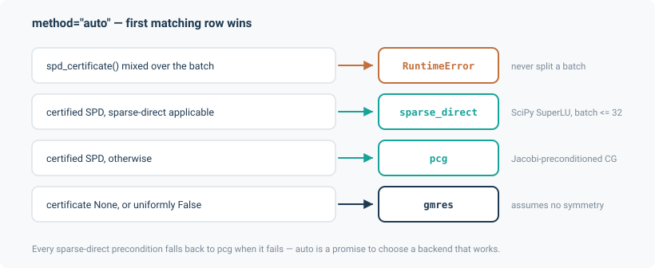

# Solvers

Underneath every layer is the same stack: a **linear operator** that knows how to apply itself
but need not store itself, a **Newton** iteration built on it, and a **selection** rule that
picks a linear backend on measured evidence.

## The `LinearOperator` contract

Operators are matvec-free. An operator must apply itself; everything else is optional and
advertised:

```python
class LinearOperator(Protocol):
    shape: tuple[int, ...]
    dtype: torch.dtype
    device: torch.device
    symmetric: bool

    def matvec(self, x: Tensor) -> Tensor: ...
    def rmatvec(self, x: Tensor) -> Tensor: ...
    def diagonal(self) -> Tensor: ...              # for Jacobi preconditioning
    def assemble(self) -> Tensor | None: ...       # dense form, if it has one
    def spd_certificate(self) -> Tensor | None: ...
```

An operator may additionally implement `assemble_sparse() -> (row, col, values)` — the
`SparseAssembling` protocol — which is what unlocks the sparse-direct backend.

Three implementations ship:

| Operator | What it represents |
|---|---|
| `DenseOperator` | A plain matrix. The retained reference against which the others are checked. |
| `GraphLaplacianOperator` | $A_I \operatorname{diag}(g) A_I^\top$, built from `endpoints` and `accumulate` — never forming $A$. This is the Jacobian of a potential-flow layer. |
| `AdvectionOperator` | The upwind advection operator a transport layer solves against. |

The point of the contract is that a network with $10^5$ edges assembles an $O(E)$ sparse triplet
or applies itself in $O(E)$ work, and never materialises an $n \times b$ dense matrix.

## The SPD certificate

`spd_certificate()` returns a tensor, or `None` for "cannot say". This drives backend selection,
and it is deliberately conservative: an operator asserts SPD only when it can prove it.

`GraphLaplacianOperator` certifies when its conductances are positive and the interior is
grounded. `_DiagonalShifted` — the Jacobian of a layer carrying potential-dependent nodal
sources — delegates to the Laplacian and keeps the certificate **only when every shift entry is
non-negative**: a non-negative diagonal added to an SPD matrix is SPD, a negative one might not
be, so the certificate is dropped rather than asserted. The solve then routes to GMRES, which
needs none.

### Grounding

`noodl.solvers.grounding` provides `spd_certificate` and `spd_diagnosis`. The second is the
useful one when something goes wrong: a potential problem needs one grounded (boundary) node per
connected component, and a network that has lost grounding — a fan reaching shutoff, a damper
closing, a component that turns out to be isolated — produces a singular operator. `spd_diagnosis`
names which component is ungrounded rather than leaving you with a failed solve.

This can happen *mid-iteration*, which is why `newton` takes a `where` label and every layer
passes something specific like `"PotentialFlowLayer 'air' solve"`. In a composed model over one
network, a bare "newton: did not converge" is not enough to find the culprit.

## `solve`: the `auto` table

```python
from noodl.solvers.select import solve

result = solve(op, b, method="auto", rtol=1e-10, on_failure="raise")
```



`method="auto"` resolves by this table, top to bottom, first match wins:

| Condition | Backend |
|---|---|
| `spd_certificate()` mixed across the batch | **`RuntimeError`** — never split a batch |
| Certified SPD, and sparse-direct applicable | `sparse_direct` (SciPy SuperLU, per instance) |
| Certified SPD, otherwise | `pcg` (Jacobi-preconditioned conjugate gradients) |
| Certificate `None`, or uniformly `False` | `gmres` (assumes no symmetry) |

"Sparse-direct applicable" is a conjunction: the operator declares `assemble_sparse` *and*
returns a sparse form from it, SciPy is importable, the solve is grad-safe, **and** the flat
batch size is at most **32**. Every one of those is a *fall back to PCG* when it fails, never a
refusal — `auto` is a promise to choose a backend that works.

### Why that default, and why the batch threshold

Measured on the reference composed model (1028 unknowns, ~5300 nonzeros, float64, 14 threads,
median of 3 warm runs):

| Pass | Ensemble | PCG | sparse-direct | |
|---|---|---|---|---|
| forward | 1 | 128.4 ms | 28.0 ms | 4.59x faster |
| forward | 100 | 2399 ms | 2182 ms | a tie |
| forward | 1000 | 29489 ms | 19263 ms | 1.53x faster |
| backward | 1 | 44.9 ms | 13.8 ms | 3.25x faster |
| backward | 100 | 1741 ms | 476 ms | 3.66x faster |

PCG needed 168–180 iterations per Newton step at this conditioning; the factorisation needs one.
But SuperLU is driven by a per-instance Python loop whose cost is *linear* in the ensemble,
while PCG's batched arithmetic is sub-linear — hence the threshold at 32 rather than an
unconditional preference. A batched vendor backend would replace the loop, not the algorithm.

Because the choice depends on runtime predicates a caller cannot otherwise observe — the batch
size, and whether SciPy is importable at all — `diagnostics` reports `method` (what you asked
for) and `backend` (what ran) separately. Without that distinction, an installation missing the
`sparse` extra looks identical to one that has it, at 4.6x the cost.

### Failure

`pcg` and `gmres` never raise. `select.solve` is the single layer where a failed *numerical*
solve becomes an exception, and `on_failure="return"` is the narrow escape hatch that returns a
`SolveResult` instead.

An **eligibility refusal** is different and always raises, whatever `on_failure` says: requesting
`method="cg"` on an operator that cannot certify SPD, or letting `auto` see a batch where some
but not all instances certify, is a modelling error, not a numerical one. There is no
per-instance result to return.

`SolveResult` carries `x`, `converged`, `iterations`, `residual` and `status` per instance, with
`status` one of `CONVERGED`, `MAX_ITER`, `BREAKDOWN`, `SINGULAR`. `raise_on_failure(where)` names
every non-converged batch index with its status and residual, and returns `self` when all
converged, so it chains.

## Newton

```python
from noodl.solvers.newton import newton

result = newton(residual, operator, x0, atol=None, rtol=None, max_iter=50,
                omega=0.75, switch_ratio=0.5, method="auto", where="my solve")
```

Damped, batched Newton. `NewtonResult` carries `x`, `converged` (per instance), `iterations`,
`residual_norm`, `linear_iterations` and `backend`.

**Tolerance defaults.** `atol` and `rtol` both default to `None`, meaning *derive from the
working dtype*: each independently becomes $\sqrt{\varepsilon}$ for the dtype of the residual
tensor actually returned — about `1.2e-4` for float32, `1.5e-8` for float64. This is the standard
"half the significant digits" heuristic. Asking for tighter than that requests precision the
dtype does not have: the residual floors below the target and `converged` never becomes true. An
explicit value always overrides, and the two are independent.

**`linear_iterations`** is, per instance, the *maximum* inner-solver count over the Newton steps
taken — the worst single linear solve. That is what a performance budget or a preconditioner
decision is made against, and it is monotone in problem difficulty in a way a sum over a varying
number of steps is not. It is `None` only when no linear solve happened at all, never as a
stand-in for an unknown count.

Convergence is per batch instance, and the mask is computed on detached copies so it never enters
the autograd graph.

## Monotone scalar solves

`noodl.solvers.scalar.solve_monotone` is a batched bracketed root-finder for a scalar equation
known to be monotone. It appears wherever a closed-form inversion does not exist but monotonicity
is provable:

- The sewer's Manning normal-depth inversion — discharge is strictly increasing in depth up to
  $h/D = 0.938$, so the ascending branch is the entire invertible domain.
- The sewer's implicit-Euler storage sweep.
- The water application's Hazen-Williams inversion with a minor-loss term.
- `CapacitatedTransferLayer`'s projection-mode QP, whose KKT stationarity reduces to one scalar
  monotone equation per node.

Monotonicity is what makes bracketing safe, and each caller documents why it holds.

## Implicit solve and the adjoint

`noodl.solvers.implicit` is what makes the whole package differentiable at reasonable cost.
`implicit_solve` wraps a Newton solve in a `torch.autograd.Function` whose backward applies the
implicit-function theorem at the converged solution rather than unrolling the forward iteration.
`adjoint` solves the transposed system, using `TransposeOperator` to present any operator's
`rmatvec` as a forward action.

The cost is one extra linear solve on the backward pass, independent of how many Newton
iterations the forward took. [Differentiability](differentiability.md) covers what this means for
your model.
