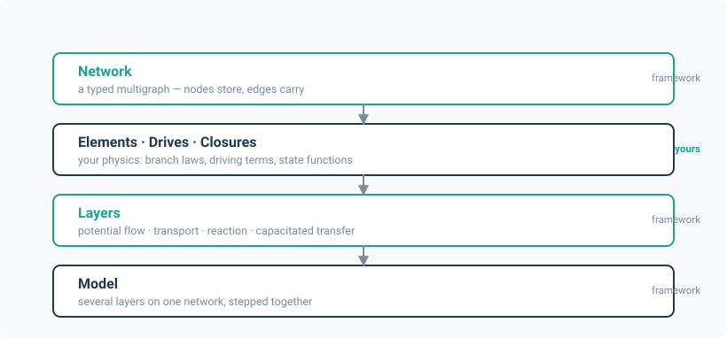

# noodl

  

**noodl** — the **N**etwork-**O**riented **O**pen **D**ifferentiable **L**ibrary — is a generic
framework for solving physics problems on networks, built on PyTorch. It combines graph
topology, conservation laws, and modular descriptions of physical processes to model flows,
storage, transport, and reactions within a common framework. Different physical systems can be
composed and coupled through shared network structures, while differentiable solvers support
simulation, parameter estimation, and optimisation.

## The idea in one paragraph

An enormous range of engineering systems are networks carrying something conserved. Air moves
between the rooms of a building through leaks and doors; water falls through a sewer and is
pumped through a distribution main; pollutants are carried along a street and exchanged with
the air above. Each of these has its own literature and its own simulation tool, and each of
those tools re-implements the same three things: a graph, a conservation law at every node, and
a constitutive law on every edge. noodl factors that common core out once. What remains
specific to a problem — the pressure-flow relation of a crack, the friction law of a pipe,
the chemistry of a street canyon — is a small, replaceable object plugged into the core.

Because the core is written in PyTorch, every quantity in it is a tensor and every operation is
differentiable. The same model that simulates forward will also tell you the derivative of any
output with respect to any parameter, which is what turns a simulator into a tool for
calibration, sensitivity analysis and design optimisation.

## What it gives you

| | |
|---|---|
| **One topology layer** | A typed multigraph with incidence, gradient and cycle-basis operators, boundary/interior selectors, spanning forests and sign-aware upwind/downwind indexing. Edges carry a `kind`, so one network holds several physical systems at once. |
| **Four ways to determine an edge flow** | Solve for a potential (Newton on a nodal conservation residual); prescribe the flow from a driver; compute it from a closure; or clip a requested flow against arc capacity and receiver headroom. Most network tools support exactly one of these. |
| **Composable physics layers** | Potential flow, multi-species and heat transport, reactions, and capacitated transfer — several of them on one network, stepped together under either of two coupling schemes. |
| **Matvec-free solvers** | A `LinearOperator` contract with dense, graph-Laplacian and advection implementations; Newton with per-instance convergence; an implicit-function adjoint so gradients cost one linear solve rather than an unrolled tape. |
| **Batching over instances** | Every solve is batched. A thousand building variants, or one network under a thousand weather realisations, is one call. |
| **Checked against reference implementations** | Each application is checked against the established engine for its domain — CONTAM, MUNICH, SWMM, EPANET, WSIMOD — with the tolerances and measured errors written down. |

## Applications

noodl ships six worked applications. Each is a thin layer of domain physics over the shared
core, and each is checked against the standard reference implementation in its field.

| Application | Physical system | Reference model |
|---|---|---|
| [Building physics](applications/building_physics.md) | Multi-zone airflow, heat and contaminant transport | CONTAM / ContamX |
| [Street air quality](applications/street_aq.md) | Urban air quality, canyon exchange and routing | MUNICH, SIRANE, IMPAQ |
| [Sewers](applications/sewer.md) | Gravity sewer hydraulics, headspace air, sulfide | SWMM |
| [Water distribution](applications/water.md) | Pressurised mains, pumps, tanks, demand | EPANET 2.2 |
| [Capacitated transfer](applications/capacitated.md) | Rule-based water-systems allocation | WSIMOD |
| [Coupling](applications/coupling.md) | Two independent models exchanging values | — |

They are also the argument for the framework: the same core carries a Newton solve on a
building's pressure network, an advection-reaction sweep along a street, a tree traversal down
a sewer, and a clip-and-allocate rule on a water-resources graph, without any of them knowing
about the others.

## Where to go next

- **[Installation](installation.md)** — pip, the optional extras, and what each one buys you.
- **[Quick start](quickstart.md)** — a working two-node model in fifteen lines, then a batched one.
- **[Concepts](concepts/index.md)** — how the framework fits together: networks, elements, layers, solvers, differentiability.
- **[Applications](applications/index.md)** — the six worked systems.
- **[API reference](api.md)** — generated from the docstrings.
- **[Theory](theory.md)** — the background: Tellegen's theorem, port-Hamiltonian systems, differentiable physics, and the literature each application builds on.

## The name

*noodl* stands for **N**etwork-**O**riented **O**pen **D**ifferentiable **L**ibrary. The mark is
a single continuous path through two nodes and a junction — flow through a network, drawn in
one stroke.

## Credits and licence

The topology layer is built on PyTorch, and the physics is implemented as nodal state-space
modules with storage at nodes, typed edges, and batching over instances.

Authors: John Craske and Maarten van Reeuwijk. MIT licensed.
