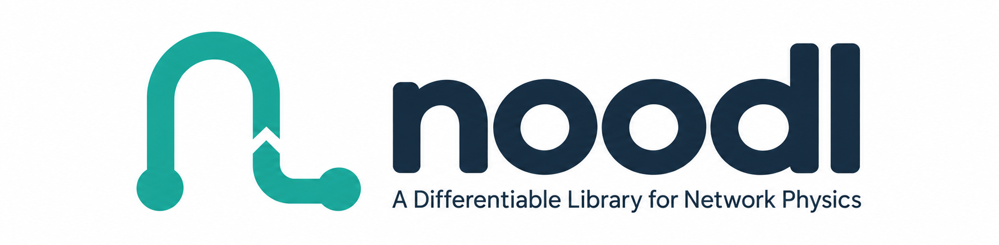
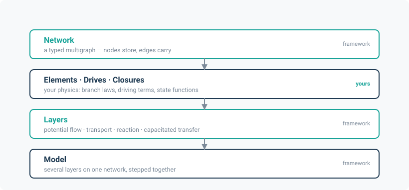

# noodl

  

**noodl** — the **N**etwork-**O**riented **O**pen **D**ifferentiable **L**ibrary — is a generic
framework for solving physics problems on networks, built on PyTorch. It combines graph
topology, conservation laws, and modular descriptions of physical processes to model flows,
storage, transport, and reactions within a common framework. Different physical systems can be
composed and coupled through shared network structures, while differentiable solvers support
simulation, parameter estimation, and optimisation.

## The idea in one paragraph

An enormous range of engineering systems are networks carrying something conserved. Air moves
between the rooms of a building through leaks and doors; water falls through a sewer and is
pumped through a distribution main; pollutants are carried along a street and exchanged with
the air above. Each of these has its own literature and its own simulation tool, and each of
those tools re-implements the same three things: a graph, a conservation law at every node, and
a constitutive law on every edge. noodl factors that common core out once. What remains
specific to a problem — the pressure-flow relation of a crack, the friction law of a pipe,
the chemistry of a street canyon — is a small, replaceable object plugged into the core.

Because the core is written in PyTorch, every quantity in it is a tensor and every operation is
differentiable. The same model that simulates forward will also tell you the derivative of any
output with respect to any parameter, which is what turns a simulator into a tool for
calibration, sensitivity analysis and design optimisation.

## What it gives you

| | |
|---|---|
| **One topology layer** | A typed multigraph with incidence, gradient and cycle-basis operators, boundary/interior selectors, spanning forests and sign-aware upwind/downwind indexing. Edges carry a `kind`, so one network holds several physical systems at once. |
| **Four ways to determine an edge flow** | Solve for a potential (Newton on a nodal conservation residual); prescribe the flow from a driver; compute it from a closure; or clip a requested flow against arc capacity and receiver headroom. Most network tools support exactly one of these. |
| **Composable physics layers** | Potential flow, multi-species and heat transport, reactions, and capacity-limited allocation — several of them on one network, stepped together under either of two coupling schemes. |
| **Matvec-free solvers** | A `LinearOperator` contract with dense, graph-Laplacian and advection implementations; Newton with per-instance convergence; an implicit-function adjoint so gradients cost one linear solve rather than an unrolled tape. |
| **Batching over instances** | Every solve is batched. A thousand building variants, or one network under a thousand weather realisations, is one call. |
| **Verified by code-to-code comparison** | Each application is compared against a reference implementation for its domain — CONTAM, MUNICH, SWMM, EPANET, WSIMOD — with the tolerances and measured errors written down. |

## Applications

noodl is one generic solver for networks whose edges carry a flow and whose nodes conserve it.
The applications are physical systems modelled with that solver, each a thin layer of domain
physics over the shared core:

| Application | Physical system | Flow determination | Entry point |
|---|---|---|---|
| [Building physics](applications/building_physics.md) | Multi-zone airflow, heat and contaminant transport | Potential: Newton on zone pressure | `build_model` |
| [Street air quality](applications/street_aq.md) | Urban air quality, canyon exchange and routing | Closure: flows computed from the wind aloft | `build_model`, `StreetNetwork` |
| [Sewers](applications/sewer.md) | Gravity sewer hydraulics, headspace air, sulfide | Continuity on a tree for the water; Newton potential for the headspace air | `build_model` |
| [Water distribution](applications/water.md) | Pressurised mains, pumps, tanks, demand | Potential: Newton on hydraulic head | `build_model` |
| [Capacitated allocation](applications/capacitated.md) | Requested flows clipped to arc capacity and free storage at the receiving node | Capacitated clip | `CapacitatedTransferLayer` |
| [Coupling](applications/coupling.md) | Two models meeting at a shared boundary | Two models exchanging values, iterated to a fixed point | `union` |

## Reading model files

A model can be built directly in Python or, where a reader exists, read from a file in an
established exchange format. A model read from a file can be batched, differentiated and coupled
exactly like one built by hand.

| Format | Reader | What it describes | Produces a model for |
|---|---|---|---|
| [CONTAM](formats/contam.md) `.prj` / `.wth` | `read_prj`, `project_to_model`, `read_wth` | Multi-zone building airflow and contaminants; weather | [Building physics](applications/building_physics.md) |
| [Modelica Buildings Library](formats/modelica.md) (JSON + CSV export) | `read_modelica` | Multi-zone airflow models built from MBL components | [Building physics](applications/building_physics.md) |
| [SWMM](formats/swmm.md) `.inp` | `read_swmm_inp` | Gravity sewer and drainage networks | [Sewers](applications/sewer.md) |
| [EPANET](formats/epanet.md) `.inp` | `read_epanet_inp` | Pressurised water distribution | [Water distribution](applications/water.md) |

See [File formats](formats/index.md) for what each reader accepts and refuses.

## Where to go next

- **[Installation](installation.md)** — pip, the optional extras, and what each one buys you.
- **[Quick start](quickstart.md)** — a working two-node model in fifteen lines, then a batched one.
- **[Concepts](concepts/index.md)** — how the framework fits together: networks, elements, layers, solvers, differentiability.
- **[Applications](applications/index.md)** — the six worked systems.
- **[API reference](api.md)** — generated from the docstrings.
- **[Theory](theory.md)** — the background: Tellegen's theorem, port-Hamiltonian systems, differentiable physics, and the literature each application builds on.

## The name

*noodl* stands for **N**etwork-**O**riented **O**pen **D**ifferentiable **L**ibrary. The mark is
a single continuous path through two nodes and a junction — flow through a network, drawn in
one stroke.

## Credits and licence

The topology layer is built on PyTorch, and the physics is implemented as nodal state-space
modules with storage at nodes, typed edges, and batching over instances.

Copyright (c) 2026, John Craske, Maarten van Reeuwijk and Imperial College London. Licensed under the BSD 3-Clause License; see `LICENSE`.
